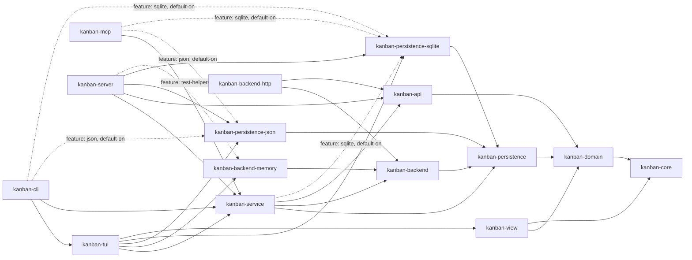

# Contributing to Kanban

Thank you for considering contributing to Kanban! This document provides guidelines and instructions for contributing.

## Development Setup

### Prerequisites

- Rust 1.74+ with cargo
- Nix (recommended for reproducible environment)

### Getting Started

```bash
# Clone the repository
git clone <repo-url>
cd kanban

# Using Nix (recommended)
nix develop

# Or install dependencies manually
rustup update stable
```

### Development Workflow

```bash
# Run the application
cargo run

# Run with import
cargo run -- test-board.json

# Auto-reload on changes
cargo watch -x run

# Fast compile check
cargo check

# Run tests
cargo test

# Linting (with warnings as errors)
cargo clippy --all-targets --all-features -- -D warnings

# Format code
cargo fmt --all
```

## Code Style

### Rust Best Practices

- Follow standard Rust conventions and idioms
- Use `rustfmt` for formatting (enforced in CI)
- Address all `clippy` warnings before submitting PR
- Choose string parameter types by what the function does with the value:
  - Read-only inspection / parsing: `&str`
  - Validate-then-maybe-store (rejection possible): `&str`
  - Always store (constructors, unconditional setters): `impl Into<String>` (or `Option<impl Into<String>>`)
  - In-place mutation of existing string: `&mut String`
  - Avoid `impl AsRef<str>` -- signature clutter without ergonomic gain
- Use `impl Trait` for return types when appropriate
- Keep functions focused and under 50 lines when possible

### Project-Specific Guidelines

**NO COMMENTS** unless:
- Documenting public APIs
- Explaining complex algorithms
- Required for safety/correctness

**Module Organization:**
- Each file should be < 300 lines
- Extract reusable patterns into separate modules
- Follow existing module structure in `crates/kanban-tui/src/`:
  - `app/` - `App` state, `AppMode`/`DialogMode`, lifecycle (`app/mod.rs`, `app/types.rs`, `app/mode.rs`, `app/lifecycle.rs`)
  - `ui/` - Rendering logic (one file per view: `board_detail.rs`, `card_detail.rs`, …)
  - `events.rs` - Terminal event loop
  - `handlers/` - Per-panel key-event handlers (`card_handlers.rs`, `dialog_handlers.rs`, …), dispatched from `app/input_router.rs`
  - `dialog.rs` - Dialog interaction patterns
  - `editor.rs` - External editor integration

**Type Safety:**
- Leverage newtype pattern (`BoardId`, `CardId`, `ColumnId`)
- Use enums for state machines (`AppMode`, `Focus`, `CardFocus`)
- Prefer compile-time guarantees over runtime checks

**Error Handling:**
- All public APIs return `KanbanResult<T>`
- Use `thiserror` for error definitions
- Provide context in error messages
- Log errors with `tracing::error!`

**Immutability:**
- Prefer immutable data structures
- Use `&mut` only when necessary
- Update timestamps on mutation methods

## Architecture Principles

### SOLID Principles

The codebase follows SOLID principles:

1. **Single Responsibility**: Each crate and module has one clear purpose
2. **Open/Closed**: Domain models are extensible through methods
3. **Liskov Substitution**: Types are consistent and predictable
4. **Interface Segregation**: Focused, minimal abstractions
5. **Dependency Inversion**: Layers depend on abstractions

### Workspace Structure

```
crates/
├── kanban-core/               # Core traits, errors, result types
├── kanban-domain/             # Domain models (Board, Card, Column, Sprint)
├── kanban-api/                # REST wire DTOs shared by kanban-server and HTTP backend clients
├── kanban-persistence/        # Persistence trait layer (StoreFactory/StoreRegistry, shared types)
├── kanban-persistence-json/   # JSON file storage backend
├── kanban-persistence-sqlite/ # SQLite storage backend
├── kanban-backend/            # KanbanBackend / KanbanBackendFactory / KanbanBackendRegistry abstractions
├── kanban-backend-memory/     # In-memory KanbanBackend (ephemeral, no persistence)
├── kanban-backend-http/       # KanbanBackend implementation talking to a remote kanban-server
├── kanban-service/            # Service layer: KanbanContext, StoreManager registry dispatch, undo/redo
├── kanban-view/               # Renderer-agnostic view-model layer shared by kanban-tui and kanban-web
├── kanban-tui/                # Terminal UI (ratatui + crossterm)
├── kanban-cli/                # CLI entry point (clap)
├── kanban-mcp/                # Model Context Protocol server for LLM integration
└── kanban-server/             # HTTP API server (axum)
```

**Dependency Flow** (post-KAN-1027; see the root [README.md](README.md#workspace-dependency-graph)
for the full per-crate graph):



The key structural change from before KAN-1027: `kanban-service` no longer depends
directly on `kanban-persistence-json` or `kanban-backend-memory`. It depends only
on the `kanban-backend`/`kanban-persistence` abstractions; each application crate
(`kanban-cli`, `kanban-tui`, `kanban-mcp`, `kanban-server`) composes and registers
the concrete backends it wants to ship with (see
[Adding a Storage Backend](#adding-a-storage-backend) below).

### Adding a Field to a Domain Model

When adding a new field to any struct in `kanban-domain` (e.g., `Card`, `Board`, `Column`, `Sprint`):

1. Add the field to the struct in `kanban-domain`.

2. **If the field is non-optional** (no `#[serde(default)]`): `row_to_*()` in `kanban-persistence-sqlite/src/sqlite_store/conversions.rs` will **fail to compile** because the struct literal is exhaustive — add the column to `schema.sql`, write a migration if the database already exists, and update both `row_to_*()` (`conversions.rs`) and the corresponding `upsert_*()` bind in `kanban-persistence-sqlite/src/sqlite_store/data_store.rs`.

3. **If the field is optional** (`Option<T>` with `#[serde(default)]`): the SQLite code compiles but silently returns `None` on load — manually update `row_to_*()` and `upsert_*()`, then set the new field to a non-`None` value in each backend's `fully_populated_card()`/entity-builder helper and the round-trip tests that use it:
   - `crates/kanban-persistence-sqlite/src/sqlite_store/tests/cards.rs` (`test_sqlite_card_round_trip_preserves_all_fields`), plus the sibling per-entity round-trip test for the struct you touched (e.g. `columns.rs::test_sqlite_column_round_trip_preserves_all_fields`, `entities.rs::test_sprint_write_then_read_round_trips_all_fields`)
   - `crates/kanban-persistence-json/src/json_file_store.rs` (`test_json_card_round_trip_preserves_all_fields`, or the equivalent for the entity you changed)

   These `*_round_trip_preserves_all_fields` tests will fail until both backends are updated.

### Adding a New Card-Relation Kind

The card-relation graph is designed to be extensible. To add a fourth
relation kind (e.g. "duplicates", a board-scoped variant, etc.), the
moving parts are:

1. **Define the edge struct** in `kanban-domain/src/dependencies/edges.rs`.
   Embed `EdgeBase` via `#[serde(flatten)]` and add any per-kind metadata
   (severity-like enum, weight, label, …):
   ```rust
   pub struct MyEdge {
       #[serde(flatten)] pub base: EdgeBase,
       pub my_metadata: MyMeta,
   }
   ```
   Implement `Edge for MyEdge` (the trait surface in
   `kanban-core::graph::edge`). `from_endpoints` must construct a default-
   metadata instance so the generic `Graph::add_edge` path works.

2. **Add a sub-graph** to `DependencyGraph` in
   `kanban-domain/src/dependencies/dependency_graph.rs` — pick `DagGraph<MyEdge>`
   (directed, cycle-rejecting) or `UndirectedGraph<MyEdge>` (no direction,
   cycles permitted). Register it in `cascadable_parts_mut()` and
   `edge_sets()` — every cross-cutting cascade (`archive_node`,
   `remove_node`, `len`, `contains`) then picks it up automatically.
   Add per-kind convenience methods (`my_action`, `un_my_action`, listing
   accessors) and a `my_edges()` raw accessor for the persistence layer.

3. **Add per-kind commands** in
   `kanban-domain/src/commands/dependency_commands.rs`:
   - `AddMyKind { source, target, my_metadata: MyMeta }`
   - `RemoveMyKind { source, target, #[serde(default)] tolerate_missing: bool }`
   - Wire them through the `DependencyCommand` enum's `execute` /
     `description` / `capture_inverse` dispatchers.
   - `AddMyKind::capture_inverse` returns a tolerant `RemoveMyKind`;
     `RemoveMyKind::capture_inverse` reads pre-remove metadata.

4. **Add `GraphOperations` trait methods** in
   `kanban-domain/src/graph_operations.rs` for the new kind. Mirror the
   pattern of `block`/`unblock` (single-edge directed) or
   `relate`/`dissociate` (undirected) depending on direction.

5. **Implement the new trait methods** on `KanbanContext` in
   `kanban-service/src/context/graph.rs` (the `impl GraphOperations for KanbanContext`
   block), and on `CliContext`, `McpContext`, `TuiContext`.

6. **Persistence**:
   - **JSON** — add a `my_kind: { edges: [...] }` key to the current envelope
     (V11; no migration needed if a field is added cleanly with
     `#[serde(default)]`); otherwise bump to V12 with a transform step in
     `kanban-persistence-json/src/migration/`.
   - **SQLite** — add a `my_kind_edges` table in
     `kanban-persistence-sqlite/src/schema.sql` with appropriate columns
     and CHECK constraints; add read/write paths in `sqlite_store/graph.rs`
     (edge-table CRUD lives there, alongside `spawns_edges`/`blocks_edges`/`relates_edges`).

7. **App surfaces** — expose via `kanban relation` subcommands (CLI),
   `tool_*` handlers (MCP), and TUI popup hooks as needed.

8. **Tests** — parameterise existing graph tests over the new kind in
   `kanban-service/tests/card_graph.rs::card_graph_tests!`, and add
   inverse round-trip tests in `inverse_commands.rs`.

### Adding a Storage Backend

KAN-1027 made this the clean extension point of the persistence stack:
`kanban-service` has no production dependency on any concrete backend, so
adding one never means touching it. The moving parts, from lowest to highest
layer:

1. **Storage format** — implement `kanban_persistence::PersistenceStore` (the
   async load/save trait) and a `kanban_persistence::StoreFactory`
   (`name()`, `matches_content()`, `create()`) in a new
   `kanban-persistence-<x>` crate. Use `kanban-persistence-json` or
   `kanban-persistence-sqlite` as the model — and see the
   [kanban-persistence README's "Writing a Third-Party Backend" walkthrough](crates/kanban-persistence/README.md#writing-a-third-party-backend)
   for a full step-by-step, including the shared contract test suite you
   should run your `PersistenceStore` against.

2. **Backend abstraction** — implement `kanban_backend::KanbanBackend`
   (`DataStore + CommandStore` plus lifecycle methods `flush()`/`reload()`/
   `needs_flush()`/`needs_save_worker()`) and a
   `kanban_backend::KanbanBackendFactory` (`name()`, `matches_locator()`,
   `create()`). Model this on
   `crates/kanban-persistence-json/src/backend_factory.rs`'s
   `JsonBackendFactory`, which wraps a `PersistenceStore` in a `JsonDataStore`
   and is only ~25 lines.

3. **Register both factories in each application that should ship the new
   backend** — `kanban-service` itself is not edited:
   - `kanban-cli`: `CliApp::with_defaults()` (`kanban-cli/src/app.rs`) registers
     the default set; ship a custom build via
     `CliApp::with_defaults().register_backend(Box::new(MyStoreFactory), Box::new(MyBackendFactory))`,
     or add the pair to `with_defaults()` itself to make it a first-class default.
   - `kanban-mcp`: same pattern via `McpServer::with_defaults()` /
     `McpServer::register_backend` (`kanban-mcp/src/server.rs`).
   - `kanban-tui`: `default_store_manager()` (`kanban-tui/src/app/types.rs`)
     builds the `StoreRegistry`/`KanbanBackendRegistry` pair the TUI ships with.
   - `kanban-server`: `run()` in `kanban-server/src/main.rs` builds its own
     `kanban_persistence::StoreRegistry` + `kanban_backend::KanbanBackendRegistry`
     and registers factories directly (it doesn't use an app-builder type like
     `CliApp`/`McpServer`).

   See the kanban-service README's
   ["Store / backend construction — `StoreManager`"](crates/kanban-service/README.md#store--backend-construction--storemanager)
   section for the `StoreManager` methods (`make_backend`, `detect_backend`,
   `sync_backend_with_file`, …) that sit downstream of whichever registries you
   populate.

### Adding New Features

**Domain First Approach:**

1. **Define Domain Model** in `kanban-domain`
   - Add fields to structs
   - Implement behavior methods
   - Update `updated_at` timestamps

2. **Update Application State** in `kanban-tui/src/app/` (`mode.rs` for
   `AppMode`/`DialogMode`, `types.rs` for the `App` struct itself)
   - Add new `AppMode` variants if needed
   - Implement business logic methods on `App`

3. **Implement UI** in `kanban-tui/src/ui/`
   - Add rendering functions
   - Use existing helpers (`render_input_popup`, `centered_rect`)
   - Follow existing panel/dialog patterns

4. **Wire Up Events** in `kanban-tui/src/handlers/` (one file per panel/domain,
   e.g. `card_handlers.rs`, `dialog_handlers.rs`), dispatched from
   `kanban-tui/src/app/input_router.rs::handle_key_event`
   - Add keyboard shortcuts
   - Update help text in footer
   - Handle dialog interactions

### State Management & Persistence Architecture

The application uses a **command pattern** for all state mutations. `KanbanContext`
(`kanban-service/src/context/`) holds no cached domain data of its own — it wraps
a `backend: Arc<dyn kanban_backend::KanbanBackend>`, and every read or write goes
through that backend.

**Command Pattern Flow:**
1. **Event Handler** (`kanban-tui/src/handlers/*.rs`): processes keyboard input, builds one or more `kanban_domain::commands::Command` values.
2. **`TuiContext::execute_command` / `execute_commands_batch`** (`kanban-tui/src/tui_context.rs`): forwards the batch to `KanbanContext::execute`, then queues a flush if the active backend needs one.
3. **`KanbanContext::execute`** (`kanban-service/src/context/undo.rs`): runs the whole batch inside one `backend.with_transaction(...)` call — each command's inverse is captured via `Command::capture_inverse` against the state left by the previous command, then the command mutates state via the `DataStore` trait, and finally the batch is appended to the audit log via `backend.append_batch`. The composed inverse is pushed onto `crate::undo_stack::UndoStack`.
4. **Save**: for the TUI, `execute_commands_batch` signals `SaveCoordinator::queue_flush()` (`kanban-tui/src/state/mod.rs`), which sends on a bounded `tokio::sync::mpsc` channel (capacity 100) to a background save-worker task (`spawn_save_worker` in `kanban-tui/src/app/lifecycle.rs`) that calls `backend.flush().await` off the UI thread. For CLI/MCP/server, `KanbanContext::save()` (`kanban-service/src/context/persistence.rs`) calls `backend.flush()` directly and is awaited inline — there is no UI thread to keep responsive, so no channel/worker is involved there.

**Example Handler Pattern** (trimmed from `kanban-tui/src/handlers/card_handlers.rs::create_card`):
```rust
pub fn create_card(&mut self) {
    let card_id = uuid::Uuid::new_v4();
    let commands: Vec<Command> = vec![Command::Card(CardCommand::Create(CreateCard {
        id: card_id,
        card_number,
        board_id,
        column_id: column.id,
        title: self.input.as_str().to_string(),
        position,
        options: CreateCardOptions { sprint_id, ..Default::default() },
        timestamp: chrono::Utc::now(),
    }))];

    // Single batch: sets dirty flag and queues a flush automatically.
    if let Err(e) = self.execute_commands_batch(commands) {
        tracing::error!("Failed to create card: {}", e);
        self.set_error(format!("Failed to create card: {}", e));
        return;
    }
}
```
Handlers that only ever issue one command (most of `handlers/*.rs`) call the
single-command wrapper `self.execute_command(cmd)` instead, which is just
`execute_commands_batch(vec![cmd])`.

**Persistence Features:**
- **Progressive Auto-Save**: Changes saved immediately after each operation (not just on exit)
- **Async Processing** (TUI only): flush signals are queued immediately via a bounded channel and drained by a background save-worker task; other frontends `.await` `backend.flush()` inline (see flow above)
- **Conflict Detection**: Multi-instance changes detected via file metadata (timestamp + size + content hash)
- **Format Versioning**: JSON envelope versioned V1..V11 (current shipped is V11); reader auto-migrates older files on load via the V1→V2→…→V11 chain, writing a one-time `.v{N}.backup` for the starting version before the upgrade. SQLite uses `metadata.schema_version` (`SUPPORTED_SCHEMA_VERSION` currently `5`) with active migrations, each guarded by a durable `VACUUM INTO` pre-migration `.v{N}.backup`, plus one-shot legacy-table drops on open.
- **Multi-Instance Support**: Last-write-wins resolution for concurrent edits (see [CONFLICT_RESOLUTION.md](CONFLICT_RESOLUTION.md) for data loss scenarios and limitations)
- **Atomic Writes**: Crash-safe write pattern (temp file → atomic rename) prevents corruption
- **Own-Write Detection**: Metadata-based filtering prevents false positives from our own saves

**When Adding Features:**
1. **Define domain command** in `kanban-domain/src/commands/`
2. **Implement `Command`** with `execute()`, `description()`, and `capture_inverse()`
3. **Update handler** in `kanban-tui/src/handlers/` to use `self.execute_command()` / `self.execute_commands_batch()`
4. **`KanbanContext::execute`** in kanban-service applies the mutation and the undo/audit bookkeeping automatically; call `.save()` (or let the TUI's save worker do it) to persist

## Testing

### Running Tests

```bash
# All tests
cargo test

# Specific crate
cargo test --package kanban-domain

# With output
cargo test -- --nocapture
```

### Writing Tests

- Unit tests go in the same file as implementation
- Test domain logic independently
- Use descriptive test names: `test_card_completion_toggle`
- Test edge cases and error conditions

Example:
```rust
#[cfg(test)]
mod tests {
    use super::*;

    #[test]
    fn test_card_completion_toggle() {
        let mut card = Card::new(column_id, "Test".to_string(), 0);
        assert_eq!(card.status, CardStatus::Todo);

        card.update_status(CardStatus::Done);
        assert_eq!(card.status, CardStatus::Done);
    }
}
```

## Branching and Release Workflow

### Branch Strategy

**develop → master** release workflow:

- **Feature branches** → merge to `develop`
- **develop** → accumulates features for next release
- **master** → production releases only

### Development Workflow

1. **Create feature branch** from `develop`:
   ```bash
   git checkout develop
   git pull origin develop
   git checkout -b MVP-123/my-feature
   ```

2. **Make changes** and commit regularly (atomic commits)

3. **Create changeset** before submitting PR:
   ```bash
   # Auto-generate from commits (default: patch)
   ./scripts/create-changeset.sh

   # Or specify bump type and description
   ./scripts/create-changeset.sh minor "Add sprint support"
   ```

4. **Submit PR to develop**:
   - PR will check for changeset presence
   - Changesets accumulate in `develop` (not consumed yet)

5. **Periodic releases** from `develop` → `master`:
   - All accumulated changesets consumed
   - Single version bump (highest precedence wins: patch < minor < major)
   - Automatic publish to crates.io
   - GitHub release created

### Release Cadence

- Features merge to `develop` continuously
- `develop` → `master` releases at the end of the sprint
- One version bump per release, not per feature

### Monorepo Versioning Strategy

**All crates in this workspace maintain synchronized versions:**

- Root `Cargo.toml` defines workspace version via `[workspace.package] version = "X.Y.Z"`
- All crates reference this via `version.workspace = true`
- Cross-crate dependencies use path-only references: `{ path = "../kanban-core" }` (no version)
- This prevents version skew between interdependent crates during publishing

**Why this matters:**

The workspace has grown to 14 crates, so the publish order is computed rather than
hardcoded — `scripts/list-crates.sh --names` topologically sorts `cargo metadata`'s
dependency graph (normal dependencies only; dev-dependency-only cycles like
`kanban-persistence-json` ↔ `kanban-service` under `test-helpers` are excluded) and
is the source of truth both scripts publish from. Its current output, grouped by
dependency tier (a crate only needs the crates in tiers above it to already be
published):

1. `kanban-core` — no internal dependencies
2. `kanban-domain` — depends on `kanban-core`
3. `kanban-api`, `kanban-persistence` — depend on `kanban-core` + `kanban-domain`
4. `kanban-backend` — depends on `kanban-persistence`
5. `kanban-backend-memory`, `kanban-backend-http` — depend on `kanban-backend`
6. `kanban-persistence-json`, `kanban-persistence-sqlite` — depend on `kanban-backend` + `kanban-backend-memory`
7. `kanban-service` — depends on `kanban-backend` + `kanban-api` (+ `kanban-persistence-sqlite` behind the default-on `sqlite` feature)
8. `kanban-tui`, `kanban-mcp`, `kanban-server` — depend on `kanban-service` and the concrete backends they ship
9. `kanban-cli` — depends on all of the above (including `kanban-tui`, behind the default-on `tui` feature)

`scripts/check-crate-list-sync.sh` (see [Adding a Storage Backend](#adding-a-storage-backend))
fails the build if `validate-release.sh`/`publish-crates.sh` regress to a hardcoded
crate array instead of calling `list-crates`, so this list should never drift from
the real graph silently.

If versions diverge between crates, the published versions on crates.io won't resolve dependencies correctly, causing build failures for users.

### Release Validation

Before publishing, the `validate-release.sh` script automatically:

1. Checks all crates use workspace versioning
2. Verifies no hardcoded versions in path dependencies
3. Validates entire workspace builds correctly
4. Runs dry-run publish for each crate
5. Confirms dependency resolution will work when published

**Run locally before release:**
```bash
# Using Nix
nix run .#validate-release

# Or directly
bash scripts/validate-release.sh
```

**Automated in CI:**
- Runs on every PR to `develop` and `master`
- Blocks merge if validation fails
- Ensures no broken releases reach crates.io

## Pull Request Guidelines

### Before Submitting

- [ ] Run `cargo fmt --all` to format code
- [ ] Run `cargo clippy --all-targets --all-features -- -D warnings` and address all warnings
- [ ] Run `cargo test` and ensure all tests pass
- [ ] Test manually with `cargo run`
- [ ] Run `bash scripts/check-crate-list-sync.sh` if you touched a release script or added/removed a crate
- [ ] Run `bash scripts/check-factory-compile-lock.sh` if you touched a `*_factory.rs`, DTO `conversions.rs`, or `response.rs`
- [ ] Create changeset with `./scripts/create-changeset.sh`
- [ ] Update README.md if adding user-facing features
- [ ] Update CLAUDE.md if changing architecture/conventions

### PR Title

Use format: `KAN-NNN <type>(<crate>): <description>`

- `KAN-NNN` — the card number, taken from the branch name (branch `max/kan-365` -> `KAN-365`). Omit if the change has no card.
- `<type>(<crate>)` — the same semantic type as the commit messages below, scoped to the crate without its `kanban-` prefix. With 14 crates in the workspace, the rule is the prefix strip itself, not a fixed enumeration — e.g. `tui`, `service`, `server`, `domain`, `cli`, `mcp`, `core`, `persistence`, `persistence-json`, `persistence-sqlite`, `backend`, `backend-memory`, `backend-http`, `api`.
- `<description>` — lowercase, concise, no trailing period.

**Examples:**
- `KAN-365 feat(tui): block quit during migration with double-q UI`
- `KAN-1011 feat(server): flat /v1/columns/{id} and /v1/cards/{id} routes`
- `fix(persistence): V8->V9 migration writes atomically`

### PR Description

Include concise list of changes:

**Example:**
```
Fixes task filtering behavior:

- Add sprint filter toggle to task view
- Update UI to show active sprint indicator
- Fix filter persistence across sessions
```

And include concisely:

- **What**: Brief description of changes
- **Why**: Motivation and context
- **How**: Implementation approach
- **Testing**: How you tested the changes

### Commit Messages

Use semantic commit format:

```
<type>(<crate>): <description>

[optional body]
```

`<crate>` is the crate name without its `kanban-` prefix — e.g. `tui`, `view`, `service`, `server`, `domain`, `cli`, `mcp`, `core`, `persistence`, `persistence-json`, `persistence-sqlite`, `backend`, `backend-memory`, `backend-http`, `api`. Omit the scope only for changes that span the whole workspace or touch no crate (e.g. `chore: add changeset`).

**Types:**
- `feat`: New feature
- `fix`: Bug fix
- `docs`: Documentation changes
- `refactor`: Code refactoring
- `test`: Adding/updating tests
- `chore`: Maintenance tasks
- `ci`: CI/CD changes

**Examples:**
- `feat(tui): add sprint filtering to task view`
- `fix(service): handle empty board state correctly`
- `docs: update keyboard shortcuts in README`
- `refactor(tui): extract dialog rendering logic`

**Commit Strategy:**

Make **small, atomic commits** that contain one functionally related change:

✅ **Good - Refactoring:**
```
refactor: add handlers module
refactor: extract navigation handlers
refactor: extract board handlers
refactor: simplify handle_key_event to use handlers
```

✅ **Good - Features:**
```
feat: add sprint domain model
feat: add sprint UI rendering
feat: wire up sprint keyboard shortcuts
```

✅ **Good - Fixes:**
```
fix: validate card title before creation
fix: handle empty board state in renderer
fix: prevent duplicate card IDs on import
```

❌ **Bad:**
```
refactor: extract all handlers and simplify app.rs (giant commit)
feat: add complete sprint feature with UI and tests (too large)
fix: fix bugs (vague, multiple unrelated fixes)
```

**Guidelines:**
- One logical change per commit
- Each commit should compile and pass tests
- Keep commits focused and reviewable
- Group related file additions together
- Separate creation from refactoring

**Quality Criteria - Each commit should be:**
- **Independent**: Can be understood on its own
- **Atomic**: Contains one logical change
- **Descriptive**: Clear commit message following conventional commits format
- **Buildable**: Each commit compiles successfully

The commits should tell a clear story of the feature or refactoring from start to finish.

### Changesets

When submitting a PR, add a changeset file to describe your changes:

1. Create `.changeset/<descriptive-name>.md`:

```md
---
bump: patch
---

Description of changes

- List of changes
```

2. **Bump types**:
   - `patch` - Bug fixes, small changes (0.1.0 → 0.1.1)
   - `minor` - New features, backwards compatible (0.1.0 → 0.2.0)
   - `major` - Breaking changes (0.1.0 → 1.0.0)

   **Pre-1.0 exception**: while the project is on `0.x`, file breaking changes
   as `minor`, not `major`. A `0.x` minor bump already breaks callers pinned to
   `^0.x`, so it is the strongest signal available short of declaring the API
   stable; `major` is reserved for the deliberate 1.0.0 release. Breaking here
   means anything that breaks a downstream crate, including removing or
   renaming a public item, changing a public function or trait method
   signature, and removing a trait's default implementation. Every crate in
   `crates/` publishes to crates.io, so this covers external users rather than
   only this workspace.

3. On merge to master:
   - Version automatically bumps based on changeset
   - CHANGELOG.md updates with your description
   - New version publishes to crates.io
   - GitHub release created with tag

## Code Review Process

1. Automated checks run on all PRs (format, clippy, tests)
2. Maintainer reviews code and provides feedback
3. Address feedback and update PR
4. Once approved, maintainer will merge

## Areas for Contribution

- **Bug Fixes**: Crashes, regressions, and cross-platform fixes (Windows, macOS, Linux) are especially welcome. Small, targeted fixes are easy to review and ship quickly.
- **UI Improvements**: Enhance TUI rendering, add color themes
- **Features**: New metadata fields, filtering, searching
- **Testing**: Increase test coverage, integration tests
- **Documentation**: Improve docs, add examples
- **Performance**: Optimize rendering, reduce allocations
- **Refactoring**: Extract common patterns, improve modularity

## CI/CD and GitHub Secrets

### Required Secrets

To enable automated publishing and releases, configure these secrets in GitHub repository settings:

**CARGO_REGISTRY_TOKEN**
- Required for: Publishing to crates.io
- How to obtain:
  1. Login to crates.io with GitHub account
  2. Go to Account Settings → API Tokens
  3. Create new token with "publish-update" scope
  4. Add to GitHub: Settings → Secrets → Actions → New repository secret

**DEPLOY_KEY**
- Required for: Automated git commits and tag pushes
- How to generate:
  ```bash
  ssh-keygen -t ed25519 -C "github-actions@kanban" -f deploy_key -N ""
  ```
- Add public key (deploy_key.pub) to GitHub: Settings → Deploy keys → Add (with write access)
- Add private key (deploy_key) to GitHub: Settings → Secrets → Actions → New repository secret

**WINGET_TOKEN**
- Required for: Submitting the winget manifest PR to `microsoft/winget-pkgs` via `winget-releaser`
- How to obtain:
  1. Create a **classic** GitHub PAT with `public_repo` scope (fine-grained tokens are not supported by the action)
  2. Add to GitHub: Settings → Secrets → Actions → New repository secret
- Also requires a fork of `microsoft/winget-pkgs` at `fulsomenko/winget-pkgs` — the action pushes its submission branch there before opening the upstream PR

### CI/CD Workflows

**ci.yml** - Runs on all pushes and PRs
- Format check (cargo fmt)
- Linter (cargo clippy)
- Tests (cargo test)
- Build validation
- Changeset validation (only on PRs to develop)

**release.yml** - Runs on push to master
- Checks for changesets (skips if none found)
- Bumps version based on changesets
- Updates CHANGELOG.md
- Publishes to crates.io
- Creates GitHub release with tag

**ci.yml**'s `release-validation` job also runs two drift guards after
`validate-release`, both defined in `scripts/`:
- `check-crate-list-sync.sh` — fails if `validate-release.sh`/`publish-crates.sh` hardcode a `crates/...` array instead of calling `list-crates`, or if `list-crates`'s output disagrees with the crates actually on disk under `crates/`
- `check-factory-compile-lock.sh` — fails if a `..` rest pattern or `Default::default()` shows up in the `*_factory.rs` record types (`kanban-domain/src/*_factory.rs`) or the DTO conversion modules (`kanban-api/src/v1/**/conversions.rs`, `.../response.rs`), since those are deliberately kept exhaustive so a new field becomes a compile error instead of a silent drop

### Packaging

`release.yml` also publishes the built binaries to several package
managers once `build-windows`/the crates.io release succeed. The
`packaging/` directory holds the source or reference files each of
these jobs consumes:

- `packaging/aur/` — AUR `PKGBUILD`, updated and pushed by the `release` job
- `packaging/chocolatey/` — Chocolatey nuspec/tools, packed and pushed by `publish-chocolatey`
- `packaging/winget/` — a reference/fallback copy of the winget manifest (for `winget validate` and manual submission); the real per-version manifest is generated and submitted to `microsoft/winget-pkgs` by the `publish-winget` job via `winget-releaser`, using the `WINGET_TOKEN` secret and the `fulsomenko/winget-pkgs` fork (see [Required Secrets](#required-secrets))

### Workflow Architecture

```
Feature Branch → develop (via PR + changeset)
                    ↓
                 (accumulate features)
                    ↓
              develop → master (weekly release PR)
                    ↓
            [CI checks] → [Release workflow]
```

## Questions?

- Open an issue for bugs or feature requests
- Start a discussion for design questions
- Check existing issues for similar topics

## License

By contributing, you agree that your contributions will be licensed under the Apache 2.0 License.

