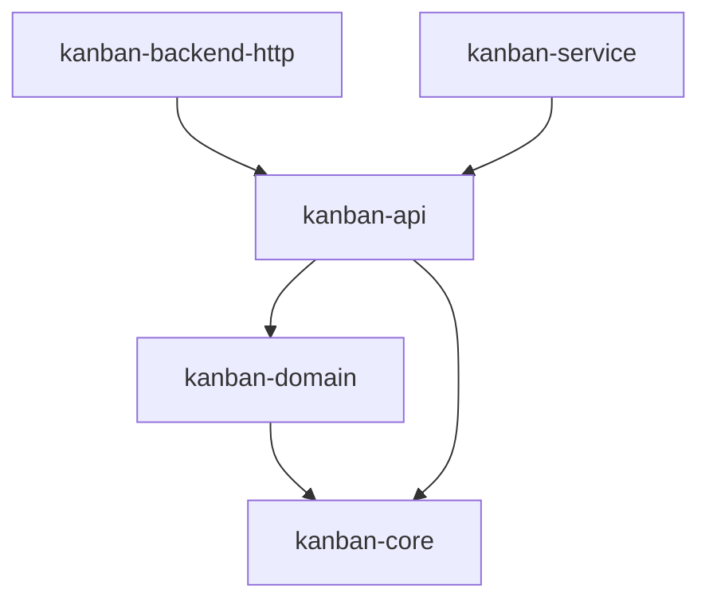

# kanban-api

Wire-format DTOs for the kanban HTTP API. Owns the request/response shapes
shared by `kanban-server` (which serializes them) and `kanban-backend-http`
(which deserializes them), so the two sides of the HTTP boundary cannot drift
independently. Pure data types — no I/O, no business logic.

The crate's own `v1` module is private; canonical imports go through
`kanban_service::api::*` (re-exported via `pub use kanban_api as api;` in
`kanban-service`), keeping a single import path stable as the wire version
evolves (`v2`, `v3`, ...).

## Key public exports

Re-exported from `src/lib.rs` (`pub use v1::{ ... }`):

```rust
pub use v1::{
    ActivateSprintRequest, AddBlockRequest, AddRelatedRequest, ApiError, ArchivedFilterDto,
    AttachChildrenRequest, BlockEdgeDto, BoardResponse, CardGraphResponse, CardPriorityDto,
    CardResponse, CardStatusDto, CarryOverRequest, CarryOverResponse, ChangeEventFrame,
    ChangeKind, CLIENT_ID_HEADER, ColumnResponse, CreateBoardRequest, CreateCardRequest,
    CreateColumnRequest, CreateSprintParts, CreateSprintRequest, DeleteResponse, EntityIdsDto,
    EntityType, ErrorCode, InvalidationDto, MutationResponse, Page, PageParams, Patch,
    PrefixResponse, RelatedEdgeDto,
    RelatesKindDto, ReorderColumnRequest, ReplaceBoardRequest,
    ReplaceCardRequest, ReplaceColumnRequest, ReplaceSprintRequest, SeverityDto, SortFieldDto,
    SortOrderDto, SprintResponse, SprintStatusDto, TaskListViewDto, UpdateBoardRequest,
    UpdateCardRequest, UpdateColumnRequest, UpdateSprintRequest,
};
```

- `*Response` types are the read-side DTOs returned by `kanban-server`'s REST endpoints.
- `Create*Request` / `Replace*Request` / `Update*Request` are the write-side DTOs for `POST` / `PUT` / `PATCH` respectively — `Update*Request` follows JSON Merge Patch (RFC 7386) semantics via `Patch<T>`.
- `ApiError` / `ErrorCode` are the shared error envelope every non-2xx response uses.
- `ChangeEventFrame` is the payload broadcast on `kanban-server`'s internal change-event channel; `entity_type`/`entity_id`/`kind` (`EntityType`, `ChangeKind`) name the single entity a mutation touched and how, retained for existing consumers; `invalidation` (`InvalidationDto`, wrapping `EntityIdsDto`) names the mutation's full blast radius, with `None` meaning the emitter could not describe the change and a consumer must treat it as invalidating everything.
- `MutationResponse<T>` flattens a `T` entity DTO with an `invalidation` field, so create/update routes return the entity's usual fields alongside the mutation's blast radius while remaining parseable as the bare entity. `DeleteResponse` carries only `invalidation`, for routes that return no entity body.
- `CLIENT_ID_HEADER` is the wire name of the client-identity request header, shared so the server's extractor and HTTP clients cannot drift.

The optional `schemars` feature (`dep:schemars`, `features = ["uuid1"]`) derives `schemars::JsonSchema` on these DTOs so `kanban-mcp` can use them directly as `Parameters<T>` for its tool handlers (rmcp requires a JSON Schema).

## Position in the workspace

`kanban-api` sits beside `kanban-persistence` in the layer just above the
domain model: both depend only on `kanban-core` + `kanban-domain`, and both
are depended on by the backend/service layer above them.



Solid arrows are normal (`[dependencies]`) edges; there are no optional or
feature-gated edges into or out of this crate. See the [root README](../../README.md)
for the full workspace dependency graph.

## Dependencies

| Crate | Purpose |
|-------|---------|
| [`kanban-core`](../kanban-core/README.md) | `KanbanError`, `KanbanResult` |
| [`kanban-domain`](../kanban-domain/README.md) | Domain types the DTOs wrap (`Board`, `Card`, `Column`, `Sprint`, ...) |
| `serde` + `serde_json` | Serialization |
| `uuid` | `Uuid` type |
| `chrono` | Timestamps |
| `schemars` (optional, feature `schemars`) | JSON Schema derivation for MCP tool parameters |

## Related crates

Used by: [kanban-backend-http](../kanban-backend-http/README.md) (HTTP request/response bodies) and [kanban-service](../kanban-service/README.md) (re-exported as `kanban_service::api` for MCP/server consumers).
