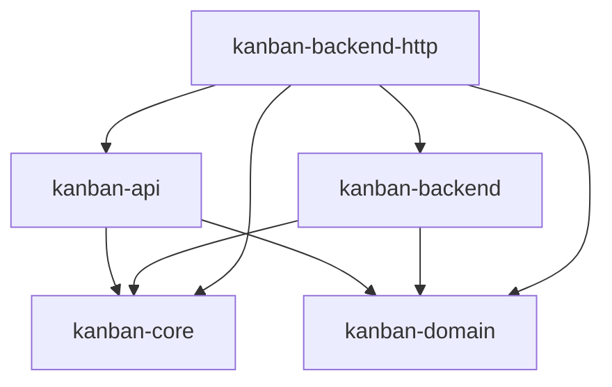

# kanban-backend-http

`HttpBackend`: a `KanbanBackend` implementation backed by a remote
`kanban-server` over HTTP, using `kanban-api`'s DTOs on the wire. Lets a
client (e.g. a future web UI, or a CLI/TUI pointed at a shared server instead
of a local file) talk to boards through the same `KanbanBackend` interface
every other backend implements.

**Status: reads and the core CRUD writes are live.** `HttpBackend` builds its
own dedicated Tokio runtime and HTTP client and implements `KanbanBackend`.
Every `DataStore` read (`src/data_store.rs`) is a real request against
`kanban-server`'s v1 REST endpoints. `RemoteWrites` (`src/remote_writes/`)
implements the nine board/column/card create/update/delete mutations the same
way, and `KanbanBackend::remote_writes()` returns `Some(self)`, so
`KanbanContext` diverts those nine operations straight to the server instead
of running them through its local command-execute-then-log path.

The remaining `DataStore`/`CommandStore` *writes* (graph mutations, sprint and
prefix writes, the command log) still decline under their own name, see
`test_http_backend_stub_method_returns_unsupported_error` in `src/lib.rs`. The
reads in those families are implemented: `get_prefix`, `list_prefixes`,
`get_sprint`, `list_sprints_by_board`, `list_archived_cards_by_board` and
`get_graph` all go over the wire.
`HttpDataStore::get_graph` is the one read that does more than deserialize:
it parses `GET /v1/graph` straight into the domain `DependencyGraph`, whose
`Deserialize` impl validates the DAG on parse (see
[the server README's Graph section](../kanban-server/README.md#graph)).
Returning `Some` from `remote_writes()` also arms a service-layer fence
(`KanbanContext::execute_with_extra`): every mutation this crate does not
implement now fails fast with an explicit "not supported over the HTTP
backend in v1" error instead of the generic `with_transaction` decline it hit
before this crate had any `RemoteWrites` impl.

## Key public exports

```rust
pub struct HttpBackend {
    base_url: String,
    client: reqwest::Client,
    runtime: tokio::runtime::Runtime,
    instance_id: uuid::Uuid,
}

impl HttpBackend {
    pub fn new(base_url: &str) -> kanban_domain::KanbanResult<Self>;
}

impl kanban_backend::KanbanBackend for HttpBackend {
    fn as_data_store(&self) -> &dyn kanban_domain::DataStore { self }
    fn instance_id(&self) -> uuid::Uuid { self.instance_id }
}

pub struct HttpBackendFactory;

impl kanban_backend::KanbanBackendFactory for HttpBackendFactory {
    fn name(&self) -> &str { "http" }
    fn matches_locator(&self, locator: &str, _header: &[u8]) -> bool;
    fn is_remote(&self) -> bool { true }
    async fn create(&self, locator: &str, config: &kanban_core::AppConfig)
        -> kanban_domain::KanbanResult<std::sync::Arc<dyn kanban_backend::KanbanBackend>>;
}
```

`HttpBackend::new` rejects a locator that does not carry an `http://` or
`https://` scheme (`kanban_core::scheme_of`), then normalizes a trailing
slash off `base_url`, builds a `reqwest::Client`, and spins up a dedicated
multi-thread Tokio runtime — every synchronous `DataStore`/`CommandStore`
call bridges onto that runtime via a private `block_on` helper rather than
assuming an ambient one, since `KanbanBackend`'s inherent methods are
synchronous but the HTTP calls underneath are async. That runtime is handed to
`shutdown_background()` when the backend is dropped, so a caller that drops it
from inside its own async context does not abort.

`HttpBackendFactory::matches_locator` claims a locator only when its scheme is
`http` or `https`, so it is safe to register alongside `JsonBackendFactory`
and `SqliteBackendFactory` in any registration order — both of those decline
a remote locator before their own content/suffix checks run.

## Position in the workspace



All edges shown are normal (`[dependencies]`) edges. `kanban-cli` (optional,
behind its `http` feature, default-on), `kanban-mcp` (same), and `kanban-tui`
(unconditional) each depend on `kanban-backend-http` and register
`HttpBackendFactory`, so an `http://`/`https://` locator resolves end to end
from all three. The crate also has `[dev-dependencies]` edges on
`kanban-server` (feature
`test-helpers`), used to spin up a real server for integration tests; that's
test-only and omitted from the diagram above. See the
[root README](../../README.md) for the full workspace dependency graph.

## Dependencies

| Crate | Purpose |
|-------|---------|
| [`kanban-core`](../kanban-core/README.md) | `KanbanResult`, `KanbanError` |
| [`kanban-domain`](../kanban-domain/README.md) | `DataStore`, `KanbanResult`, `KanbanError` |
| [`kanban-backend`](../kanban-backend/README.md) | `KanbanBackend` trait implemented by `HttpBackend` |
| [`kanban-api`](../kanban-api/README.md) | Wire DTOs for the HTTP request/response bodies |
| `reqwest` | HTTP client |
| `tokio` | Dedicated runtime for bridging sync trait methods onto async HTTP calls |
| `async-trait` | Async trait methods |
| `uuid` | Instance ID |
| `chrono` | Timestamps |

## Related crates

`HttpBackendFactory` is exported from this crate's root for an application to
register in its own `kanban_backend::KanbanBackendRegistry`. `kanban-cli`,
`kanban-mcp`, and `kanban-tui` all register it, alongside their local
`json`/`sqlite` factories. [kanban-server](../kanban-server/README.md)
depends on this crate only in reverse, as a dev-dependency (feature
`test-helpers`) to spin up a real server for this crate's own integration
tests.
