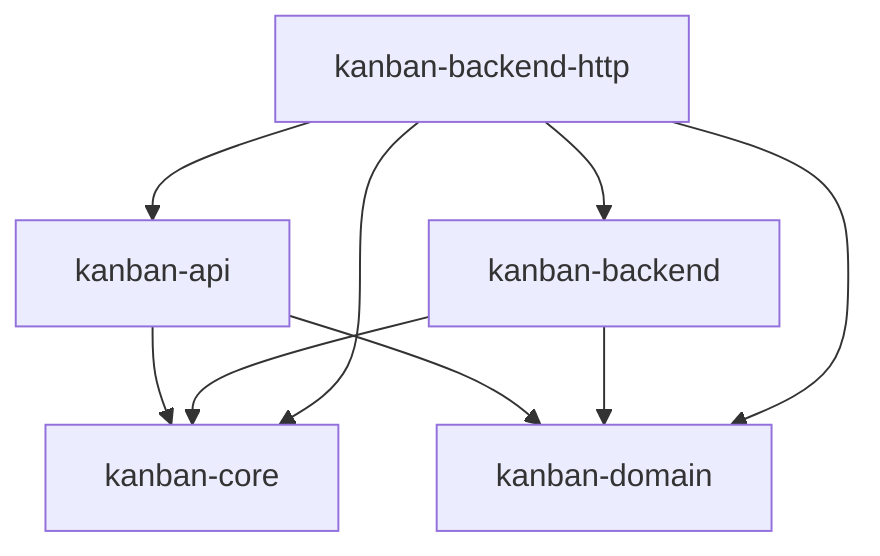

# kanban-backend-http

`HttpBackend`: a `KanbanBackend` implementation backed by a remote
`kanban-server` over HTTP, using `kanban-api`'s DTOs on the wire. Lets a
client (e.g. a future web UI, or a CLI/TUI pointed at a shared server instead
of a local file) talk to boards through the same `KanbanBackend` interface
every other backend implements.

**Status: early / stub.** `HttpBackend` builds its own dedicated Tokio
runtime and HTTP client, and implements `KanbanBackend` (so it type-checks
against the trait and is object-safe), but its `DataStore`/`CommandStore`
methods (in `src/data_store.rs` / `src/command_store.rs`) are stubs that
return an unsupported-operation error — see
`test_http_backend_stub_method_returns_unsupported_error` in `src/lib.rs`.
Real reads/writes against `kanban-server`'s REST endpoints are follow-up work.

## Key public exports

```rust
pub struct HttpBackend {
    base_url: String,
    client: reqwest::Client,
    runtime: tokio::runtime::Runtime,
    instance_id: uuid::Uuid,
}

impl HttpBackend {
    pub fn new(base_url: &str) -> kanban_domain::KanbanResult<Self>;
}

impl kanban_backend::KanbanBackend for HttpBackend {
    fn as_data_store(&self) -> &dyn kanban_domain::DataStore { self }
    fn instance_id(&self) -> uuid::Uuid { self.instance_id }
}
```

`HttpBackend::new` normalizes a trailing slash off `base_url`, builds a
`reqwest::Client`, and spins up a dedicated multi-thread Tokio runtime — every
synchronous `DataStore`/`CommandStore` call bridges onto that runtime via a
private `block_on` helper rather than assuming an ambient one, since
`KanbanBackend`'s inherent methods are synchronous but the HTTP calls
underneath are async.

## Position in the workspace



All edges shown are normal (`[dependencies]`) edges. No crate in the workspace
currently has a normal or optional dependency on `kanban-backend-http` — it
has no intra-workspace dependents yet (it's meant to be composed by an
external embedder, or by a future `kanban-cli`/`kanban-tui` "remote mode").
The crate does have a `[dev-dependencies]` edge on `kanban-server` (feature
`test-helpers`), used to spin up a real server for integration tests; that's
test-only and omitted from the diagram above. See the
[root README](../../README.md) for the full workspace dependency graph.

## Dependencies

| Crate | Purpose |
|-------|---------|
| [`kanban-core`](../kanban-core/README.md) | `KanbanResult`, `KanbanError` |
| [`kanban-domain`](../kanban-domain/README.md) | `DataStore`, `KanbanResult`, `KanbanError` |
| [`kanban-backend`](../kanban-backend/README.md) | `KanbanBackend` trait implemented by `HttpBackend` |
| [`kanban-api`](../kanban-api/README.md) | Wire DTOs for the HTTP request/response bodies |
| `reqwest` | HTTP client |
| `tokio` | Dedicated runtime for bridging sync trait methods onto async HTTP calls |
| `async-trait` | Async trait methods |
| `uuid` | Instance ID |
| `chrono` | Timestamps |

## Related crates

Used by: none yet — no crate in the workspace currently registers `HttpBackend` as a `KanbanBackendFactory`. [kanban-server](../kanban-server/README.md) depends on this crate only in reverse, as a dev-dependency (feature `test-helpers`) to spin up a real server for this crate's own integration tests.
