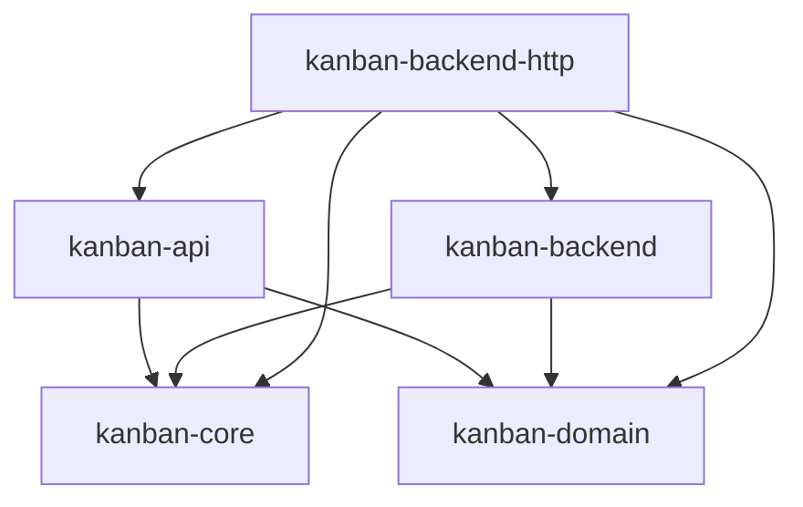

# kanban-backend-http

`HttpBackend`: a `KanbanBackend` implementation backed by a remote
`kanban-server` over HTTP, using `kanban-api`'s DTOs on the wire. Lets a
client (e.g. a future web UI, or a CLI/TUI pointed at a shared server instead
of a local file) talk to boards through the same `KanbanBackend` interface
every other backend implements.

**Status: reads, the core CRUD writes, the card batch mutations, the graph
mutations, and the sprint CRUD and lifecycle writes are live.**
`HttpBackend` builds its own dedicated Tokio runtime and HTTP client and
implements `KanbanBackend`. Every `DataStore` read (`src/data_store.rs`) is a
real request against `kanban-server`'s v1 REST endpoints. `RemoteWrites`
(`src/remote_writes/`) implements the nine board/column/card create/update/delete
mutations plus the board and card archive/restore pairs, card move, and card
sprint assign/unassign via `RemoteBoardWrites` and `RemoteCardWrites`, and
`KanbanBackend::remote_writes()` returns `Some(self)`, so `KanbanContext`
diverts those sixteen operations straight to the server instead of running
them through its local command-execute-then-log path. The four card batch
mutations (`archive_cards`, `move_cards`, `assign_cards_to_sprint`,
`update_cards`) are diverted the same way via `RemoteBatchWrites`
(`src/remote_writes/batch.rs`) and `KanbanBackend::remote_batch_writes()`:
each is a single request against the `/v1/cards/batch/*` routes, which run
the `*_detailed` service functions server-side. The client returns the
server's per-id outcome and its `Invalidation` verbatim, so the `*_detailed`
variants match a local run exactly. The `(count, Invalidation)` variants
derive the count from that outcome instead of the local before/after diff, so
the count can differ from a local run. Three cases are pinned by the
divergence tests in `tests/write_parity.rs`: a card already on the target
sprint (`assign_cards_to_sprint`) or already in the target column
(`move_cards`) counts as succeeded over HTTP and 0 locally, and an
already-archived card in an archive batch (`archive_cards`) counts as
succeeded over HTTP and 0 locally. The store state matches in all three; the
`Invalidation` matches too, except for a batch made only of already-archived
cards, where the server reports an empty `Invalidation::Entities` (nothing
changed) and a local run reports `Invalidation::All`. The list is not
exhaustive: a batch with duplicate ids, or a
`move_cards` batch mixing known and unknown ids, also diverges. Each per-id
failure carries the server's `ErrorCode`, and an all-failed `(count,
Invalidation)` call is rebuilt through the same `From<ApiError> for
KanbanError` as every other remote error, so a server fault surfaces as
`KanbanError::Internal`, one of the four dependency-graph codes as its typed
`DependencyError` variant, and any other client error as a `Validation` error
whose message carries the code (e.g. `validation error: NOT_FOUND: Card <id>
not found`). The six graph edge mutations (`attach_children`,
`detach_children`, `block`, `unblock`, `relate`, `dissociate`) are diverted the
same way via `RemoteGraphWrites` (`src/remote_writes/graph.rs`) and
`KanbanBackend::remote_graph_writes()`: each is a single request against the
`/v1/cards/{id}/children`, `/v1/cards/{id}/blocks` and `/v1/cards/{id}/related`
routes (see [the server README's Graph
section](../kanban-server/README.md#graph)), and the born-archived decision
for a new edge is made server-side from the server's own card state, not the
client's. The sprint CRUD and lifecycle mutations (`create_sprint`,
`update_sprint`, `delete_sprint`, `activate_sprint`, `complete_sprint`,
`cancel_sprint`, `carry_over_sprint_cards`) are diverted the same way via
`RemoteSprintWrites` (`src/remote_writes/sprints.rs`) and
`KanbanBackend::remote_sprint_writes()`: every one of them that returns a
`Sprint` (create, update, activate, complete, cancel) issues a mutation
request and then re-fetches the owning board so the returned `Sprint`'s
`name_index` resolves against the server's own `sprint_names` pool instead of
an empty one, since that pool is the only way a client-side `Sprint`
conversion can know it. When that board re-fetch fails after the write
already committed, the sprint is returned unnamed with a warning instead of
turning the write into an error. `carry_over_sprint_cards` returns the
server's moved count from a single `POST /v1/sprints/{id}/carry-over` and
makes no board re-read.

The remaining `DataStore`/`CommandStore` *writes* (prefix writes and the
command log) still decline under their own name, see
`test_http_backend_stub_method_returns_unsupported_error` in `src/lib.rs`. The
reads in those families are implemented: `get_prefix`, `list_prefixes`,
`get_sprint`, `list_sprints_by_board`, `list_archived_cards_by_board`,
`get_archived_card` and `get_graph` all go over the wire.
`HttpDataStore::get_graph` is the one read that does more than deserialize:
it parses `GET /v1/graph` straight into the domain `DependencyGraph`, whose
`Deserialize` impl validates the DAG on parse (see
[the server README's Graph section](../kanban-server/README.md#graph)).
Returning `Some` from `remote_writes()` also arms a service-layer fence
(`KanbanContext::execute_with_extra`): every mutation this crate does not
implement now fails fast with an explicit "not supported over the HTTP
backend in v1" error instead of the generic `with_transaction` decline it hit
before this crate had any `RemoteWrites` impl.

## Older servers

A write the server commits is reported as success even when the answer is a bare entity, or an empty `204 No Content` to a delete, rather than the `MutationResponse<T>`/`DeleteResponse` wrapper current servers send. A missing `invalidation` field is treated as `Invalidation::All`, so the client over-invalidates rather than reporting a serialization error after the write already happened.

A write route the server has no handler for (a 404 or 405 answered without an `ApiError` body) fails before anything is written, with `KanbanError::UnsupportedByServer` naming the method, the route template and the server URL, for example:

```
kanban server at http://host:5177 does not support POST /v1/cards/{id}/move, so nothing was written. Upgrade the server to this client's version (v0.12.0) to use it.
```

`is_unsupported()` is true for it. A 404 answered WITH an `ApiError` body (an entity genuinely not found) still maps to the server's own `NOT_FOUND` error as before.

## Version handshake

`HttpBackend::probe()` (called by `KanbanContext::open`, before any write) reads the `version` field of `GET /health` and refuses to open when the server's `major.minor` is lower than this binary's, or the field is absent entirely (a server that predates the handshake). A newer server is accepted. The error names the URL, the server's version (or that it reports none), and this client's version, and says to upgrade the server first:

```
kanban server at http://host:5177 reports no version, which is older than this client (v0.11.0). Upgrade the server before the client.
kanban server at http://host:5177 is v0.11.0, which is older than this client (v0.12.0). Upgrade the server before the client.
```

The first form is what a server released before the handshake (v0.10.x) produces.

## Key public exports

```rust
pub struct HttpBackend {
    base_url: String,
    client: reqwest::Client,
    runtime: tokio::runtime::Runtime,
    instance_id: uuid::Uuid,
}

impl HttpBackend {
    pub fn new(base_url: &str) -> kanban_domain::KanbanResult<Self>;
}

impl kanban_backend::KanbanBackend for HttpBackend {
    fn as_data_store(&self) -> &dyn kanban_domain::DataStore { self }
    fn instance_id(&self) -> uuid::Uuid { self.instance_id }
}

pub struct HttpBackendFactory;

impl kanban_backend::KanbanBackendFactory for HttpBackendFactory {
    fn name(&self) -> &str { "http" }
    fn matches_locator(&self, locator: &str, _header: &[u8]) -> bool;
    fn is_remote(&self) -> bool { true }
    async fn create(&self, locator: &str, config: &kanban_core::AppConfig)
        -> kanban_domain::KanbanResult<std::sync::Arc<dyn kanban_backend::KanbanBackend>>;
}
```

`HttpBackend::new` rejects a locator that does not carry an `http://` or
`https://` scheme (`kanban_core::scheme_of`), then normalizes a trailing
slash off `base_url`, builds a `reqwest::Client`, and spins up a dedicated
multi-thread Tokio runtime — every synchronous `DataStore`/`CommandStore`
call bridges onto that runtime via a private `block_on` helper rather than
assuming an ambient one, since `KanbanBackend`'s inherent methods are
synchronous but the HTTP calls underneath are async. That runtime is handed to
`shutdown_background()` when the backend is dropped, so a caller that drops it
from inside its own async context does not abort.

`HttpBackendFactory::matches_locator` claims a locator only when its scheme is
`http` or `https`, so it is safe to register alongside `JsonBackendFactory`
and `SqliteBackendFactory` in any registration order — both of those decline
a remote locator before their own content/suffix checks run.

## Position in the workspace


```mermaid
graph TD
    CORE[kanban-core] 
    DOM[kanban-domain]
    API[kanban-api] --> CORE
    API --> DOM
    BE[kanban-backend] --> CORE
    BE --> DOM
    BEHTTP[kanban-backend-http] --> CORE
    BEHTTP --> DOM
    BEHTTP --> BE
    BEHTTP --> API
```

All edges shown are normal (`[dependencies]`) edges. `kanban-cli` (optional,
behind its `http` feature, default-on), `kanban-mcp` (same), and `kanban-tui`
(unconditional) each depend on `kanban-backend-http` and register
`HttpBackendFactory`, so an `http://`/`https://` locator resolves end to end
from all three. The crate also has `[dev-dependencies]` edges on
`kanban-server` (feature
`test-helpers`), used to spin up a real server for integration tests; that's
test-only and omitted from the diagram above. See the
[root README](../../README.md) for the full workspace dependency graph.

## Dependencies

| Crate | Purpose |
|-------|---------|
| [`kanban-core`](../kanban-core/README.md) | `KanbanResult`, `KanbanError` |
| [`kanban-domain`](../kanban-domain/README.md) | `DataStore`, `KanbanResult`, `KanbanError` |
| [`kanban-backend`](../kanban-backend/README.md) | `KanbanBackend` trait implemented by `HttpBackend` |
| [`kanban-api`](../kanban-api/README.md) | Wire DTOs for the HTTP request/response bodies |
| `reqwest` | HTTP client |
| `tokio` | Dedicated runtime for bridging sync trait methods onto async HTTP calls |
| `async-trait` | Async trait methods |
| `uuid` | Instance ID |
| `chrono` | Timestamps |

## Related crates

`HttpBackendFactory` is exported from this crate's root for an application to
register in its own `kanban_backend::KanbanBackendRegistry`. `kanban-cli`,
`kanban-mcp`, and `kanban-tui` all register it, alongside their local
`json`/`sqlite` factories. [kanban-server](../kanban-server/README.md)
depends on this crate only in reverse, as a dev-dependency (feature
`test-helpers`) to spin up a real server for this crate's own integration
tests.
