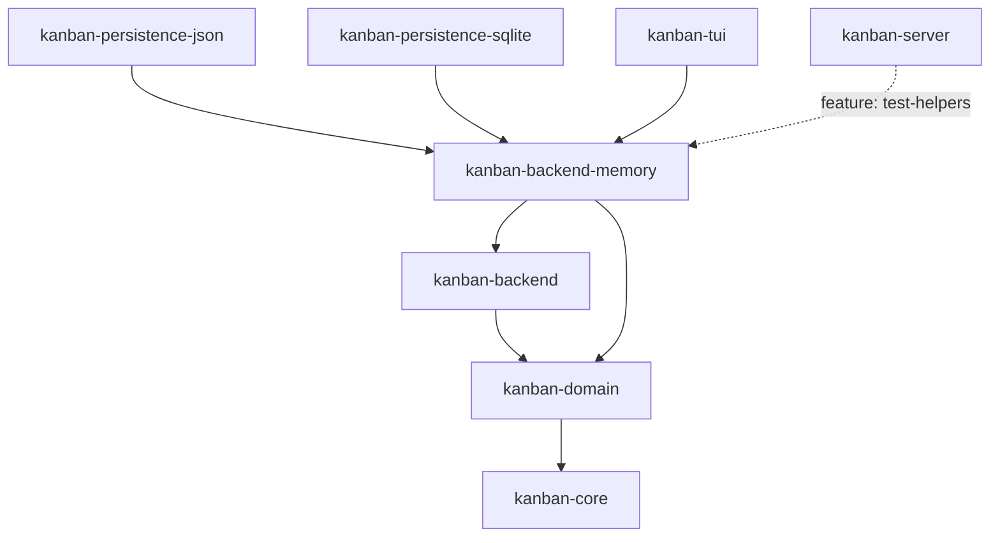

# kanban-backend-memory

An ephemeral `KanbanBackend` implementation: `InMemoryStore` holds all board
state in a plain in-process data structure with no persistence at all. Used
whenever the CLI/TUI/MCP server is launched without a file (`kanban` with no
arguments), and as the lightweight fixture backend for tests across the
workspace that need a working `KanbanBackend` without touching disk. Extracted
out of `kanban-service` into its own crate in KAN-1023.

## Key public exports

From `src/lib.rs` / `src/in_memory_store.rs`:

```rust
pub use in_memory_store::InMemoryStore;

impl kanban_backend::KanbanBackend for InMemoryStore {
    fn as_data_store(&self) -> &dyn kanban_domain::DataStore {
        self
    }
    // All lifecycle defaults are correct for in-memory:
    // flush = noop, reload = noop, needs_flush = false, needs_save_worker = false.
}
```

`InMemoryStore` itself implements `kanban_domain::DataStore` (and
`CommandStore`) directly; the `KanbanBackend` impl above is a thin marker that
accepts every trait default except `as_data_store`. There is no
`persistence_metadata` (always `None`) and no `health_checker` (always
`None`) — those only make sense for a backend with actual durable storage
behind it.

## Position in the workspace



Solid arrows are normal (`[dependencies]`) edges; the dotted arrow is
feature-gated. Not shown: `kanban-domain`, `kanban-persistence`, and
`kanban-service` each dev-depend on this crate (test-only fixture, not part
of the production graph). See the [root README](../../README.md) for the
full workspace dependency graph and its note on dev-only edges.

## Dependencies

| Crate | Purpose |
|-------|---------|
| [`kanban-domain`](../kanban-domain/README.md) | `DataStore`, `CommandStore`, and the domain model this crate stores |
| [`kanban-backend`](../kanban-backend/README.md) | `KanbanBackend` trait implemented by `InMemoryStore` |
| `uuid` | Entity IDs |
| `chrono` | Timestamps |

## Related crates

Used by: [kanban-persistence-json](../kanban-persistence-json/README.md), [kanban-persistence-sqlite](../kanban-persistence-sqlite/README.md), and [kanban-tui](../kanban-tui/README.md), plus [kanban-server](../kanban-server/README.md) behind its `test-helpers` feature.
