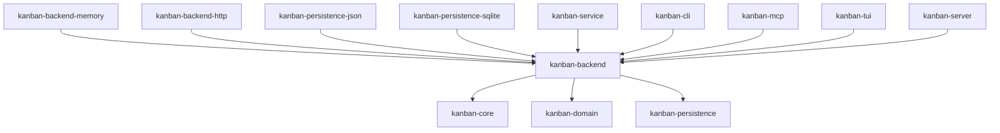

# kanban-backend

Defines the `KanbanBackend` trait and the registry/factory machinery that lets
the service layer talk to a storage backend without knowing which one is
plugged in. This is the abstraction `kanban-service` depends on instead of
depending on `kanban-persistence-json` / `kanban-persistence-sqlite` /
`kanban-backend-memory` directly (KAN-1027) — adding a new backend means
implementing `KanbanBackend` and `KanbanBackendFactory` in its own crate and
registering it from the application, not editing `kanban-service`.

## Key public exports

From `src/lib.rs`, `src/factory.rs`, `src/remote_writes.rs`:

```rust
pub use factory::{KanbanBackendFactory, KanbanBackendRegistry};
pub use remote_writes::RemoteWrites;

#[async_trait]
pub trait KanbanBackend: DataStore + CommandStore + Send + Sync {
    fn as_data_store(&self) -> &dyn DataStore;
    async fn flush(&self) -> KanbanResult<()> { Ok(()) }
    async fn reload(&self) -> KanbanResult<()> { Ok(()) }
    fn needs_flush(&self) -> bool { false }
    fn needs_save_worker(&self) -> bool { false }
    fn instance_id(&self) -> Uuid { Uuid::nil() }
    fn persistence_metadata(&self) -> Option<PersistenceMetadata> { None }
    fn health_checker(&self) -> Option<Box<dyn kanban_core::HealthChecker>> { None }
    fn remote_writes(&self) -> Option<&dyn RemoteWrites> { None }
    fn with_transaction(&self, f: &mut dyn FnMut() -> KanbanResult<()>) -> KanbanResult<()> { /* default: snapshot + restore on error */ }
}
```

`KanbanBackend` combines `kanban_domain::DataStore` (entity CRUD) with
`kanban_domain::CommandStore` (the audit/command log) plus the lifecycle hooks
above. `with_transaction`'s default implementation snapshots state before
running `f` and restores it on failure (cheap in-memory, expensive on disk);
disk-backed backends override it with a native transaction.

```rust
#[async_trait::async_trait]
pub trait KanbanBackendFactory: Send + Sync {
    fn name(&self) -> &str;
    fn matches_locator(&self, _locator: &str, _header: &[u8]) -> bool { false }
    async fn create(&self, locator: &str, config: &AppConfig) -> KanbanResult<Arc<dyn KanbanBackend>>;
}

#[derive(Default)]
pub struct KanbanBackendRegistry { /* private */ }

impl KanbanBackendRegistry {
    pub fn new() -> Self;
    pub fn register(&mut self, factory: Box<dyn KanbanBackendFactory>);
    pub fn is_empty(&self) -> bool;
    pub fn names(&self) -> Vec<&str>;
    pub fn for_name(&self, name: &str) -> Option<&dyn KanbanBackendFactory>;
    pub fn for_locator(&self, locator: &str) -> Option<&dyn KanbanBackendFactory>;
}
```

`for_name` and `for_locator` are both first-registration-wins. `for_locator`
reads up to the first 32 bytes of the file at `locator` (empty if it doesn't
exist or isn't readable) and asks each registered factory's `matches_locator`
in registration order — the same content-sniffing pattern
`kanban_persistence::StoreRegistry` uses one layer down.

`RemoteWrites` (in `remote_writes.rs`) is the escape hatch for backends where
the remote side is authoritative for create/update/delete (i.e. `kanban-backend-http`):
`KanbanBackend::remote_writes()` returns `Some(&dyn RemoteWrites)` to bypass
local command execution entirely; every local backend (JSON, SQLite,
in-memory) returns `None`, so there's zero behavior change for them.

## Implementing `KanbanBackendFactory`

A minimal factory just needs a name, a content-sniffing predicate, and a
constructor. `kanban-persistence-json`'s `JsonBackendFactory` (`src/backend_factory.rs`)
is the smallest real example in the workspace:

```rust
pub struct JsonBackendFactory;

#[async_trait::async_trait]
impl KanbanBackendFactory for JsonBackendFactory {
    fn name(&self) -> &str {
        "json"
    }

    fn matches_locator(&self, _locator: &str, header: &[u8]) -> bool {
        let trimmed = header.iter().find(|b| !b.is_ascii_whitespace());
        header.is_empty() || matches!(trimmed, Some(b'{') | Some(b'['))
    }

    async fn create(&self, locator: &str, _config: &AppConfig) -> KanbanResult<Arc<dyn KanbanBackend>> {
        let store: Arc<dyn PersistenceStore + Send + Sync> = Arc::new(JsonFileStore::new(locator));
        Ok(Arc::new(JsonDataStore::new(store)))
    }
}
```

This is the layer above `StoreFactory`/`PersistenceStore` — see
[`kanban-persistence`'s "Writing a Third-Party Backend"](../kanban-persistence/README.md#writing-a-third-party-backend)
for the full walkthrough of the storage-format layer this factory wraps,
including the contract test suite and `register_backend` wiring on
`CliApp`/`McpServer`.

## Position in the workspace



All edges shown are normal (`[dependencies]`) edges — every crate above
depends on `kanban-backend` unconditionally, none behind a feature flag. See
the [root README](../../README.md) for the full workspace dependency graph
(including the optional/feature edges elsewhere in the graph).

## Dependencies

| Crate | Purpose |
|-------|---------|
| [`kanban-core`](../kanban-core/README.md) | `KanbanResult`, `AppConfig`, `HealthChecker` |
| [`kanban-domain`](../kanban-domain/README.md) | `DataStore`, `CommandStore` traits this crate's trait is built on |
| [`kanban-persistence`](../kanban-persistence/README.md) | `PersistenceMetadata` type surfaced by `persistence_metadata()` |
| `async-trait` | Async trait methods |
| `uuid` | Instance IDs |
| `chrono` | Timestamps |

## Related crates

Used by: the concrete backend crates [kanban-backend-memory](../kanban-backend-memory/README.md), [kanban-backend-http](../kanban-backend-http/README.md), [kanban-persistence-json](../kanban-persistence-json/README.md), and [kanban-persistence-sqlite](../kanban-persistence-sqlite/README.md), plus [kanban-service](../kanban-service/README.md).
