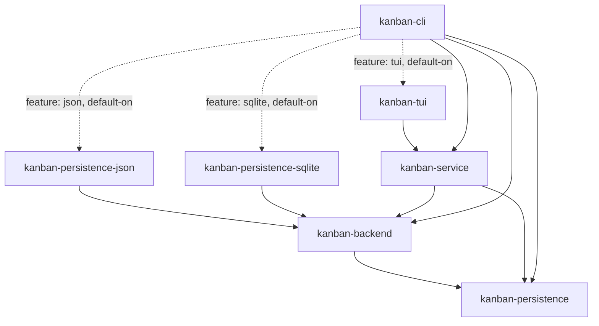

# kanban-cli

CLI entry point for the kanban workspace. Parses commands with [clap](https://docs.rs/clap), loads a `CliContext` wrapping `KanbanContext`, and emits JSON to stdout.

## Usage

```bash
kanban [FILE] [COMMAND]
kanban                        # Launch TUI; pick or skip a file from the startup dialog
kanban boards.json            # Launch TUI with specific file
kanban boards.json board list # Run a CLI command
kanban init boards.json --board "Project"  # Create file + first board, exit
```

**File selection priority** (TUI launches the choose-storage dialog when none of these is set):
1. Positional `FILE` argument
2. `KANBAN_FILE` environment variable
3. Config file `storage_location`

All commands output JSON to stdout. Errors are written to stderr.

---

## Command Reference

### `board`

```bash
kanban board create --name <NAME> [--card-prefix <PREFIX>]
kanban board list
kanban board get <ID>
kanban board update <ID> [--name <NAME>] [--description <DESC>]
                         [--sprint-prefix <PREFIX>] [--card-prefix <PREFIX>]
kanban board delete <ID>
```

### `column`

```bash
kanban column create --board <ID> --name <NAME> [--position <N>]
kanban column list --board <ID>
kanban column get <ID>
kanban column update <ID> [--name <NAME>] [--position <N>] [--wip-limit <N>]
kanban column delete <ID>
kanban column reorder <ID> --position <N>
```

### `card`

```bash
# CRUD
kanban card create --board <ID> --column <ID> --title <TITLE>
                   [--description <DESC>] [--priority low|medium|high|critical]
                   [--points <N>] [--due-date <YYYY-MM-DD>]
kanban card list [--board <ID>] [--column <ID>] [--sprint <ID>]
                 [--status todo|in_progress|blocked|done]
                 [--page <N>] [--page-size <N>]
kanban card get <ID_OR_IDENTIFIER>
kanban card update <ID_OR_IDENTIFIER> [--title <TITLE>] [--description <DESC>]
                   [--priority <P>] [--status <S>] [--points <N>]
                   [--due-date <DATE>] [--clear-due-date]
kanban card delete <ID_OR_IDENTIFIER>

# Movement & archiving
kanban card move <ID_OR_IDENTIFIER> --column <ID> [--position <N>]
kanban card archive <ID_OR_IDENTIFIER>
kanban card restore <ID_OR_IDENTIFIER> [--column <ID>]

# Sprint
kanban card assign-sprint <ID_OR_IDENTIFIER> --sprint <ID>
kanban card unassign-sprint <ID_OR_IDENTIFIER>

# Git
kanban card branch-name <ID_OR_IDENTIFIER>
kanban card git-checkout <ID_OR_IDENTIFIER>

# Bulk operations
kanban card archive-cards --cards <UUID,UUID,...>
kanban card move-cards --cards <UUID,UUID,...> --column <ID>
kanban card assign-cards-to-sprint --cards <UUID,UUID,...> --sprint <ID>
```

**Card identifier resolution**: `<ID_OR_IDENTIFIER>` accepts:
- A full UUID: `550e8400-e29b-41d4-a716-446655440000`
- A prefix+number identifier: `KAN-5`
- If ambiguous, the command prints all matching cards and exits with error

### `sprint`

```bash
kanban sprint create --board <ID> [--name <NAME>] [--prefix <PREFIX>]
kanban sprint list --board <ID>
kanban sprint get <ID>
kanban sprint update <ID> [--name <NAME>] [--prefix <PREFIX>]
                          [--card-prefix <PREFIX>]
                          [--start-date <DATE>] [--end-date <DATE>]
kanban sprint activate <ID> [--duration-days <N>]
kanban sprint complete <ID>
kanban sprint cancel <ID>
kanban sprint delete <ID>
kanban sprint carry-over --from <ID> --to <ID>
```

### `relation`

Manage parent / child relationships between cards. All four subcommands
accept UUIDs or short identifiers (e.g. `KAN-5`). Cross-board parent /
child relations are permitted.

```bash
kanban relation add <PARENT> <CHILD> [<CHILD>...]
kanban relation remove <PARENT> <CHILD> [<CHILD>...]
kanban relation parents <CARD> [--sort <KEY>] [--order <DIR>]
kanban relation children <CARD> [--sort <KEY>] [--order <DIR>]
```

`add` and `remove` are atomic: the entire multi-child batch is committed
or rolled back as a single transaction. A mid-list failure (cycle,
self-reference, duplicate, unknown card) leaves both in-memory and
on-disk state unchanged. Error messages name the offending parent and
child via the shared `messages::*` helpers (e.g.
`"cycle detected: making KAN-5 a parent of KAN-7 would create a cycle"`).

`--sort` accepts `card-number / priority / points / created-at /
updated-at / status / position`. `--order` accepts `asc / desc`. Default:
`--sort card-number --order asc`.

### `init`

```bash
kanban init [FILE] [--board <NAME>]
```

Create a board file and an initial board, then exit without opening the TUI.

- `FILE` — target file path (default: uses KANBAN_FILE env var, then config storage_location, then boards.json)
- `--board` — name of the first board to create. Omit to create an empty file.

Examples:

```bash
kanban init                    # creates boards.json with no entities
kanban init boards.json        # creates boards.json with no entities
kanban init boards.json --board "Sprint 1"  # creates boards.json with "Sprint 1"
KANBAN_FILE=work.json kanban init --board "Team Board"  # uses env var
```

### Top-level commands

```bash
kanban export [--board <ID>] [--output <FILE>]
kanban import <FILE>
kanban migrate <SOURCE> <BACKEND> [-o <OUTPUT>] [--source-backend <BACKEND>]
kanban completions <bash|zsh|fish|powershell>
```

**`migrate`** moves all data from one storage backend to another:
- `SOURCE` — path to the source file
- `BACKEND` — target backend: `json` or `sqlite`
- `-o, --output` — output path (default: source filename with the new backend's extension)
- `--source-backend` — override auto-detection of the source format

```bash
# JSON → SQLite
kanban migrate boards.json sqlite

# SQLite → JSON with explicit output path
kanban migrate boards.sqlite json -o backup.json

# Source format cannot be detected from extension
kanban migrate data.bin json --source-backend sqlite
```

---

## Output Format

All commands emit JSON to stdout:

```bash
$ kanban board list
[
  {
    "id": "...",
    "name": "My Project",
    ...
  }
]

$ kanban card get KAN-5
{
  "id": "...",
  "title": "Fix login bug",
  "priority": "High",
  ...
}
```

Bulk operations emit a `BatchOperationResult`:

```json
{
  "succeeded": ["uuid1", "uuid2"],
  "failed": [
    { "id": "uuid3", "error": "card not found" }
  ]
}
```

---

## Shell Completions

```bash
kanban completions bash   >> ~/.bashrc
kanban completions zsh    >> ~/.zshrc
kanban completions fish   > ~/.config/fish/completions/kanban.fish
kanban completions powershell >> $PROFILE
```

---

## Environment Variables

| Variable | Description |
|----------|-------------|
| `KANBAN_FILE` | Default data file path |
| `EDITOR` | External editor for description editing (TUI) |

---

## Position in the workspace



Solid arrows are normal (`[dependencies]`) edges; dotted arrows are
feature-gated (all three optional features are on by default, so a plain
`cargo build`/`cargo install kanban-cli` pulls all of them — `--no-default-features
--features sqlite` builds a JSON-less, TUI-less binary). This is the
KAN-1027 shape: `kanban-cli`, not `kanban-service`, registers the concrete
backends (`kanban-persistence-json`, `kanban-persistence-sqlite`) it ships
with. See the [root README](../../README.md) for the full workspace
dependency graph.

## Dependencies

| Crate | Purpose |
|-------|---------|
| [`kanban-service`](../kanban-service/README.md) | `KanbanContext`, all domain operations |
| [`kanban-core`](../kanban-core/README.md) | Shared types, config |
| [`kanban-domain`](../kanban-domain/README.md) | Domain models |
| [`kanban-persistence`](../kanban-persistence/README.md) | `PersistenceStore`, `StoreRegistry` |
| [`kanban-backend`](../kanban-backend/README.md) | `KanbanBackend`, `KanbanBackendRegistry` |
| [`kanban-persistence-json`](../kanban-persistence-json/README.md) (optional, feature `json`, default-on) | JSON backend, registered at startup |
| [`kanban-persistence-sqlite`](../kanban-persistence-sqlite/README.md) (optional, feature `sqlite`, default-on) | SQLite backend, registered at startup |
| [`kanban-tui`](../kanban-tui/README.md) (optional, feature `tui`, default-on) | TUI launch |
| `clap` + `clap_complete` | CLI argument parsing, shell completions |
| `tokio` | Async runtime |
| `serde` + `serde_json` | JSON output formatting |
| `tracing` + `tracing-subscriber` | Structured logging |
| `anyhow` + `thiserror` | Error handling |

## Related crates

Used by: none — `kanban-cli` is a binary entry point, not a library dependency of any other workspace crate.
