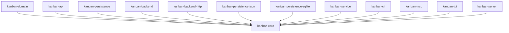

# kanban-core

Foundation crate for the kanban workspace. Provides shared types, error handling, configuration, state primitives, and the dependency graph used by all other crates.

## Modules

### Error Types

#### `CoreError`

```rust
pub enum CoreError {
    Validation(String),  // Input validation failure
    Config(String),      // Configuration error
}

pub type CoreResult<T> = Result<T, CoreError>;
```

### `AppConfig`

Application configuration loaded from a TOML or JSON config file.

| Field | Type | Default | Description |
|-------|------|---------|-------------|
| `configuration_format` | `Option<String>` | `"toml"` | Config file format (`"json"` or `"toml"`) |
| `configuration_location` | `Option<String>` | system default | Path to the config file |
| `default_card_prefix` | `Option<String>` | `"task"` | Default card identifier prefix (e.g. `"KAN"` → `KAN-1`) |
| `default_sprint_prefix` | `Option<String>` | `"sprint"` | Default sprint identifier prefix |
| `editing_format` | `Option<String>` | `"json"` | Format used for external editor (`"json"` or `"toml"`) |
| `storage_backend` | `Option<String>` | `"json"` | Storage backend (`"json"` or `"sqlite"`) |
| `storage_location` | `Option<String>` | `"boards.json"` / `"boards.sqlite"` | Path to the data file |

**Effective-value getters** (return the value or its default):

```rust
config.effective_default_card_prefix()   // → "task"
config.effective_default_sprint_prefix() // → "sprint"
config.effective_storage_backend()       // → "json"
config.effective_editing_format()        // → "json"
config.effective_configuration_format()  // → "toml"
config.effective_storage_location()      // → "boards.json"
```

**Validation**: `config.validate_values()` returns `CoreError::Validation` if any field is out of range.

**Branch prefix validation**: `validate_branch_prefix(prefix: &str) -> bool` — non-empty, alphanumeric + hyphens/underscores, must start and end with an alphanumeric character.

### `PaginatedList<T>`

Serialized pagination envelope used by CLI and MCP list responses.

```rust
pub struct PaginatedList<T> {
    pub items: Vec<T>,
    pub total: usize,
    pub page: usize,
    pub page_size: usize,
    pub total_pages: usize,
}
```

- `PaginatedList::paginate(items, page, page_size)` — slices `items` and returns the envelope. Returns `CoreError::Validation` if `page_size > MAX_PAGE_SIZE` (500) or `page_size == 0`.
- `resolve_page_params(page: Option<u32>, page_size: Option<u32>) -> CoreResult<(usize, usize)>` — applies defaults (`page=1`, `page_size=50`) and validates.
- Constants: `DEFAULT_PAGE = 1`, `DEFAULT_PAGE_SIZE = 50`, `MAX_PAGE_SIZE = 500`.

### `Page` / `PageInfo`

TUI viewport pagination — manages which items are visible in a terminal viewport given a scroll offset. **Pure in-memory state — lives only in the TUI process.**

```rust
pub struct PageInfo {
    pub visible_indices: Vec<usize>,
    pub first_visible: usize,
    pub last_visible: usize,
    pub items_per_page: usize,
    pub show_above_indicator: bool,
    pub items_above: usize,
    pub show_below_indicator: bool,
    pub items_below: usize,
    pub current_page: usize,
    pub total_pages: usize,
}
```

`Page` computes a `PageInfo` for a given item count, viewport height, and scroll offset.

### `InputState`

UTF-8–aware text input with cursor management. Used for all text entry dialogs in the TUI.

```rust
pub struct InputState {
    pub value: String,       // Current text
    pub cursor_pos: usize,   // Byte offset of cursor
}
```

Methods: `insert_char`, `delete_char_before`, `delete_char_after`, `move_left`, `move_right`, `jump_to_start`, `jump_to_end`, `clear`.

The cursor tracks byte offsets that always fall on UTF-8 character boundaries.

### `SelectionState`

Cursor navigation for a fixed-size list.

```rust
pub struct SelectionState {
    pub selected: usize,
    pub total: usize,
}
```

Methods: `next()`, `prev()`, `clamp()` — wraps around at boundaries.

### `Editable<T>` trait

```rust
pub trait Editable<T> {
    fn to_editable(&self) -> T;
    fn from_editable(value: T) -> Self;
}
```

Implemented by domain types to support round-trip serialization through an external editor.

### Graph machinery

Reusable graph primitives for relating domain entities (used by `kanban-domain` for card dependency tracking). Direction is a property of the **container**, not the edge — `DagGraph<E>` carries directed edges, `UndirectedGraph<E>` carries undirected ones, and the type system prevents calling directed vocabulary on an undirected graph.

The machinery is fully generic over `Edge::NodeId`. The kanban domain keys on `Uuid` today, but the algorithms only require `Copy + Eq + Hash`, so external callers can pick any node identity (e.g. `u32`, or a discriminated `(EntityKind, Uuid)` newtype for heterogeneous-entity graphs).

#### Trait taxonomy

| Trait | Purpose |
|-------|---------|
| `GraphNode` | Implemented by domain entities (`Card`, `Sprint`, ...) — provides `node_id() -> Uuid`. |
| `Graph` | Direction-agnostic core: `add_edge`, `remove_edge`, `contains_edge`. Object-safe with an explicit `NodeId` binding (e.g. `&dyn Graph<NodeId = Uuid>`). |
| `Directed: Graph` | Adds `outgoing(node)` / `incoming(node)` — distinct successor / predecessor sets. Only directed containers implement this. |
| `Undirected: Graph` | Adds `neighbors(node)` — a single direction-less neighbour set. Only undirected containers implement this. |
| `Cascadable: Graph` | Mutating node-keyed cascade: `archive_node`, `unarchive_node`, `remove_node`. |
| `EdgeSet: Graph` | Read-only set vocabulary aligned with `HashSet` / `BTreeSet`: `len`, `active_len`, `is_empty`, `contains`, `contains_archived`. `contains` returns the active view; `contains_archived` is the explicit escape hatch for history. |

Splitting `Cascadable` (mutating) from `EdgeSet` (read-only) keeps each trait's name accurate to its single purpose and lets a generic consumer ask for only the surface it actually uses.

#### The `Edge` trait and `EdgeBase<N>`

Concrete edge kinds (e.g. `SpawnsEdge`, `BlocksEdge`, `RelatesEdge` in `kanban-domain`) embed `EdgeBase<N>` for the common fields and implement the `Edge` trait so the graph containers can operate on them uniformly:

```rust
pub struct EdgeBase<N = Uuid> {
    pub source: N,
    pub target: N,
    pub created_at: DateTime<Utc>,
    pub archived_at: Option<DateTime<Utc>>,
}

pub trait Edge {
    type NodeId: Copy + Eq + std::hash::Hash;

    fn source(&self) -> Self::NodeId;
    fn target(&self) -> Self::NodeId;
    fn created_at(&self) -> DateTime<Utc>;
    fn archived_at(&self) -> Option<DateTime<Utc>>;
    fn archive(&mut self);
    fn unarchive(&mut self);
    fn from_endpoints(source: Self::NodeId, target: Self::NodeId) -> Self where Self: Sized;

    // Provided: is_active, is_archived, involves.
}
```

`EdgeBase<N>` itself implements `Edge` for `N: Copy + Eq + Hash`, so it works as a standalone edge when no per-kind metadata is needed.

#### Concrete containers

- `DagGraph<E: Edge>` — directed acyclic graph. Rejects self-references, active duplicates, and any edge whose insertion would create a cycle in the active subgraph. Implements `Graph + Directed + Cascadable + EdgeSet`. Provides `descendants` / `ancestors` for transitive traversal. `Deserialize` re-runs the DAG invariants so a corrupted file fails to load up front.
- `UndirectedGraph<E: Edge>` — undirected graph. Rejects self-references and active duplicates (either ordering of endpoints counts as the same edge). Cycles are permitted. Implements `Graph + Undirected + Cascadable + EdgeSet`.

Both are backed by a crate-internal `EdgeStore<E>` that holds active + archived edges in a flat list. Archived edges survive remove operations as history; the active view ignores them.

#### `GraphError`

```rust
pub enum GraphError {
    Cycle,           // DAG only: insertion would close a directed cycle.
    SelfReference,   // Both: source == target.
    EdgeNotFound,    // Both: remove_edge target is absent.
    Duplicate,       // Both: an active edge with the same endpoints exists.
}
```

#### Plugging in a custom edge struct

```rust
use chrono::{DateTime, Utc};
use kanban_core::graph::{DagGraph, Edge, EdgeBase};
use uuid::Uuid;

#[derive(Debug, Clone)]
pub struct BlocksEdge {
    pub base: EdgeBase<Uuid>,
    pub severity: Severity,
}

#[derive(Debug, Clone, Copy)]
pub enum Severity { Low, High }

impl Edge for BlocksEdge {
    type NodeId = Uuid;

    fn source(&self) -> Uuid { self.base.source }
    fn target(&self) -> Uuid { self.base.target }
    fn created_at(&self) -> DateTime<Utc> { self.base.created_at }
    fn archived_at(&self) -> Option<DateTime<Utc>> { self.base.archived_at }
    fn archive(&mut self) { self.base.archive(); }
    fn unarchive(&mut self) { self.base.unarchive(); }
    fn from_endpoints(source: Uuid, target: Uuid) -> Self {
        Self { base: EdgeBase::new(source, target), severity: Severity::Low }
    }
}

let mut graph: DagGraph<BlocksEdge> = DagGraph::new();
graph.add_edge_with_metadata(BlocksEdge {
    base: EdgeBase::new(blocker, blocked),
    severity: Severity::High,
})?;
```

Use `Graph::add_edge(from, to)` when default metadata is fine (it calls `Edge::from_endpoints` under the hood); use `add_edge_with_metadata(edge)` when the caller needs to set kind-specific fields explicitly.

#### Algorithms

The cycle, path, and reachability primitives live in `kanban_core::graph::algorithms` (`would_create_cycle`, `has_cycle`, `reachable_from`). They operate on a generic `HashMap<N, Vec<N>>` adjacency list and are reused both by the containers and by `EdgeStore::adjacency_list` for ad-hoc analysis.

### `LogEntry` / `Loggable` trait

Structured logging support for domain events.

```rust
pub trait Loggable {
    fn log_entries(&self) -> Vec<LogEntry>;
}
```

---

## Position in the workspace

`kanban-core` is the foundation crate: it has no intra-workspace dependencies,
and almost every other crate in the workspace depends on it directly (not
just transitively through `kanban-domain`).



All edges shown are normal (`[dependencies]`) edges — none are behind a
feature flag. `kanban-backend-memory` is the one crate that does *not*
depend on `kanban-core` directly (it reaches `kanban-core`'s types only
transitively, through `kanban-domain` / `kanban-backend`). See the
[root README](../../README.md) for the full workspace dependency graph.

## Dependencies

| Crate | Purpose |
|-------|---------|
| `serde` + `serde_json` | Serialization |
| `uuid` | `Uuid` type |
| `thiserror` | Error derivation |
| `chrono` | Timestamps |

## Related crates

Used by: essentially every crate in the workspace. All other 13 crates depend on `kanban-core` directly or transitively (`kanban-backend-memory` is the sole exception, reaching it only through `kanban-domain` / `kanban-backend`) for `KanbanError`, `KanbanResult`, and the other shared foundation types.
