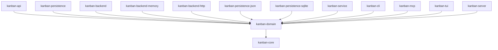

# kanban-domain

Pure domain logic — zero I/O, zero async, zero infrastructure dependencies. Depends only on `kanban-core`.

## Models

### `Board`

Top-level container for columns, cards, and sprints.

| Field | Type | Description |
|-------|------|-------------|
| `id` | `Uuid` | Unique identifier |
| `name` | `String` | Display name |
| `description` | `Option<String>` | Optional description |
| `card_prefix` | `Option<String>` | Default prefix for card identifiers (e.g. `"KAN"` → `KAN-1`) |
| `sprint_prefix` | `Option<String>` | Default prefix for sprint names |
| `sprint_names` | `Vec<String>` | Pool of sprint name tokens (consumed in order) |
| `prefix_counters` | `HashMap<String, u32>` | Per-prefix card number counter |
| `created_at` | `DateTime<Utc>` | Creation timestamp |
| `updated_at` | `DateTime<Utc>` | Last modification timestamp |

**Key methods**:

```rust
board.get_next_card_number(prefix: &str) -> u32
// Atomically increments and returns the next card number for the given prefix.

board.resolve_completion_column(columns: &[Column]) -> Option<&Column>
// Returns the rightmost column, used as the "done" column when toggling completion.

board.consume_sprint_name() -> Option<String>
// Pops and returns the next sprint name from sprint_names, if any.
```

**Partial update**:

```rust
pub struct BoardUpdate {
    pub name: Option<String>,
    pub description: FieldUpdate<String>,
    pub sprint_prefix: FieldUpdate<String>,
    pub card_prefix: FieldUpdate<String>,
    // ... additional fields
}
```

---

### `Column`

A swim lane within a board.

| Field | Type | Description |
|-------|------|-------------|
| `id` | `Uuid` | Unique identifier |
| `board_id` | `Uuid` | Parent board |
| `name` | `String` | Display name |
| `position` | `i32` | Display order (lower = left) |
| `wip_limit` | `Option<i32>` | Advisory WIP limit — shown in the UI as a guide |
| `created_at` | `DateTime<Utc>` | Creation timestamp |
| `updated_at` | `DateTime<Utc>` | Last modification timestamp |

WIP limits are **advisory**: the UI surfaces it as a visual cue; card creation always succeeds.

**Partial update**: `ColumnUpdate { name, position, wip_limit: FieldUpdate<i32> }`

---

### `Card`

The primary work item.

| Field | Type | Description |
|-------|------|-------------|
| `id` | `Uuid` | Unique identifier |
| `column_id` | `Uuid` | Parent column |
| `title` | `String` | Card title |
| `description` | `Option<String>` | Long-form description (markdown supported) |
| `priority` | `CardPriority` | `Low` / `Medium` / `High` / `Critical` |
| `status` | `CardStatus` | `Todo` / `InProgress` / `Blocked` / `Done` |
| `position` | `i32` | Display order within the column |
| `due_date` | `Option<DateTime<Utc>>` | Optional due date |
| `points` | `Option<u8>` | Story points (1–5) |
| `card_number` | `u32` | Sequential number within the prefix namespace |
| `sprint_id` | `Option<Uuid>` | Assigned sprint, if any |
| `assigned_prefix` | `Option<String>` | Prefix used when the card was created (e.g. `"KAN"`) |
| `card_prefix` | `Option<String>` | Optional per-card prefix override |
| `completed_at` | `Option<DateTime<Utc>>` | Set when status transitions to `Done`, cleared otherwise |
| `sprint_logs` | `Vec<SprintLog>` | History of sprint assignments |
| `created_at` | `DateTime<Utc>` | Creation timestamp |
| `updated_at` | `DateTime<Utc>` | Last modification timestamp |

**Status transitions**: `card.update_status(status)` — automatically sets `completed_at = Some(now)` when transitioning to `Done`, and clears it when transitioning away from `Done`.

**Branch name generation**: derived from `assigned_prefix` + `card_number` + slugified title (lowercase, hyphens replace whitespace and punctuation, truncated for length).

**Partial update**: `CardUpdate { title, description, priority, status, position, column_id, points, due_date, sprint_id, assigned_prefix, card_prefix }` — all fields are `Option<T>` or `FieldUpdate<T>`.

---

### `Sprint`

A time-boxed work period.

| Field | Type | Description |
|-------|------|-------------|
| `id` | `Uuid` | Unique identifier |
| `board_id` | `Uuid` | Parent board |
| `sprint_number` | `u32` | Sequential sprint number within the board |
| `name_index` | `Option<usize>` | Index into `board.sprint_names` for the human-readable name |
| `prefix` | `Option<String>` | Sprint prefix override (falls back to board prefix) |
| `card_prefix` | `Option<String>` | Card prefix override for this sprint |
| `status` | `SprintStatus` | `Planning` / `Active` / `Completed` / `Cancelled` |
| `start_date` | `Option<DateTime<Utc>>` | Set when activated |
| `end_date` | `Option<DateTime<Utc>>` | Set when activated (= start + duration) |
| `created_at` | `DateTime<Utc>` | Creation timestamp |
| `updated_at` | `DateTime<Utc>` | Last modification timestamp |

**Status lifecycle**:

```
Planning ──activate()──► Active ──complete()──► Completed
                               └──cancel()───► Cancelled
```

**Key methods**:

```rust
sprint.activate(duration_days: u32)
// Sets status to Active, records start_date = now, end_date = now + duration.

sprint.formatted_name(board: &Board, default_prefix: &str) -> String
// e.g. "KAN-3/bugfix-week" or "KAN-3"

sprint.is_ended(now: DateTime<Utc>) -> bool
// True if Active and end_date is before `now`.

Sprint::for_assignment_dialog(
    sprints: &[Sprint],
    board_id: Uuid,
    now: DateTime<Utc>,
) -> (Vec<&Sprint>, Vec<&Sprint>)
// Splits a board's sprints into (active_or_planned, completed_or_ended).
// Cancelled sprints are excluded; each section is sorted by sprint_number desc.
```

---

### `SprintLog`

Records a single sprint assignment event for a card.

| Field | Type | Description |
|-------|------|-------------|
| `sprint_id` | `Uuid` | Sprint that was assigned |
| `assigned_at` | `DateTime<Utc>` | When the assignment occurred |
| `unassigned_at` | `Option<DateTime<Utc>>` | When the assignment ended, if applicable |

A card accumulates one `SprintLog` entry per unique sprint assignment. Re-assigning to the same sprint is a no-op (deduplication by `sprint_id`).

---

### `ArchivedCard`

A card that has been moved out of active columns.

| Field | Type | Description |
|-------|------|-------------|
| `id` | `Uuid` | Unique identifier |
| `original_column_id` | `Uuid` | Column the card was in before archiving |
| `original_position` | `i32` | Position before archiving |
| `card` | `Card` | Full card snapshot |
| `archived_at` | `DateTime<Utc>` | When the card was archived |

Restoring an archived card places it back in `original_column_id` at `original_position` (or a specified column if provided).

---

### `FieldUpdate<T>`

Three-state enum for partial updates to optional fields.

```rust
pub enum FieldUpdate<T> {
    NoChange,   // Leave the field as-is
    Set(T),     // Set the field to this value
    Clear,      // Set the field to None
}

// Apply to a mutable target:
update.apply_to(&mut self.due_date);
```

Used throughout all `*Update` structs to distinguish "not provided" from "explicitly set to None".

---

### `DependencyGraph`

Container for all card-relation edges, stored alongside the board snapshot. Three discrete sub-graphs, each with its own structural rules and its own concrete edge kind (carrying any per-kind metadata):

```rust
pub struct DependencyGraph {
    parent_child: DagGraph<SpawnsEdge>,
    blocks: DagGraph<BlocksEdge>,
    relates: UndirectedGraph<RelatesEdge>,
}
```

| Sub-graph | Type | Cycles | Per-kind metadata |
|-----------|------|--------|-------------------|
| `parent_child` | `DagGraph<SpawnsEdge>` | rejected | none today |
| `blocks` | `DagGraph<BlocksEdge>` | rejected | `Severity` |
| `relates` | `UndirectedGraph<RelatesEdge>` | permitted | `RelatesKind` |

Each per-kind edge struct embeds the shared `EdgeBase` (endpoints, timestamps, archival state) via `#[serde(flatten)]` and adds its own metadata:

```rust
pub struct SpawnsEdge   { #[serde(flatten)] pub base: EdgeBase }
pub struct BlocksEdge   { #[serde(flatten)] pub base: EdgeBase, #[serde(default)] pub severity: Severity }
pub struct RelatesEdge  { #[serde(flatten)] pub base: EdgeBase, #[serde(default)] pub kind: RelatesKind }
```

All three implement the `Edge` trait from `kanban-core::graph`, so they plug into the generic `DagGraph` / `UndirectedGraph` machinery. The `flatten` plus `default` combination means edges written before the metadata fields existed deserialise cleanly into the new shape.

**`Severity`** (on `BlocksEdge`) — variant order matches conventional escalation, so derived `Ord` reads naturally:

```rust
pub enum Severity {
    Low,
    #[default] Medium,
    High,
    Critical,
}
```

**`RelatesKind`** (on `RelatesEdge`):

```rust
pub enum RelatesKind {
    #[default] General,    // catch-all human-curated link
    Duplicates,            // one card duplicates the other
    MentionedIn,           // mentioned in the other's description / comments
}
```

**Invariants**: each sub-graph independently rejects self-references and duplicate edges; the two DAG sub-graphs also reject edges that would close a cycle. `UndirectedGraph<RelatesEdge>` matches duplicates in either orientation.

**Cross-cutting cascades**: `archive_node`, `unarchive_node`, and `remove_node` fan out across all three sub-graphs. Read-only aggregates (`len`, `is_empty`, `active_len`, `contains`, `contains_archived`) sum across them.

**Cross-kind discriminator**: `CardEdgeType { Blocks, RelatesTo, Spawns }` exists only for cross-kind tooling (parameterised tests, debugging utilities, `requires_dag` / `allows_cycles` checks). Production code paths are per-kind: per-kind edges, per-kind sub-graphs, per-kind `GraphOperations` verbs, per-kind `DependencyCommand` variants. The enum is never used as a runtime discriminator on edges themselves.

---

### `GraphOperations`

Service-layer interface to the card-relation graph. One canonical method per per-kind operation, with plural batch primitives as the unit of atomicity. The singular variants are default methods that delegate to the plural by wrapping a single id in a `Vec`, which routes every mutation through the same transactional path.

Per-kind methods carry per-kind metadata directly in their signatures — severity for blocks, kind for relates, nothing extra for spawns. No runtime kind discriminator.

```rust
pub trait GraphOperations {
    // Spawns (parent / child)
    fn attach_children(&mut self, parent: Uuid, children: Vec<Uuid>) -> KanbanResult<()>;
    fn detach_children(&mut self, parent: Uuid, children: Vec<Uuid>) -> KanbanResult<()>;
    fn attach_child(&mut self, parent: Uuid, child: Uuid) -> KanbanResult<()> { /* default */ }
    fn detach_child(&mut self, parent: Uuid, child: Uuid) -> KanbanResult<()> { /* default */ }
    fn list_children_of(&self, parent: Uuid) -> KanbanResult<Vec<Uuid>>;
    fn list_parents_of(&self, child: Uuid) -> KanbanResult<Vec<Uuid>>;

    // Blocks
    fn block(&mut self, blocker: Uuid, blocked: Uuid, severity: Severity) -> KanbanResult<()>;
    fn unblock(&mut self, blocker: Uuid, blocked: Uuid) -> KanbanResult<()>;
    fn list_blocked_by(&self, blocker: Uuid) -> KanbanResult<Vec<Uuid>>;
    fn list_blockers_of(&self, blocked: Uuid) -> KanbanResult<Vec<Uuid>>;

    // Relates
    fn relate(&mut self, a: Uuid, b: Uuid, kind: RelatesKind) -> KanbanResult<()>;
    fn dissociate(&mut self, a: Uuid, b: Uuid) -> KanbanResult<()>;
    fn list_related_to(&self, card: Uuid) -> KanbanResult<Vec<Uuid>>;
}
```

**Design notes**:
- The trait stands alone from the `KanbanOperations` god-trait — no supertrait bound. Implementers compose both separately when they need card-resolution alongside graph mutation.
- List queries return `Vec<Uuid>`. Surfaces that need display data resolve ids at their own boundary.
- Cross-board parent/child is permitted at the domain layer today; board-scoping is a separate decision left to the caller.

---

### `DependencyCommand`

Per-kind dependency commands routed through the command bus. Each variant has a single relation kind baked into its type and carries the kind-specific metadata directly. Replay sees the same metadata the forward saw:

```rust
pub enum DependencyCommand {
    AddSpawns(AddSpawns),         // parent -> child; as_archived flag for cascade-undo
    AddBlocks(AddBlocks),         // blocker -> blocked, with Severity; as_archived flag
    AddRelates(AddRelates),       // a <-> b, with RelatesKind; as_archived flag
    RemoveSpawns(RemoveSpawns),   // tolerate_missing flag for inverse replay
    RemoveBlocks(RemoveBlocks),   // tolerate_missing flag for inverse replay
    RemoveRelates(RemoveRelates), // tolerate_missing flag for inverse replay
    CreateSubcard(CreateSubcardCommand),
}
```

`CreateSubcard` is atomic create-card-and-link-as-subcard — genuinely different from the edge commands because it touches the board (card counter), the card store (new card), and the graph (parent edge) in one step. Its inverse is `DeleteCard`, which is polymorphic over live / archived and strips incident edges in the same pass.

The previously kind-agnostic `RemoveDependencyCommand` was removed; each `Add*` now captures a per-kind `Remove*` inverse with `tolerate_missing = true`, so a `[AddSpawns(a,b), AddBlocks(a,b)]` batch undoes each kind independently instead of having the first inverse wipe both.

Both `Add*` and `Remove*` carry per-paradigm flags with `#[serde(default)]` so legacy command-log entries replay unchanged:

- **`tolerate_missing: bool`** on `Remove*` — swallows `EdgeNotFound` during inverse replay so undo succeeds against an already-removed edge. User-initiated paths set this `false` (strict); inverse-capture sets it `true`.
- **`as_archived: bool`** on `Add*` — inserts the edge already in the archived state. Used by cascade-undo (`DeleteCard` / `DeleteCardEdges`) to preserve the active/archived split across delete/undo cycles. User-initiated paths leave this `false` (edges land active); `edges_to_undo_commands` sets it from `!e.is_active()` per restored edge so archived incident edges restore as archived instead of silently reviving to active.

---

### `HistoryManager`

Undo/redo stack for `KanbanContext`.

```rust
pub struct HistoryManager { /* private */ }
```

| Method | Description |
|--------|-------------|
| `capture_before_command(snapshot)` | Push snapshot onto undo stack |
| `pop_undo()` | Pop and return the most recent undo snapshot |
| `push_redo(snapshot)` | Push snapshot onto redo stack |
| `suppress()` | Temporarily disable capture (used during undo/redo) |
| `clear()` | Clear both stacks (called on external reload) |

Both stacks are capped at **100 entries**. The oldest entries are dropped when the cap is exceeded.

---

## Error Types

### `KanbanError`

```rust
pub enum KanbanError {
    Domain(DomainError),
    Io(std::io::Error),
    Serialization(String),
    ConflictDetected { path: String, source: Option<Box<dyn Error + Send + Sync>> },
    Database(String),
    Internal(String),
}
```

### `DomainError`

```rust
pub enum DomainError {
    NotFound { entity: &'static str, id: Uuid },
    Validation(String),
    Dependency(DependencyError),
}
```

### `DependencyError`

```rust
pub enum DependencyError {
    CycleDetected,   // adding this edge would close a cycle in a DAG sub-graph
    SelfReference,   // endpoints are the same node
    EdgeNotFound,    // remove targeted an edge that does not exist
    DuplicateEdge,   // an edge between these endpoints already exists in this sub-graph
}
```

**Helper constructors** on `KanbanError`:

```rust
KanbanError::not_found(entity, id)
KanbanError::validation(msg)
KanbanError::serialization(msg)
KanbanError::is_not_found(&self) -> bool
KanbanError::is_validation(&self) -> bool
KanbanError::is_cycle_detected(&self) -> bool
KanbanError::is_self_reference(&self) -> bool
KanbanError::is_edge_not_found(&self) -> bool
KanbanError::is_duplicate_edge(&self) -> bool
KanbanError::is_conflict_detected(&self) -> bool
```

---

## Business Rules

- **Card numbering**: per-prefix counter stored in `Board::prefix_counters`; monotonically increasing, permanently unique per prefix
- **Sprint assignment deduplication**: assigning a card to a sprint it already belongs to is a no-op
- **Completion column**: the rightmost column is used when toggling a card to Done (falls back to the rightmost column)
- **WIP limits**: advisory only — enforcement is the UI's responsibility
- **Sprint assignability**: only `Planning` and `Active` sprints can be assigned to cards

---

## Position in the workspace

`kanban-domain` depends only on `kanban-core`, and (aside from
`kanban-core` itself) is the crate the rest of the workspace depends on most
broadly — every other crate reaches it directly.



All edges shown are normal (`[dependencies]`) edges. Not shown: this crate
has a `[dev-dependencies]` edge on `kanban-backend-memory` for lightweight
in-memory test fixtures — a dev-only edge back into a crate that itself
depends on `kanban-domain` in production, which Cargo permits but which is
never reachable from a release build. See the [root README](../../README.md)
for the full workspace dependency graph.

## Dependencies

| Crate | Purpose |
|-------|---------|
| `kanban-core` | Error types, config, graph |
| `serde` + `serde_json` | Serialization |
| `uuid` | `Uuid` type |
| `chrono` | Timestamps |
| `thiserror` | Error derivation |
| `async-trait` | Async trait methods (e.g. persistence-facing traits defined here) |
| `tracing` | Structured logging |
