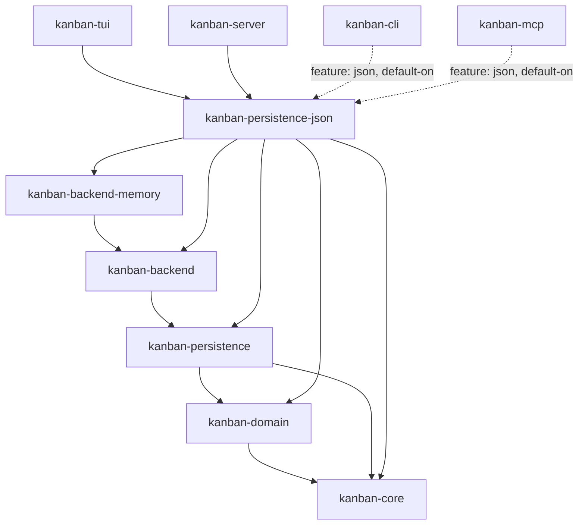

# kanban-persistence-json

JSON file storage backend for the kanban workspace. Implements `StoreFactory` and `PersistenceStore` from `kanban-persistence`.

## `JsonFileStore`

```rust
pub struct JsonFileStore {
    path: PathBuf,
    instance_id: Uuid,
    last_known_metadata: Mutex<Option<FileMetadata>>,
}

impl JsonFileStore {
    pub fn new(path: impl AsRef<Path>) -> Self;
    pub fn with_instance_id(path: impl AsRef<Path>, instance_id: Uuid) -> Self;
}
```

`instance_id` is a random UUID generated per process; used for conflict detection.

---

## Envelope Format

```json
{
  "version": 6,
  "metadata": {
    "instance_id": "550e8400-e29b-41d4-a716-446655440000",
    "saved_at": "2024-06-15T10:30:00Z"
  },
  "data": { /* kanban_domain::Snapshot */ }
}
```

V6 is the current on-disk format and is what `save` writes. The reader accepts envelopes with `version` in the range `2..=6` and migrates anything below 6 up to 6 before returning the snapshot. Anything below 2 or above 6 is rejected with `PersistenceError::Serialization`.

V1 was a bare `Snapshot` JSON object with no envelope (flat, no `version` field).

`#[serde(deny_unknown_fields)]` is deliberately NOT applied to the envelope: pre-KAN-405 builds wrote top-level `commands` / `undo_cursor` / `baseline_data` / `command_schema_version` fields, and tolerant deserialisation lets those files still load. The load path actively scrubs those legacy fields from disk on the next load, rather than leaving "dust" until the next mutation.

---

## Save Flow

1. Check for conflict: compare current file metadata (size + mtime) against the last-seen value
2. Stamp `PersistenceMetadata` with this store's `instance_id` and the current time
3. Wrap the snapshot in a V6 envelope
4. Pretty-print to JSON bytes
5. Write atomically via `AtomicWriter` (temp file + rename) for crash safety
6. Update the cached `FileMetadata` after a successful write

The atomic rename means a crash at any point leaves either the old file or the new file intact, always a complete consistent file on disk.

---

## Load Flow

1. Detect the current on-disk format version via `Migrator::detect_version`
2. If `< V7`, run the migration chain in order, each step writing back atomically:
   - **V1 -> V2**: wrap the bare V1 `Snapshot` in an envelope, side-stepping through a `<path>.v1.backup` file that is removed once the new file is written
   - **V2 -> V3**: in-place transform via `transform_v2_to_v3_value`
   - **V3 -> V4** and **V4 -> V5**: version bump only, no shape change on disk (the reader simply accepts these versions and the chain hands them on)
   - **V5 -> V6 (split-graph)**: see below
   - **V6 -> V7 (spawns-bucket rename)**: see below
3. Read the bytes, parse as a `JsonEnvelope`, and validate `2 <= version <= 7`
4. Detect any pre-KAN-405 legacy fields on the raw value and rewrite the file with a clean envelope if any are present (errors are logged but non-fatal; the in-memory load still succeeds)
5. Extract `envelope.data` as the `StoreSnapshot`

A `load_sync` variant performs the same chain through synchronous helpers (`migrate_v1_to_v2_sync`, `migrate_v2_to_v3_sync`, `split_graph_sync`, `v6_to_v7_rename_sync`) so non-async callers see the same migration semantics.

A clean V7 file with no legacy fields is read but not rewritten, so mtimes stay stable and version-controlled kanban files don't churn.

### V6 split-graph migration

V6 splits the single `data.graph.cards.edges` list (used by V3, V4 and V5 on disk) into three sub-graphs keyed by the original `edge_type`:

```json
"data": {
  "graph": {
    "parent_child": { "edges": [...] },
    "blocks":       { "edges": [...] },
    "relates":      { "edges": [...] }
  }
}
```

Each migrated edge has its `edge_type`, `direction`, and `weight` keys removed (the sub-graph encodes the kind, and the new per-kind edge structs no longer carry those fields). `source`, `target`, `created_at`, and `archived_at` are preserved. Migrated `Blocks` edges get `severity: "Medium"` and `RelatesTo` edges get `kind: "General"` as defaults. Unknown or missing `edge_type` values and non-object entries in the legacy edge list are rejected with a clear diagnostic.

`transform_to_v6_split_graph_value` is idempotent: invoked on an already-V6 envelope it returns without touching `data.graph`, so re-running the migration cannot silently wipe a populated split graph.

### V7 spawns-bucket rename

V7 renames the spawns sub-graph key from `parent_child` to `spawns` so the wire format matches the `SpawnsEdge` struct, the `spawns_edges()` accessor on `DependencyGraph`, and the SQLite `spawns_edges` table:

```json
"data": {
  "graph": {
    "spawns":  { "edges": [...] },
    "blocks":  { "edges": [...] },
    "relates": { "edges": [...] }
  }
}
```

Pure key rename: edge contents are untouched. The transform writes a `<path>.v6.backup` before rewriting and removes it on success. `transform_v6_to_v7_value` is idempotent and tolerates a missing `data.graph` (only the version field is bumped).

---

## Conflict Detection

`FileMetadata` captures the file's size and modification time at last load/save. On the next save the current file metadata is compared:

- If they match: file unchanged since last save, safe to write
- If they differ: another instance wrote the file, return `PersistenceError::ConflictDetected`

---

## `JsonStoreFactory`

The actual `StoreFactory` trait (defined in `kanban-persistence/src/registry.rs`) has only three methods:

```rust
pub trait StoreFactory: Send + Sync {
    fn name(&self) -> &str;
    fn matches_content(&self, header: &[u8]) -> bool { false }
    fn create(&self, locator: &str)
        -> Result<Arc<dyn PersistenceStore + Send + Sync>, PersistenceError>;
}
```

`JsonStoreFactory` implements it as:

```rust
impl StoreFactory for JsonStoreFactory {
    fn name(&self) -> &str { "json" }
    fn matches_content(&self, header: &[u8]) -> bool { /* content sniff */ }
    fn create(&self, locator: &str) -> Result<...> {
        Ok(Arc::new(JsonFileStore::new(locator)))
    }
}
```

**Backend selection is by content sniffing, not by file extension.** The registry reads the first 32 bytes of the file and asks each registered factory whether the header looks like its format. `JsonStoreFactory::matches_content` skips an optional UTF-8 BOM and any leading ASCII whitespace, then accepts the header if the first significant byte is `{` or `[`. This lets a `.json` file with SQLite contents be routed to the SQLite backend (and vice versa), and means a misleading file extension cannot trick the registry.

---

## Position in the workspace

`kanban-persistence-json` implements both `kanban-persistence`'s
`StoreFactory`/`PersistenceStore` traits (the storage-format layer) and, via
its `kanban-backend` + `kanban-backend-memory` dependencies, the
`KanbanBackend` layer above it — one crate covers both halves of "JSON
backend."



Solid arrows are normal (`[dependencies]`) edges; dotted arrows are
feature-gated. Not shown: `kanban-service` dev-depends on this crate (feature
`test-helpers`) to run the shared contract test suite against the JSON
backend, and this crate dev-depends back on `kanban-service` — a
dev-dependency-only cycle, never reachable from a release build. See the
[root README](../../README.md) for the full workspace dependency graph.

Note the KAN-1027 shift: `kanban-service` no longer has a production
dependency on this crate (its old `json` feature and `kanban-service ->
kanban-persistence-json` production edge are both gone) — `kanban-cli`,
`kanban-mcp`, `kanban-tui`, and `kanban-server` each depend on it directly
instead.

## Dependencies

| Crate | Purpose |
|-------|---------|
| [`kanban-persistence`](../kanban-persistence/README.md) | `PersistenceStore`, `StoreFactory` traits, `FormatVersion` |
| [`kanban-core`](../kanban-core/README.md) | `KanbanError`, `KanbanResult` |
| [`kanban-domain`](../kanban-domain/README.md) | `Snapshot` type |
| [`kanban-backend`](../kanban-backend/README.md) | `KanbanBackend` trait this backend's `KanbanBackendFactory` produces |
| [`kanban-backend-memory`](../kanban-backend-memory/README.md) | Shared in-memory scaffolding this backend's `KanbanBackend` impl builds on |
| `serde` + `serde_json` | JSON parsing |
| `tokio` | Async I/O |
| `async-trait` | Async trait methods |
| `chrono` | Timestamps |
| `tracing` | Structured logging |
| `tempfile` | Temp file for atomic writes |

## Related crates

Used by: [kanban-cli](../kanban-cli/README.md) (optional feature `json`, default-on), [kanban-mcp](../kanban-mcp/README.md) (optional feature `json`, default-on), [kanban-tui](../kanban-tui/README.md), and [kanban-server](../kanban-server/README.md).
