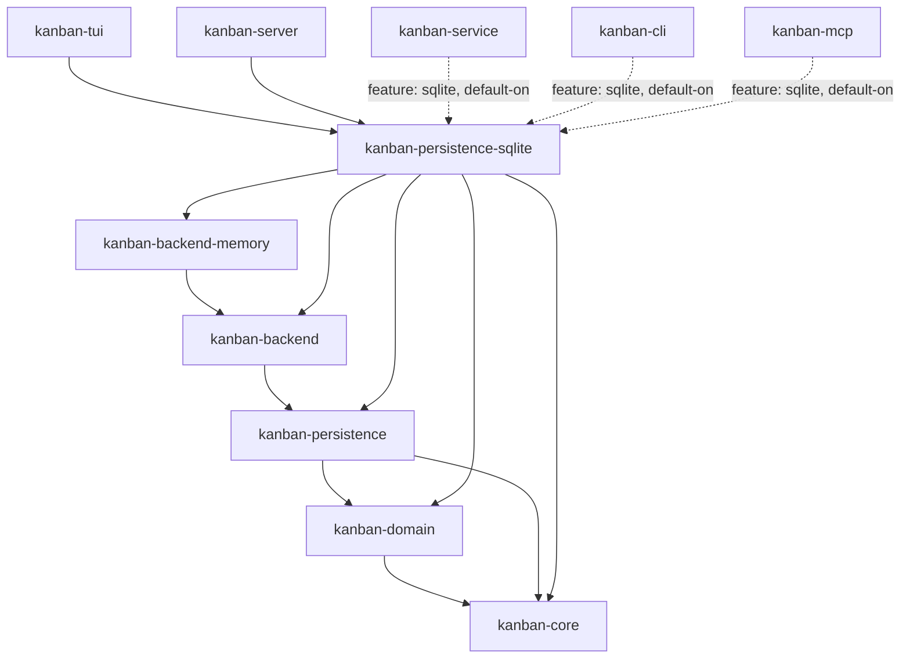

# kanban-persistence-sqlite

SQLite storage backend for the kanban workspace. Implements `StoreFactory` and `PersistenceStore` from `kanban-persistence`.

## `SqliteStore`

```rust
pub struct SqliteStore {
    path: String,
    instance_id: String,
    // connection pool (lazily initialized)
}

impl SqliteStore {
    pub fn new(path: &str) -> Self;
    pub fn with_instance_id(path: &str, instance_id: &str) -> Self;
}
```

The connection pool is initialized lazily on the first operation. The database file is created automatically on first use.

---

## Connection Pool Configuration

| Setting | Value |
|---------|-------|
| Max connections | 2 |
| Journal mode | WAL (Write-Ahead Logging) |
| Foreign keys | Enforced (`PRAGMA foreign_keys = ON`) |

---

## Schema

The schema consists of 13 tables:

| Table | Description |
|-------|-------------|
| `metadata` | Singleton row holding `instance_id`, `saved_at`, and `schema_version` |
| `boards` | Board records |
| `board_sprint_names` | Sprint name pool per board (ordered by position) |
| `board_sprint_counters` | Per-prefix sprint number counters |
| `columns` | Column records |
| `sprints` | Sprint records |
| `cards` | Card records (active and archived live here) |
| `sprint_logs` | Sprint assignment history per card |
| `archived_cards` | Archive metadata for cards (original column/position, archived_at) |
| `spawns_edges` | DAG edges for the `spawns` relation |
| `blocks_edges` | DAG edges for the `blocks` relation, with `severity` |
| `relates_edges` | Undirected edges for the `relates` relation, with `kind` |
| `command_log` | Per-batch JSON serialisation for cross-session undo (KAN-191) |

All foreign key relationships are enforced. `boards` → `columns` → `cards` cascade on delete. Edge tables intentionally omit foreign keys on `source_id` / `target_id`: edges are bulk-replaced on every save (DELETE-all + re-INSERT).

### Dependency edge tables

The single legacy `card_edges` table was split into one table per kind to mirror the in-memory split (`DagGraph<SpawnsEdge>` / `DagGraph<BlocksEdge>` / `UndirectedGraph<RelatesEdge>`). Each table carries only the metadata its kind needs — no nullable catch-all columns.

| Table | Columns | CHECK constraints |
|-------|---------|-------------------|
| `spawns_edges` | `source_id`, `target_id`, `created_at`, `archived_at` | — |
| `blocks_edges` | `source_id`, `target_id`, `severity`, `created_at`, `archived_at` | `severity IN ('Low', 'Medium', 'High', 'Critical')` |
| `relates_edges` | `source_id`, `target_id`, `kind`, `created_at`, `archived_at` | `kind IN ('General', 'Duplicates', 'MentionedIn')` |

Each table has `(source_id, target_id)` as the composite primary key and indexes on both columns.

---

## Save Flow

1. Begin a write transaction
2. `PRAGMA defer_foreign_keys = ON` to allow ordered re-population
3. Delete from every table in dependency order (edges, archive metadata, sprint logs, cards, sprints, board aux tables, columns, boards)
4. Re-insert boards, columns, sprints, cards, archived metadata, then graph edges
5. Commit

All operations occur within a single transaction; a failure at any point rolls back completely. This is a full-snapshot replace, not an incremental upsert.

---

## Load Flow

1. Read all tables in join order (boards → columns → sprints → cards → archived metadata → graph edges)
2. Reconstruct `kanban_domain::Snapshot` from relational rows
3. Return snapshot + `PersistenceMetadata` derived from the `metadata` row

---

## Schema Versioning

There is no dedicated `schema_version` table. The `metadata` table carries the `schema_version` column (currently `1`) on its singleton row. Migration helpers in `sqlite_store.rs` drop legacy tables (`card_edges`, an older `command_log` shape) when an older database is opened.

---

## `SqliteStoreFactory`

```rust
pub struct SqliteStoreFactory;

impl StoreFactory for SqliteStoreFactory {
    fn name(&self) -> &str { "sqlite" }
    fn matches_content(&self, header: &[u8]) -> bool {
        header.starts_with(b"SQLite format 3\0")
    }
    fn create(&self, locator: &str)
        -> Result<Arc<dyn PersistenceStore + Send + Sync>, PersistenceError>;
}
```

Backend selection is content-sniffed, not extension-based. `StoreRegistry` reads the first 32 bytes of the file and asks each registered factory whether it recognises the header. `SqliteStoreFactory::matches_content` returns `true` iff the header starts with the SQLite magic string `"SQLite format 3\0"`. Files that do not yet exist are not detected by sniffing; in that case the caller picks a backend by name (`create_store("sqlite", path)`).

`create` requires a multi-thread Tokio runtime — it uses `block_in_place` and returns an error on a `current_thread` runtime. Tests must use `#[tokio::test(flavor = "multi_thread")]`.

---

## Position in the workspace

`kanban-persistence-sqlite` mirrors `kanban-persistence-json`'s shape: it
implements both the storage-format layer (`kanban-persistence`'s
`StoreFactory`/`PersistenceStore`) and the `KanbanBackend` layer above it.



Solid arrows are normal (`[dependencies]`) edges; dotted arrows are
feature-gated. Unlike `kanban-persistence-json`, `kanban-service` keeps an
*optional* production dependency on this crate, gated behind its own
`sqlite` feature (default-on) — SQLite is still the crate's default storage
backend even after KAN-1027 dropped the JSON one. Not shown: this crate
dev-depends on `kanban-service` (feature `test-helpers`) for the shared
contract test suite, and `kanban-service` dev-depends back on it — a
dev-dependency-only cycle, never reachable from a release build. See the
[root README](../../README.md) for the full workspace dependency graph.

## Dependencies

| Crate | Purpose |
|-------|---------|
| [`kanban-persistence`](../kanban-persistence/README.md) | `PersistenceStore`, `StoreFactory` traits |
| [`kanban-core`](../kanban-core/README.md) | `KanbanError`, `KanbanResult` |
| [`kanban-domain`](../kanban-domain/README.md) | `Snapshot` type |
| [`kanban-backend`](../kanban-backend/README.md) | `KanbanBackend` trait this backend's `KanbanBackendFactory` produces |
| [`kanban-backend-memory`](../kanban-backend-memory/README.md) | Shared in-memory scaffolding this backend's `KanbanBackend` impl builds on |
| `sqlx` | Async SQLite with connection pooling |
| `tokio` | Async runtime |
| `serde` + `serde_json` | Serialisation for the `command_log` table |
| `async-trait` | Async trait methods |
| `chrono` | Timestamps |
| `tracing` | Structured logging |
| `flate2` | Compression for durable pre-migration `VACUUM INTO` backups |
| `tempfile` | Temp file handling |

## Related crates

Used by: [kanban-cli](../kanban-cli/README.md) (optional feature `sqlite`, default-on), [kanban-mcp](../kanban-mcp/README.md) (optional feature `sqlite`, default-on), [kanban-tui](../kanban-tui/README.md), [kanban-server](../kanban-server/README.md), and [kanban-service](../kanban-service/README.md) (optional feature `sqlite`, default-on).
