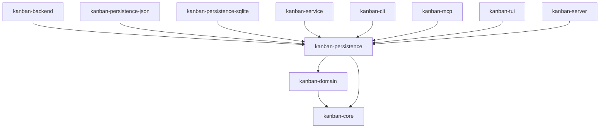

# kanban-persistence

Persistence trait layer for the kanban workspace. **Pure trait definitions — all I/O lives in the backend crates.** Defines the interfaces implemented by `kanban-persistence-json` and `kanban-persistence-sqlite`, plus shared serialization types used across all persistence crates.

## Traits

### `PersistenceStore`

```rust
#[async_trait]
pub trait PersistenceStore: Send + Sync {
    async fn save(&self, snapshot: StoreSnapshot) -> PersistenceResult<PersistenceMetadata>;
    async fn load(&self) -> PersistenceResult<(StoreSnapshot, PersistenceMetadata)>;
    async fn exists(&self) -> bool;
    fn path(&self) -> &Path;
    fn instance_id(&self) -> uuid::Uuid;
}
```

- `save` takes a `StoreSnapshot` and returns the persisted `PersistenceMetadata`. Implementations must guarantee an atomic write — either the full snapshot is written or the store is left unchanged.
- `load` returns the current snapshot and its associated metadata. Returns an error if the store has never been saved.
- `exists` returns `true` if the backing store has been written at least once.
- `path` returns the file path or backing location.
- `instance_id` is a stable `Uuid` that identifies this store handle across saves. Used for conflict detection between concurrent writers.

### `StoreFactory`

```rust
pub trait StoreFactory: Send + Sync {
    fn name(&self) -> &str;
    fn matches_content(&self, header: &[u8]) -> bool { false }
    fn create(&self, locator: &str) -> Result<Arc<dyn PersistenceStore + Send + Sync>, PersistenceError>;
}
```

Backend plugins implement `StoreFactory` and register themselves with `StoreRegistry`.

- `name` returns the canonical backend identifier used in CLI `--backend` flags and `StoreRegistry::create_store` lookups (e.g. `"json"`, `"sqlite"`).
- `matches_content` receives the first 32 bytes of an existing file. Return `true` if those bytes indicate your format. Used for automatic backend detection when no explicit backend is specified. Defaults to `false`.
- `create` instantiates a `PersistenceStore` for the given locator (file path or connection string).

### `StoreRegistry`

The registry holds a prioritized list of `StoreFactory` implementations.

```rust
impl StoreRegistry {
    pub fn new() -> Self;
    pub fn register(&mut self, factory: Box<dyn StoreFactory>);
    pub fn is_empty(&self) -> bool;
    pub fn backend_names(&self) -> Vec<&str>;
    pub fn detect_backend(&self, locator: &str) -> Option<&str>;
    pub fn create_store(
        &self,
        backend: &str,
        locator: &str,
    ) -> Result<Arc<dyn PersistenceStore + Send + Sync>, PersistenceError>;
}
```

- `register` appends a factory. Registration order matters: `detect_backend` returns the **first** factory whose `matches_content` returns `true`.
- `detect_backend` reads the first 32 bytes of an existing file and returns the name of the matching factory, or `None` if no factory claims it.
- `create_store` looks up the factory by `name` and calls `factory.create(locator)`.

### `ChangeDetector` trait

Provides file-watching capability for detecting external changes.

```rust
pub trait ChangeDetector: Send + Sync {
    async fn start_watching(&self, path: PathBuf) -> PersistenceResult<()>;
    async fn stop_watching(&self) -> PersistenceResult<()>;
    fn subscribe(&self) -> tokio::sync::broadcast::Receiver<ChangeEvent>;
    fn is_watching(&self) -> bool;
}
```

### `Serializer<T>` trait

```rust
pub trait Serializer<T: Send + Sync>: Send + Sync {
    fn serialize(&self, data: &T) -> PersistenceResult<Vec<u8>>;
    fn deserialize(&self, bytes: &[u8]) -> PersistenceResult<T>;
}
```

### `MigrationStrategy` trait

```rust
pub trait MigrationStrategy: Send + Sync {
    async fn detect_version(&self, path: &Path) -> PersistenceResult<FormatVersion>;
    async fn migrate(
        &self,
        from: FormatVersion,
        to: FormatVersion,
        path: &Path,
    ) -> PersistenceResult<PathBuf>;
}
```

---

## Shared Types

### `StoreSnapshot`

```rust
pub struct StoreSnapshot {
    pub data: Vec<u8>,           // Raw JSON bytes of kanban_domain::Snapshot
    pub metadata: PersistenceMetadata,
}
```

### `PersistenceMetadata`

```rust
pub struct PersistenceMetadata {
    pub instance_id: uuid::Uuid, // Identifies the writer
    pub saved_at: DateTime<Utc>,
}
```

### `FormatVersion`

```rust
pub enum FormatVersion { V1, V2, V3, V4, V5, V6 }
```

Current shipped version is V6 (introduced by KAN-504): splits the dependency
graph from a single edge-type-tagged list into three typed sub-graphs
(`parent_child`, `blocks`, `relates`) keyed by relation kind. The JSON
backend chains V1→V2→V3→V4→V5→V6 migrations on load; the SQLite backend
ships the per-kind tables directly. See `kanban-persistence-json`'s
`migration/split_graph.rs` for the JSON V6 transform.

### `PersistenceError`

```rust
pub enum PersistenceError {
    Io(std::io::Error),
    Serialization(String),
    Conflict { path: String },
    Database(String),
    NotFound(String),
    Migration(String),
    UnsupportedLocator { locator: String, supported: Vec<String> },
}
```

---

## Helper Functions

```rust
pub fn snapshot_to_json_bytes(snapshot: &kanban_domain::Snapshot) -> Result<Vec<u8>, KanbanError>;
pub fn snapshot_from_json_bytes(data: &[u8]) -> Result<kanban_domain::Snapshot, KanbanError>;
```

Used by backends and the service layer to serialize/deserialize the domain `Snapshot`.

---

## Position in the workspace



All edges shown are normal (`[dependencies]`) edges. Not shown: this crate
has a `[dev-dependencies]` edge on `kanban-backend-memory` for test fixtures
— a dev-only edge into a crate that (via `kanban-backend`) depends on
`kanban-persistence` in production; never reachable from a release build. See
the [root README](../../README.md) for the full workspace dependency graph.

## Dependencies

| Crate | Purpose |
|-------|---------|
| `kanban-core` | `KanbanError`, `KanbanResult` |
| `kanban-domain` | `Snapshot` type |
| `serde` + `serde_json` | Serialization |
| `async-trait` | Async trait methods |
| `chrono` | Timestamps in metadata |
| `thiserror` | Error derivation |
| `uuid` | Instance IDs |
| `tokio` | Async I/O, file watching |
| `notify` | File-watching backend for `ChangeDetector` |
| `tracing` | Structured logging |
| `tempfile` (optional, feature `test-helpers`) | Test fixture helpers |

---

## Writing a Third-Party Backend

This section walks through implementing a custom storage backend and plugging it into the CLI or MCP server without forking the repo.

### Step 1 — Add dependencies

In your crate's `Cargo.toml`:

```toml
[dependencies]
kanban-cli    = { version = "0.3", features = ["json", "sqlite"] }  # or kanban-mcp
kanban-persistence = { version = "0.3" }
async-trait   = "0.1"
tokio         = { version = "1", features = ["full"] }
uuid          = { version = "1", features = ["v4"] }

[dev-dependencies]
kanban-persistence = { version = "0.3", features = ["test-helpers"] }
kanban-service     = { version = "0.3", features = ["test-helpers"] }
tempfile           = "3"
tokio              = { version = "1", features = ["full"] }
```

### Step 2 — Implement `PersistenceStore`

```rust
use async_trait::async_trait;
use kanban_persistence::{PersistenceError, PersistenceMetadata, PersistenceResult, StoreSnapshot};
use std::path::{Path, PathBuf};
use uuid::Uuid;

pub struct MyStore {
    path: PathBuf,
    instance_id: Uuid,
}

impl MyStore {
    pub fn new(path: &Path) -> Self {
        Self { path: path.to_owned(), instance_id: Uuid::new_v4() }
    }
}

#[async_trait]
impl kanban_persistence::PersistenceStore for MyStore {
    async fn save(&self, snapshot: StoreSnapshot) -> PersistenceResult<PersistenceMetadata> {
        // Write snapshot.data atomically (e.g. temp file + rename).
        // Return metadata with your instance_id and the current timestamp.
        let metadata = PersistenceMetadata::new(self.instance_id);
        // ... write to self.path ...
        Ok(metadata)
    }

    async fn load(&self) -> PersistenceResult<(StoreSnapshot, PersistenceMetadata)> {
        // Read the file and reconstruct snapshot + metadata.
        todo!()
    }

    async fn exists(&self) -> bool {
        self.path.exists()
    }

    fn path(&self) -> &Path {
        &self.path
    }

    fn instance_id(&self) -> Uuid {
        self.instance_id
    }
}
```

### Step 3 — Implement `StoreFactory`

```rust
use kanban_persistence::{PersistenceError, PersistenceStore, StoreFactory};
use std::sync::Arc;

pub struct MyStoreFactory;

impl StoreFactory for MyStoreFactory {
    fn name(&self) -> &str {
        "my-backend"
    }

    fn matches_content(&self, header: &[u8]) -> bool {
        // Return true if the first bytes of the file indicate your format.
        // Omit this method (or return false) if you rely on explicit --backend selection.
        header.starts_with(b"MY_MAGIC\0")
    }

    fn create(
        &self,
        locator: &str,
    ) -> Result<Arc<dyn PersistenceStore + Send + Sync>, PersistenceError> {
        Ok(Arc::new(MyStore::new(std::path::Path::new(locator))))
    }
}
```

### Step 4 — Validate with the contract test suite

Add a test file (e.g. `tests/contract.rs`) to your crate:

```rust
fn my_factory() -> kanban_persistence::test_helpers::StoreFactory {
    Box::new(|path| std::sync::Arc::new(MyStore::new(path)))
}

mod tier1 {
    // 8 round-trip / metadata / conflict / path tests
    kanban_persistence::store_contract_tests!(super::my_factory);
}

mod tier2 {
    // Full KanbanContext integration tests (board/column/card CRUD + undo/redo)
    kanban_service::context_contract_tests!(super::my_factory);
}
```

Run with:

```bash
cargo test
```

All 8 Tier 1 tests must pass before the backend is usable. Tier 2 tests verify the full service layer works on top of your store.

### Step 5 — Own `main()` and register your backend

#### CLI binary

```rust
use kanban_cli::CliApp;

#[tokio::main]
async fn main() -> anyhow::Result<()> {
    CliApp::with_defaults()          // includes built-in json + sqlite
        .register_backend(Box::new(MyStoreFactory))
        .run()
        .await
}
```

#### MCP server binary

```rust
use kanban_mcp::McpServer;

#[tokio::main]
async fn main() -> anyhow::Result<()> {
    McpServer::with_defaults()
        .register_backend(Box::new(MyStoreFactory))
        .run()
        .await
}
```

Both builders accept any number of `.register_backend()` calls. Factories registered **before** the built-in ones take priority in content-sniffing; factories registered **after** are checked last.

To ship a binary with **only** your backend (no built-in JSON or SQLite), use `CliApp::default()` / `McpServer::default()` and register exclusively your factory:

```rust
CliApp::default()
    .register_backend(Box::new(MyStoreFactory))
    .run()
    .await
```
