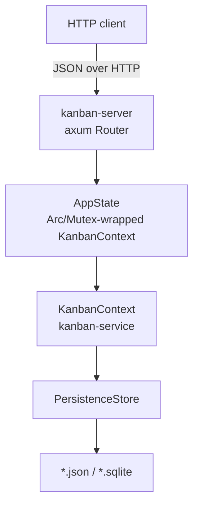

# kanban-server

HTTP API server for kanban project management. Wraps `kanban-service` behind a REST interface so non-Rust clients (web UIs, scripts, other services) can read and write boards without going through the TUI, CLI, or MCP server.

**Status: early / minimal.** Only boards and column reads are wired up so far — see [Endpoints](#endpoints). The binding address and logging are not yet configurable; treat this as a local development server, not a production deployment.

## Architecture

`kanban-server` holds a single `KanbanContext` in memory behind a `tokio::sync::Mutex`, shared across all handlers via axum's `State`.



A `tokio::sync::Mutex` is used rather than a sync `RwLock`: `KanbanContext`'s write path (`save`/`reload`) is async, and holding a sync write guard across an `.await` would be a `Send`/deadlock hazard.

Each successful mutation broadcasts a `ChangeEventFrame` on an in-process `tokio::sync::broadcast` channel (`AppState::broadcast_change`), for future streaming (e.g. SSE) consumers — nothing currently subscribes to it.

## Installation

### From Nix (recommended)
```bash
nix build .#kanban-server
```

### From Cargo
```bash
cargo install --path crates/kanban-server
```

## Usage

```bash
kanban-server
```

On startup the server opens (or creates) the board file, binds to `127.0.0.1` on an OS-assigned ephemeral port, and serves until killed. There is currently no way to pin the port or host — the process must be introspected (e.g. via its log line, or `lsof -p <pid>`) to find where it's listening.

### Configuration

| Env var | Default | Purpose |
|---|---|---|
| `KANBAN_FILE` | `kanban.json` (in the working directory) | Storage locator, resolved through the same backend registry as the CLI/TUI/MCP server — a `.json` path uses the JSON backend, a `.sqlite`/`.db` path (or existing SQLite file) uses the SQLite backend. |
| `RUST_LOG` | unset (⇒ `error` only) | Standard `tracing-subscriber` env filter. Set to `info` to see the startup log line; there is no per-request access logging. |

There are no other flags or config files. The bind address (`127.0.0.1:0`) is hardcoded in `src/main.rs`.

### Example

```bash
RUST_LOG=info KANBAN_FILE=/path/to/boards.json kanban-server
# 2026-07-27T20:56:12Z  INFO kanban_server: kanban-server listening addr=127.0.0.1:58548
```

```bash
curl -s http://127.0.0.1:58548/health | jq
```
```json
{
  "status": "ok",
  "instance_id": "079131c7-ffac-4269-9dc6-5dee6af77097"
}
```

`instance_id` is a random UUID generated once per process start (`AppState::new`) — stable across requests within a run, and useful for a client to detect a server restart.

```bash
curl -s http://127.0.0.1:58548/v1/boards | jq
```
```json
[
  {
    "id": "e119c091-e1fa-4596-9bc7-038ceab6adec",
    "name": "Kanban",
    "description": "Management of the **Kanban** project\n",
    "sprint_prefix": "KAN",
    "card_prefix": "KAN",
    "task_sort_field": "updated_at",
    "task_sort_order": "descending",
    "sprint_duration_days": 7,
    "task_list_view": "grouped_by_column",
    "active_sprint_id": "2ab2a4d3-80d0-4bd6-881c-88bed5fd7670",
    "completion_column_id": null,
    "position": 0,
    "created_at": "2025-10-10T08:47:44.779097Z",
    "updated_at": "2026-07-04T10:55:00.488151029Z"
  }
]
```

```bash
curl -s http://127.0.0.1:58548/v1/boards/e119c091-e1fa-4596-9bc7-038ceab6adec/columns | jq '.[].name'
```
```json
"Backlog"
"In Progress"
"Done"
```

Creating a board (`POST`) returns `201` with the same `BoardResponse` shape as the reads above:

```bash
curl -s -X POST http://127.0.0.1:58548/v1/boards \
  -H 'content-type: application/json' \
  -d '{"name": "Roadmap", "card_prefix": "RM"}' | jq
```
```json
{
  "id": "3fbb2b8b-...",
  "name": "Roadmap",
  "card_prefix": "RM",
  ...
}
```

A lookup miss comes back as the error envelope, not an empty body:

```bash
curl -s http://127.0.0.1:58548/v1/boards/00000000-0000-0000-0000-000000000000 | jq
```
```json
{
  "code": "NOT_FOUND",
  "message": "Board 00000000-0000-0000-0000-000000000000 not found"
}
```

## Endpoints

All request/response bodies are JSON. Errors share one envelope (see [Error Handling](#error-handling)).

### Health

| Method | Path | Description |
|---|---|---|
| `GET` | `/health` | Liveness check. Returns `{"status": "ok", "instance_id": "<uuid>"}`. |

### Boards

| Method | Path | Description | Body |
|---|---|---|---|
| `GET` | `/v1/boards` | List all boards | — |
| `GET` | `/v1/boards/{id}` | Get a board by UUID. Returns `archived_at` (present only if the board is archived). | — |
| `POST` | `/v1/boards` | Create a board. `201 Created`. A board created this way always has zero columns. | `CreateBoardRequest` |
| `PUT` | `/v1/boards/{id}` | Full replace (RFC 9110 §9.3.4) — creates the board at `id` if absent (`201`), otherwise replaces it in full (`200`). All non-nullable fields are required; a partial body is a 400. | `ReplaceBoardRequest` |
| `PATCH` | `/v1/boards/{id}` | Partial update — JSON Merge Patch (RFC 7386): an absent field is no change, `null` clears it, a value sets it. | `UpdateBoardRequest` |
| `DELETE` | `/v1/boards/{id}` | Delete a board and everything under it. `204 No Content`. | — |

### Columns

| Method | Path | Description |
|---|---|---|
| `GET` | `/v1/boards/{board_id}/columns` | List a board's columns |
| `GET` | `/v1/boards/{board_id}/columns/{id}` | Get a column by UUID. 404s if the column exists but belongs to a different board. |

Column writes (create/update/delete) aren't implemented yet.

Every write route (`POST`/`PUT`/`PATCH`) broadcasts a change event and, per the persistence layer's normal save path, durably writes to the configured store before responding.

## Error Handling

Every non-2xx response is a JSON `ApiError`:

```json
{ "code": "NOT_FOUND", "message": "Board 079131c7-... not found" }
```

`code` is a stable, machine-readable `SCREAMING_SNAKE_CASE` string clients can branch on without parsing `message`. HTTP status is derived from `code`:

| Status | Codes |
|---|---|
| 400 | `BATCH_RESOLUTION_FAILED` |
| 404 | `NOT_FOUND`, `NOT_FOUND_BY_NAME`, `EDGE_NOT_FOUND` |
| 409 | `AMBIGUOUS`, `WIP_LIMIT_EXCEEDED`, `CONFLICT_DETECTED`, `ALREADY_EXISTS`, `UNSUPPORTED_VERSION`, `DEPENDENCY_ERROR`, `CYCLE_DETECTED`, `DUPLICATE_EDGE` |
| 422 | `VALIDATION_FAILED`, `SPRINT_BOARD_MISMATCH`, `SELF_REFERENCE` |
| 500 | `IO_ERROR`, `SERIALIZATION_ERROR`, `DATABASE_ERROR`, `INTERNAL_ERROR` |

Malformed or type-mismatched request bodies (e.g. missing a required field) also come back as `VALIDATION_FAILED` (422) in this same envelope, rather than axum's default plain-text rejection.
