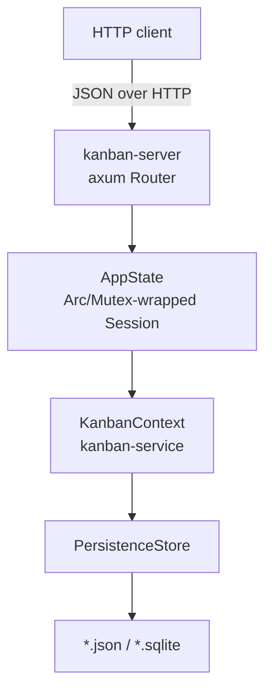
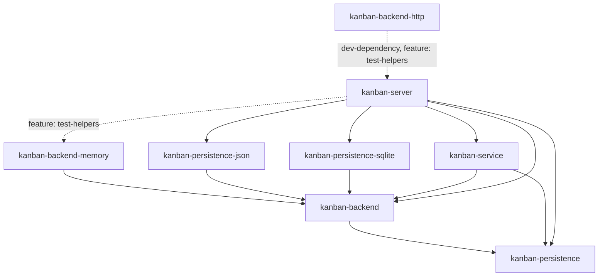

# kanban-server

HTTP API server for kanban project management. Wraps `kanban-service` behind a REST interface so non-Rust clients (web UIs, scripts, other services) can read and write boards without going through the TUI, CLI, or MCP server.

**Status: early / minimal.** See [Endpoints](#endpoints) for what is wired up; reads and writes are covered across boards, columns, cards, sprints, the graph and transfer, with conditional-request guards on the entity writes. The bind address is configurable (see [Configuration](#configuration)); per-request logging is not. Still best treated as a development server rather than a hardened production deployment.

## Architecture

`kanban-server` holds a `Session` in memory behind a `tokio::sync::Mutex`, shared across all handlers via axum's `State`. `Session` wraps a `KanbanContext` and implements `KanbanOperations`/`GraphOperations` itself (mutators routed through a `state::mutate`/`state::mutate_unit` seam), while still `Deref`ing to `KanbanContext` for non-trait access. No `kanban_domain::Model` is retained between requests: each read handler builds its own `Model::default()` for the duration of its own request and syncs it against the locked context, so every request sees the current state of the store regardless of backend.



A `tokio::sync::Mutex` is used rather than a sync `RwLock`: `KanbanContext`'s write path (`save`/`reload`) is async, and holding a sync write guard across an `.await` would be a `Send`/deadlock hazard.

Each successful mutation broadcasts a `ChangeEventFrame` on an in-process `tokio::sync::broadcast` channel (`AppState::broadcast_change`), naming the entity type, id and change kind (created/updated/deleted) it touched, plus an `invalidation` (`InvalidationDto`) naming the mutation's full blast radius — every board/column/card/sprint id it actually affected, not just the single entity above. `GET /v1/events` streams these frames to clients over SSE, so a client can invalidate exactly what changed instead of its whole cache. A frame caused by an external process writing the file directly (`AppState::broadcast_unscoped_change`) carries no entity identity and an `invalidation` of `InvalidationDto::All`, meaning subscribers must invalidate everything.

## Installation

### From Nix (recommended)
```bash
nix build .#kanban-server
```

### From Cargo
```bash
cargo install --path crates/kanban-server
```

## Usage

```bash
kanban-server
```

On startup the server opens (or creates) the board file, binds the configured address (default `127.0.0.1` on an OS-assigned ephemeral port), and serves until it receives SIGTERM or ctrl-c (SIGINT), at which point it stops accepting connections, lets in-flight requests finish, cuts anything still open (an SSE stream never finishes on its own) after the drain window, and exits 0. Pin a fixed host/port with the `--addr` flag, the `KANBAN_ADDR` env var, or the `server_addr` config key (see [Configuration](#configuration)). When left on the default ephemeral port, read the bound address from the startup log line (`RUST_LOG=info`) or `lsof -p <pid>`.

### Configuration

| Env var | Default | Purpose |
|---|---|---|
| `KANBAN_FILE` | `kanban.json` (in the working directory) | Storage locator, resolved through the same backend registry as the CLI/TUI/MCP server — a `.json` path uses the JSON backend, a `.sqlite`/`.db` path (or existing SQLite file) uses the SQLite backend. |
| `KANBAN_ADDR` | `127.0.0.1:0` (ephemeral loopback) | Address the HTTP server binds, as `host:port` where host is an IP literal (`127.0.0.1`, `0.0.0.0`, `[::1]`); hostnames such as `localhost` are not resolved. Resolved with the same layered precedence as `KANBAN_FILE`: the `--addr` flag wins, then `KANBAN_ADDR`, then the `server_addr` key in the config file, then the default. Set `0.0.0.0:<port>` to accept non-loopback connections (e.g. behind a reverse proxy). |
| `KANBAN_SHUTDOWN_GRACE_SECS` | `10` | Seconds to wait after a shutdown signal for in-flight responses to complete before remaining connections are closed. Open SSE streams never end on their own, so this is what bounds shutdown. An unparseable value falls back to the default. |
| `RUST_LOG` | unset (⇒ `error` only) | Standard `tracing-subscriber` env filter. Set to `info` to see the startup log line. Per-request access logging comes from tower-http's TraceLayer; set `tower_http=debug` (or `debug`) to see one span per request with method, path, status and latency. |
| `KANBAN_CORS_ORIGINS` | unset (no CORS layer, same-origin only) | Comma-separated list of allowed browser origins. Unset means no CORS headers are sent at all. A single `*` allows any origin and is intended for local development only. A list allows exactly those origins with the GET/POST/PUT/PATCH/DELETE methods and the `content-type`, `if-match`, `if-none-match` and `x-kanban-client-id` request headers, and exposes `ETag` on responses so browser clients can use conditional requests cross-origin. |
| `KANBAN_REQUEST_TIMEOUT_SECS` | `30` | Seconds a single request may take before the server answers 408 Request Timeout. `0` disables the timeout entirely. An unparseable value falls back to the default. |

The bind address can also be set with the `--addr` flag or the `server_addr` key in the kanban config file (`~/.config/kanban/config.toml`); the resolution order is `--addr` > `KANBAN_ADDR` > `server_addr` > the `127.0.0.1:0` default.

Request bodies are capped at 2 MiB by default. A request over the cap is rejected with 413 Payload Too Large before it reaches the handler. `POST /v1/import` is the exception: it is capped at 32 MiB instead, since a full board export can exceed the default cap. The request timeout bounds the time to the response, not the lifetime of a streaming body, so an open `GET /v1/events` SSE stream is unaffected and stays connected indefinitely. The timeout also does not remove write serialization: every handler acquires one shared `tokio::sync::Mutex`, so a slow store still queues every other request behind the in-flight one, and the timeout only bounds how long a queued client waits before failing fast.

### Example

```bash
RUST_LOG=info KANBAN_FILE=/path/to/boards.json kanban-server
# 2026-07-27T20:56:12Z  INFO kanban_server: kanban-server listening addr=127.0.0.1:58548
```

```bash
curl -s http://127.0.0.1:58548/health | jq
```
```json
{
  "status": "ok",
  "instance_id": "079131c7-ffac-4269-9dc6-5dee6af77097"
}
```

`instance_id` is a random UUID generated once per process start (`AppState::new`) — stable across requests within a run, and useful for a client to detect a server restart.

```bash
curl -s http://127.0.0.1:58548/v1/boards | jq
```
```json
{
  "items": [
    {
      "id": "e119c091-e1fa-4596-9bc7-038ceab6adec",
      "name": "Kanban",
      "description": "Management of the **Kanban** project\n",
      "sprint_prefix": "KAN",
      "card_prefix": "KAN",
      "task_sort_field": "updated_at",
      "task_sort_order": "descending",
      "sprint_duration_days": 7,
      "task_list_view": "grouped_by_column",
      "active_sprint_id": "2ab2a4d3-80d0-4bd6-881c-88bed5fd7670",
      "position": 0,
      "created_at": "2025-10-10T08:47:44.779097Z",
      "updated_at": "2026-07-04T10:55:00.488151029Z"
    }
  ],
  "total": 1,
  "page": 1,
  "page_size": 50,
  "total_pages": 1
}
```

```bash
curl -s http://127.0.0.1:58548/v1/boards/e119c091-e1fa-4596-9bc7-038ceab6adec/columns | jq '.items[].name'
```
```json
"Backlog"
"In Progress"
"Done"
```

Creating a board (`POST`) returns `201` with the same `BoardResponse` shape as the reads above:

```bash
curl -s -X POST http://127.0.0.1:58548/v1/boards \
  -H 'content-type: application/json' \
  -d '{"name": "Roadmap", "card_prefix": "RM"}' | jq
```
```json
{
  "id": "3fbb2b8b-...",
  "name": "Roadmap",
  "card_prefix": "RM",
  ...
}
```

A lookup miss comes back as the error envelope, not an empty body:

```bash
curl -s http://127.0.0.1:58548/v1/boards/00000000-0000-0000-0000-000000000000 | jq
```
```json
{
  "code": "NOT_FOUND",
  "message": "Board 00000000-0000-0000-0000-000000000000 not found"
}
```

### Client identity

Send `X-Kanban-Client-Id: <uuid>` on a write request to attribute it to that client. The server stamps the value onto the audit log entry the write produces and onto the `ChangeEventFrame` broadcast on `/v1/events`, so a client can filter its own writes back out of the SSE stream by comparing `issued_by` to the UUID it sent, instead of relying on `writer_instance_id`.

The header is a client-generated UUID, stable for the client's lifetime; omit it and the write is recorded and broadcast with a nil `issued_by`. A value that does not parse as a UUID is rejected with `422 VALIDATION_FAILED` before the request reaches the store. The identity is unauthenticated: any client can send any UUID, so it identifies provenance for echo suppression and auditing, not authorization.

Every write route honours the header. Frames whose origin is an external file writer detected by the watcher carry a nil `issued_by`, since no client issued them.

## Endpoints

All request/response bodies are JSON. Errors share one envelope (see [Error Handling](#error-handling)). The paginated collection `GET`s (`/v1/boards`, `/v1/archived-boards`, `/v1/boards/{board_id}/columns`, `/v1/boards/{board_id}/cards`, `/v1/boards/{board_id}/sprints`) accept `?page=&page_size=` and return a `Page<T>` envelope; see [Pagination](#pagination).

### Health

| Method | Path | Description |
|---|---|---|
| `GET` | `/health` | Liveness check. Returns `{"status": "ok", "instance_id": "<uuid>"}`. |

### Boards

| Method | Path | Description | Body |
|---|---|---|---|
| `GET` | `/v1/boards` | List all boards. Returns `Page<BoardResponse>`; accepts `?page=&page_size=`. | — |
| `GET` | `/v1/boards/{id}` | Get a board by UUID. Returns `archived_at` (present only if the board is archived). | — |
| `POST` | `/v1/boards` | Create a board. `201 Created`. A board created this way always has zero columns. Body is `BoardResponse` flattened with an `invalidation` field (`MutationResponse<BoardResponse>`, see below). | `CreateBoardRequest` |
| `PUT` | `/v1/boards/{id}` | Full replace (RFC 9110 §9.3.4) — creates the board at `id` if absent (`201`), otherwise replaces it in full (`200`). All non-nullable fields are required; a partial body is a 400. | `ReplaceBoardRequest` |
| `PATCH` | `/v1/boards/{id}` | Partial update — JSON Merge Patch (RFC 7386): an absent field is no change, `null` clears it, a value sets it. Body is `MutationResponse<BoardResponse>`. | `UpdateBoardRequest` |
| `DELETE` | `/v1/boards/{id}` | Delete a board and everything under it. `200 OK` with `{"invalidation": ...}` (`DeleteResponse`, see below), not `204 No Content`. | — |
| `POST` | `/v1/boards/{id}/archive` | Archive a board reversibly. `200 OK` with the board stamped with `archived_at`; the subtree stays reachable. Re-archiving succeeds and refreshes the stamp. | — |
| `POST` | `/v1/boards/{id}/restore` | Restore an archived board. `200 OK`; `archived_at` is absent. 404 if the board is not archived. | — |
| `GET` | `/v1/archived-boards` | List archived-board markers (`entity_id` + `archived_at`). Returns `Page<ArchivedBoardResponse>`; accepts `?page=&page_size=`. | — |

Nine v1 write routes return the mutation's `Invalidation`: `POST /v1/boards`, `PATCH /v1/boards/{id}`, `DELETE /v1/boards/{id}`, `POST /v1/boards/{board_id}/columns`, `PATCH /v1/columns/{id}`, `DELETE /v1/columns/{id}`, `POST /v1/columns/{column_id}/cards`, `PATCH /v1/cards/{id}`, `DELETE /v1/cards/{id}`. The create/update routes return `MutationResponse<T>` — the usual entity fields flattened with an `invalidation` field, so the body still deserializes as the bare entity DTO. The three deletes above return `DeleteResponse` (`{"invalidation": ...}`) with `200 OK` instead of `204 No Content`. Every other write route (nested board-scoped column/card routes, sprint routes, graph routes) is unchanged.

### Columns

| Method | Path | Description |
|---|---|---|
| `GET` | `/v1/boards/{board_id}/columns` | List a board's columns. 404s if `board_id` doesn't exist (does not collapse into an empty list). Returns `Page<ColumnResponse>`; accepts `?page=&page_size=`. |
| `GET` | `/v1/boards/{board_id}/columns/{id}` | Get a column by UUID. 404s if the column exists but belongs to a different board. |

### Sprints

| Method | Path | Description | Body |
|---|---|---|---|
| `GET` | `/v1/boards/{board_id}/sprints` | List a board's sprints. 404s if `board_id` doesn't exist (does not collapse into an empty list). Returns `Page<SprintResponse>`; accepts `?page=&page_size=`. | — |
| `GET` | `/v1/boards/{board_id}/sprints/{id}` | Get a sprint by UUID. 404s if the sprint exists but belongs to a different board. | — |
| `POST` | `/v1/boards/{board_id}/sprints` | Create a sprint. `201 Created`. A client-supplied `id` that already exists is a `409 Conflict`. | `CreateSprintRequest` |
| `PUT` | `/v1/boards/{board_id}/sprints/{id}` | Full replace (RFC 9110 §9.3.4) — creates the sprint at `id` if absent (`201`), otherwise replaces it in full (`200`). 404s if `id` belongs to a different board. | `ReplaceSprintRequest` |
| `PATCH` | `/v1/boards/{board_id}/sprints/{id}` | Partial update — JSON Merge Patch (RFC 7386). 404s if the sprint belongs to a different board. | `UpdateSprintRequest` |
| `DELETE` | `/v1/boards/{board_id}/sprints/{id}` | Delete a sprint. `204 No Content`. 404s if the sprint belongs to a different board. | — |
| `POST` | `/v1/boards/{board_id}/sprints/{id}/activate` | Activate a sprint, setting `start_date` to now and `end_date` to `start_date + duration_days`. `duration_days` defaults to 14 when omitted; values outside `0..=36500` are a `422`. Re-activating an already-active sprint resets both dates. 404s if the sprint belongs to a different board. | `ActivateSprintRequest` |
| `POST` | `/v1/boards/{board_id}/sprints/{id}/complete` | Mark a sprint completed. 404s if the sprint belongs to a different board. | — |
| `POST` | `/v1/boards/{board_id}/sprints/{id}/cancel` | Mark a sprint cancelled. 404s if the sprint belongs to a different board. | — |
| `POST` | `/v1/boards/{board_id}/sprints/{id}/carry-over` | Move every uncompleted card from this sprint to `to_sprint_id`. `422` unless this sprint is completed or cancelled and `to_sprint_id` is in planning. 404s if either sprint belongs to a different board. Returns `CarryOverResponse` with the moved count. | `CarryOverRequest` |
| `GET` | `/v1/sprints/{id}` | Flat alias for the board-scoped `GET`. | — |
| `PATCH` | `/v1/sprints/{id}` | Flat alias for the board-scoped `PATCH`. | `UpdateSprintRequest` |
| `DELETE` | `/v1/sprints/{id}` | Flat alias for the board-scoped `DELETE`. | — |

### Cards

| Method | Path | Description | Body |
|---|---|---|---|
| `GET` | `/v1/boards/{board_id}/cards` | List a board's cards. 404s if `board_id` doesn't exist (does not collapse into an empty list). Supports `?column_id=`, `?sprint_id=` and `?archived=` filters alongside pagination. Returns `Page<CardResponse>`; accepts `?page=&page_size=`. | — |
| `POST` | `/v1/cards/{id}/archive` | Archive a card. `200` with `CardResponse` (`archived_at` set). 404 if the card is unknown or already archived. | — |
| `POST` | `/v1/cards/{id}/restore` | Restore an archived card. `200` with the live `CardResponse` (no `archived_at`). Accepts `?column_id=` to redirect it to a different column; otherwise it stays in its current column. 404 if the card is not archived, or if `column_id` names an unknown column. | — |
| `POST` | `/v1/cards/batch/archive` | Archive up to N cards. `200` with `BatchOperationResponse`: each id lands in `succeeded` or `failed` (with an error message) independently; an unknown id never fails the whole request. | `BatchArchiveRequest` (`{"ids": [uuid, ...]}`) |
| `POST` | `/v1/cards/batch/move` | Move up to N cards into `column_id`. `200` with `BatchOperationResponse`. If moving would violate the target column's WIP limit, every id in the request fails with no card moved. | `BatchMoveRequest` (`{"ids": [uuid, ...], "column_id": uuid}`) |
| `POST` | `/v1/cards/batch/assign-sprint` | Assign up to N cards to `sprint_id`. `200` with `BatchOperationResponse`. An unknown sprint id fails every card id. | `BatchAssignSprintRequest` (`{"ids": [uuid, ...], "sprint_id": uuid}`) |
| `POST` | `/v1/cards/batch/update` | Apply a per-card `UpdateCardRequest`-shaped patch to each id, all-or-nothing. `200` with `BatchOperationResponse` (`failed` always empty) on full success; an unknown id or any other execution error is an ordinary `ApiError` envelope and no card is modified. | `BatchUpdateRequest` (`{"updates": [{"id": uuid, ...UpdateCardRequest fields}, ...]}`) |
| `GET` | `/v1/cards/lookup` | Resolve a card identifier (`KAN-7` or a bare `7`). Requires `?identifier=`. Returns an unpaginated JSON array of `CardResponse`; an empty array for no match or an unparseable identifier, never 404. A bare number matches across every namespace. | — |

The remaining card routes (get/create/replace/update/delete, and the flat `/v1/cards/{id}` aliases) exist but aren't documented in this table yet.

### Graph

| Method | Path | Description | Body |
|---|---|---|---|
| `GET` | `/v1/graph` | The whole workspace dependency graph as the domain `DependencyGraph` serde shape (`spawns`/`blocks`/`relates`, each `{"edges": [...]}`). Includes archived (tombstoned) edges and every edge's `created_at`, unlike the card-scoped route. Always `200`, never `404`. With no edges the body is `{"spawns":{"edges":[]},"blocks":{"edges":[]},"relates":{"edges":[]}}`, not `{}`: all three sub-graphs are always present. | — |
| `GET` | `/v1/cards/{id}/graph` | The card's dependency edges, scoped to that card: parents/children (spawns), blocked_by/blocks and related, plus `block_edges`/`related_edges` carrying each edge's severity/kind. Only active edges; archived edges are omitted. 404s if the card does not exist, rather than returning empty arrays. | — |
| `POST` | `/v1/cards/{id}/children` | Attach cards as spawned children of `id`. `200` with the updated `CardGraphResponse`. 404 if `id` or any child is unknown; 409 `CYCLE_DETECTED` if the edge would create a cycle. | `{"children": [uuid, ...]}` |
| `DELETE` | `/v1/cards/{id}/children/{child_id}` | Detach `child_id` as a spawned child of `id`. `204` on success. 404 `EDGE_NOT_FOUND` if no such edge exists. | — |
| `POST` | `/v1/cards/{id}/blocks` | Add a blocking edge from `id` to `blocked`. `200` with the updated `CardGraphResponse`. `severity` defaults to `medium`. 422 `SELF_REFERENCE` if `blocked == id`; 409 `DUPLICATE_EDGE` if the edge already exists. | `{"blocked": uuid, "severity"?: "low"\|"medium"\|"high"\|"critical"}` |
| `DELETE` | `/v1/cards/{id}/blocks/{blocked_id}` | Remove the blocking edge from `id` to `blocked_id`. `204` on success. 404 `EDGE_NOT_FOUND` if no such edge exists. | — |
| `POST` | `/v1/cards/{id}/related` | Add an undirected relates edge between `id` and `other`. `200` with the updated `CardGraphResponse`. `kind` defaults to `general`. 409 `DUPLICATE_EDGE` if the edge already exists. | `{"other": uuid, "kind"?: "general"\|"duplicates"\|"mentioned_in"}` |
| `DELETE` | `/v1/cards/{id}/related/{other_id}` | Remove the relates edge between `id` and `other_id`. `204` on success. 404 `EDGE_NOT_FOUND` if no such edge exists. | — |

A client that parses `GET /v1/graph`'s body into the domain `DependencyGraph` gets the same cycle/self-reference guard the server itself enforces: `DagGraph`'s `Deserialize` impl (used by `spawns` and `blocks`) replays every edge through `add_edge_with_metadata`, so a body doctored to contain a cycle or a self-reference among active edges fails to deserialize. An edge that only completes a cycle through an archived (tombstoned) edge is accepted, since archived edges no longer constrain the DAG. `relates`, being undirected, has the equivalent guard against a self-reference edge.

### Transfer

| Method | Path | Description | Body |
|---|---|---|---|
| `GET` | `/v1/boards/{board_id}/export` | Export a single board's full subtree (board, columns, live and archived cards, sprints, dependency graph, prefixes) as a bare `Snapshot` JSON document, byte-compatible with `kanban export`. No `version`/`metadata`/`data` envelope. 404 if `board_id` doesn't exist; still 200 for an archived board (the head and its `archived_boards` marker are both carried). | — |
| `GET` | `/v1/export` | Export every board in the workspace, in the same bare `Snapshot` shape. | — |
| `POST` | `/v1/import` | Import a `Snapshot` document (from either export route, or `kanban export`) unmodified. `201` with the imported `BoardResponse`. Import is create-only: any board, column, card, archived card or sprint id already present in the target returns 422 `VALIDATION_FAILED` with a "Duplicate ..." message and imports nothing. A document with no board, a dangling column reference, or a body that fails to parse as a `Snapshot` (invalid JSON, or a wrong-typed field) also returns 422 `VALIDATION_FAILED`, never a 500. Capped at 32 MiB rather than the server's default 2 MiB body limit (see [Configuration](#configuration)). | `Snapshot` (bare JSON, no envelope) |

### Events

| Method | Path | Description |
|---|---|---|
| `GET` | `/v1/events` | Server-Sent Events stream of `ChangeEventFrame`s, one per successful mutation (or per detected external write). Each frame carries `entity_type`/`entity_id`/`kind`, all absent when the emitter cannot name what changed, and `issued_by` (see [Client identity](#client-identity)) for per-client echo suppression. |

Every write route (`POST`/`PUT`/`PATCH`) broadcasts a change event naming the entity it touched and, per the persistence layer's normal save path, durably writes to the configured store before responding.

## Pagination

`GET /v1/boards`, `GET /v1/archived-boards`, `GET /v1/boards/{board_id}/columns`, `GET /v1/boards/{board_id}/cards` and `GET /v1/boards/{board_id}/sprints` accept `?page=` (1-based) and `?page_size=`, both optional, and return a `Page<T>` envelope:

```json
{ "items": [...], "total": 42, "page": 1, "page_size": 50, "total_pages": 1 }
```

- `page` defaults to `1`, `page_size` defaults to `50`.
- `page_size` is capped at `500`; `page=0`, `page_size=0` or `page_size` over the cap is a `422 VALIDATION_FAILED`.
- A `page` past the last page is a normal `200` with `items: []`; `total` still reports the true, unfiltered count.
- `total_pages` is `0` for an empty collection.
- Slicing is in-memory: the full collection is read from storage first, then windowed. There is no store-level `LIMIT`/`OFFSET`.
- Other query params on `GET /v1/boards/{board_id}/cards` (`column_id`, `sprint_id`, `archived`) apply before pagination, so `total` reflects the filtered count, not the whole board.

## Conditional requests

Every single-entity `GET` for boards, columns, cards and sprints (board-scoped and flat alike) responds with an `ETag`: `GET /v1/boards/{id}`, `GET /v1/boards/{board_id}/columns/{id}`, `GET /v1/columns/{id}`, `GET /v1/boards/{board_id}/cards/{id}`, `GET /v1/cards/{id}`, `GET /v1/boards/{board_id}/sprints/{id}` and `GET /v1/sprints/{id}`. The tag is always strong: the response body's SHA-256 digest, truncated to its first 16 bytes, lowercase hex-encoded and quoted (34 characters total, e.g. `"0123456789abcdef0123456789abcdef"`). No route emits a weak (`W/`) tag.

`If-None-Match` short-circuits a `GET` that already holds the current representation: send a `304 Not Modified` with no body, but still carrying the `ETag` header. The header accepts a comma-separated list of tags or `*`; a match on any entry (`*` always matches) triggers the `304`. A `W/`-prefixed candidate is compared with its prefix stripped on both sides, so a weak client tag can still satisfy `If-None-Match` against a strong server tag.

`If-Match` guards a write against a stale representation: `PUT`, `PATCH` and `DELETE` on `/v1/boards/{id}`; `PUT`, `PATCH` and `DELETE` on `/v1/boards/{board_id}/columns/{id}`; `PATCH` and `DELETE` on `/v1/columns/{id}`; `PUT` on `/v1/columns/{column_id}/cards/{id}`; `PATCH` and `DELETE` on `/v1/boards/{board_id}/cards/{id}`; `PATCH` and `DELETE` on `/v1/cards/{id}`; `PUT`, `PATCH` and `DELETE` on `/v1/boards/{board_id}/sprints/{id}`; `PATCH` and `DELETE` on `/v1/sprints/{id}`. No other route emits an ETag - not the collection GETs, not `/v1/cards/lookup`, `/v1/prefixes`, `/v1/export`, `/health` or `/v1/events`, not the graph routes, and not any write response. A missing `If-Match` header always proceeds without building the current representation. When present, the comparison is strong only: a `*` value fails if the target has no current representation at all, and a `W/`-prefixed candidate never matches, even the target's own tag. A stale or non-matching `If-Match` is a `412 PRECONDITION_FAILED`.

Since no write response carries an `ETag`, a client that wants the new tag for its next conditional write must re-`GET` the entity after mutating it.

CORS exposes the `ETag` header to browser clients in both modes: an explicit `KANBAN_CORS_ORIGINS` list names it in `Access-Control-Expose-Headers`, and the permissive (`*`) mode exposes every header via a wildcard. With `KANBAN_CORS_ORIGINS` unset the server sends no CORS headers at all, so a browser client cannot read `ETag` cross-origin.

## Error Handling

Every non-2xx response is a JSON `ApiError`:

```json
{ "code": "NOT_FOUND", "message": "Board 079131c7-... not found" }
```

`code` is a stable, machine-readable `SCREAMING_SNAKE_CASE` string clients can branch on without parsing `message`. HTTP status is derived from `code`:

| Status | Codes |
|---|---|
| 400 | `BATCH_RESOLUTION_FAILED` |
| 404 | `NOT_FOUND`, `NOT_FOUND_BY_NAME`, `EDGE_NOT_FOUND` |
| 409 | `AMBIGUOUS`, `WIP_LIMIT_EXCEEDED`, `CONFLICT_DETECTED`, `ALREADY_EXISTS`, `UNSUPPORTED_VERSION`, `DEPENDENCY_ERROR`, `CYCLE_DETECTED`, `DUPLICATE_EDGE` |
| 412 | `PRECONDITION_FAILED` (see [Conditional requests](#conditional-requests)) |
| 422 | `VALIDATION_FAILED`, `SPRINT_BOARD_MISMATCH`, `SELF_REFERENCE` |
| 500 | `IO_ERROR`, `SERIALIZATION_ERROR`, `DATABASE_ERROR`, `INTERNAL_ERROR` |

Malformed or type-mismatched request bodies (e.g. missing a required field) also come back as `VALIDATION_FAILED` (422) in this same envelope, rather than axum's default plain-text rejection.

---

## Position in the workspace



Solid arrows are normal (`[dependencies]`) edges; the `kanban-backend-memory`
edge is feature-gated (`test-helpers`, off by default) rather than optional
in the usual sense — it exists so integration tests can spin up an in-memory
`AppState` without touching disk. Like `kanban-cli`/`kanban-mcp`/`kanban-tui`,
`kanban-server` — not `kanban-service` — registers the concrete storage
backends (`kanban-persistence-json`, `kanban-persistence-sqlite`)
unconditionally (KAN-1027). The dashed edge from `kanban-backend-http` is a
`[dev-dependencies]` edge (feature `test-helpers`) used only to spin up a
real server for that crate's integration tests — not reachable from a
release build. See the [root README](../../README.md) for the full workspace
dependency graph.

## Dependencies

| Crate | Purpose |
|-------|---------|
| [`kanban-core`](../kanban-core/README.md) | Shared types, config |
| [`kanban-domain`](../kanban-domain/README.md) | Domain models |
| [`kanban-persistence`](../kanban-persistence/README.md) | `PersistenceStore`, `StoreRegistry` |
| [`kanban-backend`](../kanban-backend/README.md) | `KanbanBackend`, `KanbanBackendRegistry` |
| [`kanban-persistence-json`](../kanban-persistence-json/README.md) | JSON backend, registered at startup |
| [`kanban-persistence-sqlite`](../kanban-persistence-sqlite/README.md) | SQLite backend, registered at startup |
| [`kanban-service`](../kanban-service/README.md) | `KanbanContext`, all domain operations |
| [`kanban-backend-memory`](../kanban-backend-memory/README.md) (optional, feature `test-helpers`) | In-memory backend for tests |
| `axum` + `tower` + `tower-http` | HTTP routing/middleware |
| `tokio` | Async runtime |
| `serde` | Serialization |
| `prometheus` | Metrics |
| `clap` | CLI argument parsing |
| `tracing` + `tracing-subscriber` | Structured logging |

## Related crates

Used by: none in production — [kanban-backend-http](../kanban-backend-http/README.md) depends on this crate only as a dev-dependency (feature `test-helpers`) to spin up a real server for its own integration tests.
