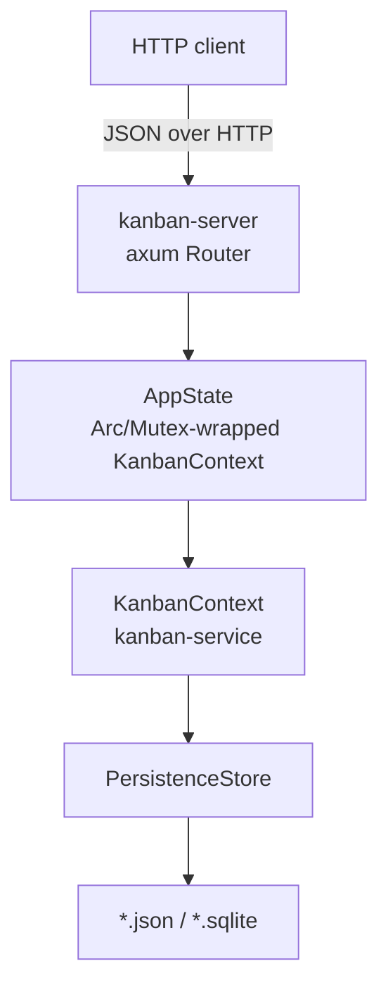
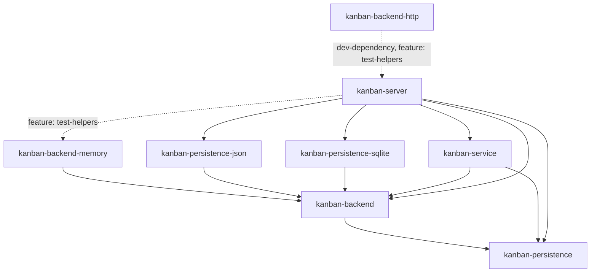

# kanban-server

HTTP API server for kanban project management. Wraps `kanban-service` behind a REST interface so non-Rust clients (web UIs, scripts, other services) can read and write boards without going through the TUI, CLI, or MCP server.

**Status: early / minimal.** Only boards and column reads are wired up so far — see [Endpoints](#endpoints). The bind address is configurable (see [Configuration](#configuration)); per-request logging is not. Still best treated as a development server rather than a hardened production deployment.

## Architecture

`kanban-server` holds a single `KanbanContext` in memory behind a `tokio::sync::Mutex`, shared across all handlers via axum's `State`.



A `tokio::sync::Mutex` is used rather than a sync `RwLock`: `KanbanContext`'s write path (`save`/`reload`) is async, and holding a sync write guard across an `.await` would be a `Send`/deadlock hazard.

Each successful mutation broadcasts a `ChangeEventFrame` on an in-process `tokio::sync::broadcast` channel (`AppState::broadcast_change`), naming the entity type, id and change kind (created/updated/deleted) it touched. `GET /v1/events` streams these frames to clients over SSE, so a client can invalidate just the affected board, column, card or sprint instead of its whole cache. A frame caused by an external process writing the file directly (`AppState::broadcast_unscoped_change`) carries no entity identity, meaning subscribers must invalidate everything.

## Installation

### From Nix (recommended)
```bash
nix build .#kanban-server
```

### From Cargo
```bash
cargo install --path crates/kanban-server
```

## Usage

```bash
kanban-server
```

On startup the server opens (or creates) the board file, binds the configured address (default `127.0.0.1` on an OS-assigned ephemeral port), and serves until killed. Pin a fixed host/port with the `--addr` flag, the `KANBAN_ADDR` env var, or the `server_addr` config key (see [Configuration](#configuration)). When left on the default ephemeral port, read the bound address from the startup log line (`RUST_LOG=info`) or `lsof -p <pid>`.

### Configuration

| Env var | Default | Purpose |
|---|---|---|
| `KANBAN_FILE` | `kanban.json` (in the working directory) | Storage locator, resolved through the same backend registry as the CLI/TUI/MCP server — a `.json` path uses the JSON backend, a `.sqlite`/`.db` path (or existing SQLite file) uses the SQLite backend. |
| `KANBAN_ADDR` | `127.0.0.1:0` (ephemeral loopback) | Address the HTTP server binds, as `host:port` where host is an IP literal (`127.0.0.1`, `0.0.0.0`, `[::1]`); hostnames such as `localhost` are not resolved. Resolved with the same layered precedence as `KANBAN_FILE`: the `--addr` flag wins, then `KANBAN_ADDR`, then the `server_addr` key in the config file, then the default. Set `0.0.0.0:<port>` to accept non-loopback connections (e.g. behind a reverse proxy). |
| `RUST_LOG` | unset (⇒ `error` only) | Standard `tracing-subscriber` env filter. Set to `info` to see the startup log line; there is no per-request access logging. |

The bind address can also be set with the `--addr` flag or the `server_addr` key in the kanban config file (`~/.config/kanban/config.toml`); the resolution order is `--addr` > `KANBAN_ADDR` > `server_addr` > the `127.0.0.1:0` default.

### Example

```bash
RUST_LOG=info KANBAN_FILE=/path/to/boards.json kanban-server
# 2026-07-27T20:56:12Z  INFO kanban_server: kanban-server listening addr=127.0.0.1:58548
```

```bash
curl -s http://127.0.0.1:58548/health | jq
```
```json
{
  "status": "ok",
  "instance_id": "079131c7-ffac-4269-9dc6-5dee6af77097"
}
```

`instance_id` is a random UUID generated once per process start (`AppState::new`) — stable across requests within a run, and useful for a client to detect a server restart.

```bash
curl -s http://127.0.0.1:58548/v1/boards | jq
```
```json
{
  "items": [
    {
      "id": "e119c091-e1fa-4596-9bc7-038ceab6adec",
      "name": "Kanban",
      "description": "Management of the **Kanban** project\n",
      "sprint_prefix": "KAN",
      "card_prefix": "KAN",
      "task_sort_field": "updated_at",
      "task_sort_order": "descending",
      "sprint_duration_days": 7,
      "task_list_view": "grouped_by_column",
      "active_sprint_id": "2ab2a4d3-80d0-4bd6-881c-88bed5fd7670",
      "position": 0,
      "created_at": "2025-10-10T08:47:44.779097Z",
      "updated_at": "2026-07-04T10:55:00.488151029Z"
    }
  ],
  "total": 1,
  "page": 1,
  "page_size": 50,
  "total_pages": 1
}
```

```bash
curl -s http://127.0.0.1:58548/v1/boards/e119c091-e1fa-4596-9bc7-038ceab6adec/columns | jq '.items[].name'
```
```json
"Backlog"
"In Progress"
"Done"
```

Creating a board (`POST`) returns `201` with the same `BoardResponse` shape as the reads above:

```bash
curl -s -X POST http://127.0.0.1:58548/v1/boards \
  -H 'content-type: application/json' \
  -d '{"name": "Roadmap", "card_prefix": "RM"}' | jq
```
```json
{
  "id": "3fbb2b8b-...",
  "name": "Roadmap",
  "card_prefix": "RM",
  ...
}
```

A lookup miss comes back as the error envelope, not an empty body:

```bash
curl -s http://127.0.0.1:58548/v1/boards/00000000-0000-0000-0000-000000000000 | jq
```
```json
{
  "code": "NOT_FOUND",
  "message": "Board 00000000-0000-0000-0000-000000000000 not found"
}
```

## Endpoints

All request/response bodies are JSON. Errors share one envelope (see [Error Handling](#error-handling)). The four collection `GET`s (`/v1/boards`, `/v1/boards/{board_id}/columns`, `/v1/boards/{board_id}/cards`, `/v1/boards/{board_id}/sprints`) accept `?page=&page_size=` and return a `Page<T>` envelope; see [Pagination](#pagination).

### Health

| Method | Path | Description |
|---|---|---|
| `GET` | `/health` | Liveness check. Returns `{"status": "ok", "instance_id": "<uuid>"}`. |

### Boards

| Method | Path | Description | Body |
|---|---|---|---|
| `GET` | `/v1/boards` | List all boards. Returns `Page<BoardResponse>`; accepts `?page=&page_size=`. | — |
| `GET` | `/v1/boards/{id}` | Get a board by UUID. Returns `archived_at` (present only if the board is archived). | — |
| `POST` | `/v1/boards` | Create a board. `201 Created`. A board created this way always has zero columns. | `CreateBoardRequest` |
| `PUT` | `/v1/boards/{id}` | Full replace (RFC 9110 §9.3.4) — creates the board at `id` if absent (`201`), otherwise replaces it in full (`200`). All non-nullable fields are required; a partial body is a 400. | `ReplaceBoardRequest` |
| `PATCH` | `/v1/boards/{id}` | Partial update — JSON Merge Patch (RFC 7386): an absent field is no change, `null` clears it, a value sets it. | `UpdateBoardRequest` |
| `DELETE` | `/v1/boards/{id}` | Delete a board and everything under it. `204 No Content`. | — |

### Columns

| Method | Path | Description |
|---|---|---|
| `GET` | `/v1/boards/{board_id}/columns` | List a board's columns. Returns `Page<ColumnResponse>`; accepts `?page=&page_size=`. |
| `GET` | `/v1/boards/{board_id}/columns/{id}` | Get a column by UUID. 404s if the column exists but belongs to a different board. |

Column writes (create/update/delete) aren't implemented yet.

### Sprints

| Method | Path | Description | Body |
|---|---|---|---|
| `GET` | `/v1/boards/{board_id}/sprints` | List a board's sprints. 404s if `board_id` doesn't exist (does not collapse into an empty list). Returns `Page<SprintResponse>`; accepts `?page=&page_size=`. | — |
| `GET` | `/v1/boards/{board_id}/sprints/{id}` | Get a sprint by UUID. 404s if the sprint exists but belongs to a different board. | — |
| `POST` | `/v1/boards/{board_id}/sprints` | Create a sprint. `201 Created`. A client-supplied `id` that already exists is a `409 Conflict`. | `CreateSprintRequest` |
| `PUT` | `/v1/boards/{board_id}/sprints/{id}` | Full replace (RFC 9110 §9.3.4) — creates the sprint at `id` if absent (`201`), otherwise replaces it in full (`200`). 404s if `id` belongs to a different board. | `ReplaceSprintRequest` |
| `PATCH` | `/v1/boards/{board_id}/sprints/{id}` | Partial update — JSON Merge Patch (RFC 7386). 404s if the sprint belongs to a different board. | `UpdateSprintRequest` |
| `DELETE` | `/v1/boards/{board_id}/sprints/{id}` | Delete a sprint. `204 No Content`. 404s if the sprint belongs to a different board. | — |
| `GET` | `/v1/sprints/{id}` | Flat alias for the board-scoped `GET`. | — |
| `PATCH` | `/v1/sprints/{id}` | Flat alias for the board-scoped `PATCH`. | `UpdateSprintRequest` |
| `DELETE` | `/v1/sprints/{id}` | Flat alias for the board-scoped `DELETE`. | — |

### Cards

| Method | Path | Description | Body |
|---|---|---|---|
| `GET` | `/v1/boards/{board_id}/cards` | List a board's cards. Supports `?column_id=`, `?sprint_id=` and `?archived=` filters alongside pagination. Returns `Page<CardResponse>`; accepts `?page=&page_size=`. | — |

The remaining card routes (get/create/replace/update/delete, and the flat `/v1/cards/{id}` aliases) exist but aren't documented in this table yet.

### Graph

| Method | Path | Description | Body |
|---|---|---|---|
| `GET` | `/v1/cards/{id}/graph` | The card's dependency edges, scoped to that card: parents/children (spawns), blocked_by/blocks and related. Only active edges; archived edges are omitted. 404s if the card does not exist, rather than returning empty arrays. | — |

### Events

| Method | Path | Description |
|---|---|---|
| `GET` | `/v1/events` | Server-Sent Events stream of `ChangeEventFrame`s, one per successful mutation (or per detected external write). Each frame carries `entity_type`/`entity_id`/`kind`, all absent when the emitter cannot name what changed. |

Every write route (`POST`/`PUT`/`PATCH`) broadcasts a change event naming the entity it touched and, per the persistence layer's normal save path, durably writes to the configured store before responding.

## Pagination

`GET /v1/boards`, `GET /v1/boards/{board_id}/columns`, `GET /v1/boards/{board_id}/cards` and `GET /v1/boards/{board_id}/sprints` accept `?page=` (1-based) and `?page_size=`, both optional, and return a `Page<T>` envelope:

```json
{ "items": [...], "total": 42, "page": 1, "page_size": 50, "total_pages": 1 }
```

- `page` defaults to `1`, `page_size` defaults to `50`.
- `page_size` is capped at `500`; `page=0`, `page_size=0` or `page_size` over the cap is a `422 VALIDATION_FAILED`.
- A `page` past the last page is a normal `200` with `items: []`; `total` still reports the true, unfiltered count.
- `total_pages` is `0` for an empty collection.
- Slicing is in-memory: the full collection is read from storage first, then windowed. There is no store-level `LIMIT`/`OFFSET`.
- Other query params on `GET /v1/boards/{board_id}/cards` (`column_id`, `sprint_id`, `archived`) apply before pagination, so `total` reflects the filtered count, not the whole board.

## Error Handling

Every non-2xx response is a JSON `ApiError`:

```json
{ "code": "NOT_FOUND", "message": "Board 079131c7-... not found" }
```

`code` is a stable, machine-readable `SCREAMING_SNAKE_CASE` string clients can branch on without parsing `message`. HTTP status is derived from `code`:

| Status | Codes |
|---|---|
| 400 | `BATCH_RESOLUTION_FAILED` |
| 404 | `NOT_FOUND`, `NOT_FOUND_BY_NAME`, `EDGE_NOT_FOUND` |
| 409 | `AMBIGUOUS`, `WIP_LIMIT_EXCEEDED`, `CONFLICT_DETECTED`, `ALREADY_EXISTS`, `UNSUPPORTED_VERSION`, `DEPENDENCY_ERROR`, `CYCLE_DETECTED`, `DUPLICATE_EDGE` |
| 422 | `VALIDATION_FAILED`, `SPRINT_BOARD_MISMATCH`, `SELF_REFERENCE` |
| 500 | `IO_ERROR`, `SERIALIZATION_ERROR`, `DATABASE_ERROR`, `INTERNAL_ERROR` |

Malformed or type-mismatched request bodies (e.g. missing a required field) also come back as `VALIDATION_FAILED` (422) in this same envelope, rather than axum's default plain-text rejection.

---

## Position in the workspace



Solid arrows are normal (`[dependencies]`) edges; the `kanban-backend-memory`
edge is feature-gated (`test-helpers`, off by default) rather than optional
in the usual sense — it exists so integration tests can spin up an in-memory
`AppState` without touching disk. Like `kanban-cli`/`kanban-mcp`/`kanban-tui`,
`kanban-server` — not `kanban-service` — registers the concrete storage
backends (`kanban-persistence-json`, `kanban-persistence-sqlite`)
unconditionally (KAN-1027). The dashed edge from `kanban-backend-http` is a
`[dev-dependencies]` edge (feature `test-helpers`) used only to spin up a
real server for that crate's integration tests — not reachable from a
release build. See the [root README](../../README.md) for the full workspace
dependency graph.

## Dependencies

| Crate | Purpose |
|-------|---------|
| [`kanban-core`](../kanban-core/README.md) | Shared types, config |
| [`kanban-domain`](../kanban-domain/README.md) | Domain models |
| [`kanban-persistence`](../kanban-persistence/README.md) | `PersistenceStore`, `StoreRegistry` |
| [`kanban-backend`](../kanban-backend/README.md) | `KanbanBackend`, `KanbanBackendRegistry` |
| [`kanban-persistence-json`](../kanban-persistence-json/README.md) | JSON backend, registered at startup |
| [`kanban-persistence-sqlite`](../kanban-persistence-sqlite/README.md) | SQLite backend, registered at startup |
| [`kanban-service`](../kanban-service/README.md) | `KanbanContext`, all domain operations |
| [`kanban-backend-memory`](../kanban-backend-memory/README.md) (optional, feature `test-helpers`) | In-memory backend for tests |
| `axum` + `tower` + `tower-http` | HTTP routing/middleware |
| `tokio` | Async runtime |
| `serde` | Serialization |
| `prometheus` | Metrics |
| `clap` | CLI argument parsing |
| `tracing` + `tracing-subscriber` | Structured logging |

## Related crates

Used by: none in production — [kanban-backend-http](../kanban-backend-http/README.md) depends on this crate only as a dev-dependency (feature `test-helpers`) to spin up a real server for its own integration tests.
