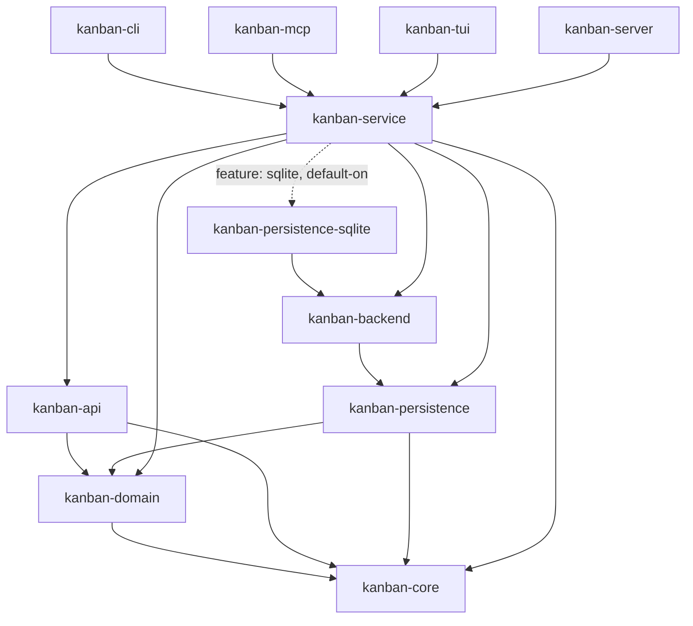

# kanban-service

Shared service layer implementing `KanbanOperations` over a pluggable
`PersistenceStore` / `KanbanBackend`. Sits between the persistence backends
(`kanban-backend` and its concrete implementations) and the interactive
frontends (`kanban-cli`, `kanban-mcp`, `kanban-tui`, `kanban-server`).

## Current architecture (post KAN-1024 / KAN-1027)

> **Note:** the rest of this file's detailed `KanbanContext` walkthrough below
> predates the backend-registry refactor (KAN-1024 onward) and describes an
> older shape of the struct (a raw `store: Arc<dyn PersistenceStore>` plus
> `boards`/`columns`/`cards`/... `Vec` fields and a standalone
> `HistoryManager`). That shape no longer matches the source. The paragraph
> below is accurate as of KAN-1027; the walkthrough after it is kept for its
> still-useful method-reference tables (construction/accessor/CRUD method
> names generally still exist, just not on the struct shape shown) but should
> not be trusted for the struct's actual fields. A full refresh of this
> file's body is tracked as a follow-up, not done as part of this change.
>
> `KanbanContext` now wraps `backend: Arc<dyn kanban_backend::KanbanBackend>`
> instead of a `PersistenceStore` directly, and undo/redo is driven by
> `undo_stack::UndoStack` (in `src/undo_stack.rs`) rather than a
> `HistoryManager`. Every command batch runs through
> `KanbanBackend::with_transaction`, and `KanbanContext::open`/`open_deferred`
> take a pre-built `Arc<dyn KanbanBackend>` — constructed by the caller via
> `StoreManager` (`src/store_manager.rs`), which wraps both a
> `kanban_persistence::StoreRegistry` (storage-format dispatch) and a
> `kanban_backend::KanbanBackendRegistry` (backend dispatch). See
> [Position in the workspace](#position-in-the-workspace) below for the
> corrected dependency graph — `kanban-service` has no production dependency
> on `kanban-persistence-json` or `kanban-backend-memory` any more, and no
> `json` feature.

## `KanbanContext`

The central type. Holds all domain data in memory and delegates to a `PersistenceStore` for load/save operations.

```rust
pub struct KanbanContext {
    // private fields:
    boards: Vec<Board>,
    columns: Vec<Column>,
    cards: Vec<Card>,
    sprints: Vec<Sprint>,
    archived_cards: Vec<ArchivedCard>,
    graph: DependencyGraph,
    app_config: AppConfig,
    store: Arc<dyn PersistenceStore + Send + Sync>,
    history: HistoryManager,
    dirty: bool,
    conflict_pending: bool,
}
```

**(Stale — see the callout above. The struct now holds `backend: Arc<dyn KanbanBackend>` and `undo_stack: UndoStack`, not the fields shown here.)**

### Construction

```rust
KanbanContext::load(store, config) -> KanbanResult<Self>
KanbanContext::load_with_defaults(store) -> KanbanResult<Self>
KanbanContext::empty(store, config) -> Self
```

### State Accessors

```rust
ctx.boards() -> &[Board]
ctx.columns() -> &[Column]
ctx.cards() -> &[Card]
ctx.sprints() -> &[Sprint]
ctx.archived_cards() -> &[ArchivedCard]
ctx.graph() -> &DependencyGraph
ctx.app_config() -> &AppConfig
ctx.is_dirty() -> bool
ctx.has_conflict() -> bool
ctx.set_conflict(bool)
ctx.clear_conflict()
```

### Persistence

```rust
ctx.save() -> KanbanResult<()>
ctx.reload() -> KanbanResult<()>
ctx.replace_store(store)
ctx.snapshot() -> Snapshot
ctx.apply_snapshot(snapshot)
```

### Undo / Redo

```rust
ctx.undo() -> bool        // Returns true if there was something to undo
ctx.redo() -> bool        // Returns true if there was something to redo
ctx.can_undo() -> bool
ctx.can_redo() -> bool
ctx.undo_depth() -> usize
ctx.redo_depth() -> usize
ctx.clear_history()
```

History is captured before every mutating operation. Stacks are capped at 100 entries.

### Board Operations

| Method | Description |
|--------|-------------|
| `create_board(name, card_prefix)` | Create a new board |
| `list_boards()` | List all boards |
| `get_board(id)` | Get a board by ID |
| `update_board(id, updates)` | Partially update a board |
| `delete_board(id)` | Delete board and all its data |

### Column Operations

| Method | Description |
|--------|-------------|
| `create_column(board_id, name, position)` | Create a column |
| `list_columns(board_id)` | List columns for a board |
| `get_column(id)` | Get a column by ID |
| `update_column(id, updates)` | Partially update a column |
| `delete_column(id)` | Delete column and its cards |
| `reorder_column(id, position)` | Move column to new position |

### Card Operations

| Method | Description |
|--------|-------------|
| `create_card(board_id, column_id, title, options)` | Create a card |
| `list_cards(filter)` | List cards with `CardListFilter` |
| `list_cards_paged(filter, page, page_size)` | Paginated card list |
| `get_card(id)` | Get full card by ID |
| `find_cards_by_identifier(s)` | Find card(s) by UUID or `KAN-5` format |
| `update_card(id, updates)` | Partially update a card |
| `move_card(id, column_id, position)` | Move card to a column |
| `archive_card(id)` | Archive a card |
| `restore_card(id, column_id)` | Restore an archived card |
| `delete_card(id)` | Permanently delete a card |
| `list_archived_cards()` | List all archived cards |

### Card–Sprint Operations

| Method | Description |
|--------|-------------|
| `assign_card_to_sprint(card_id, sprint_id)` | Assign a card to a sprint |
| `unassign_card_from_sprint(card_id)` | Remove card from its sprint |
| `get_card_branch_name(id)` | Generate git branch name for a card |
| `get_card_git_checkout(id)` | Generate `git checkout -b <branch>` command |

### Bulk Operations

| Method | Description |
|--------|-------------|
| `archive_cards(ids)` | Archive multiple cards; returns count |
| `move_cards(ids, column_id)` | Move multiple cards; returns count |
| `assign_cards_to_sprint(ids, sprint_id)` | Bulk sprint assignment; returns count |
| `archive_cards_detailed(ids)` | Archive with per-card success/failure report |
| `move_cards_detailed(ids, column_id)` | Move with per-card success/failure report |
| `assign_cards_to_sprint_detailed(ids, sprint_id)` | Bulk assign with report |

### Sprint Operations

| Method | Description |
|--------|-------------|
| `create_sprint(board_id, prefix, name)` | Create a sprint |
| `list_sprints(board_id)` | List sprints for a board |
| `get_sprint(id)` | Get a sprint by ID |
| `update_sprint(id, updates)` | Partially update a sprint |
| `activate_sprint(id, duration_days)` | Activate a sprint |
| `complete_sprint(id)` | Complete a sprint |
| `cancel_sprint(id)` | Cancel a sprint |
| `delete_sprint(id)` | Delete a sprint |
| `carry_over_sprint_cards(from, to)` | Move uncompleted cards to a new sprint |

### Card Relations (GraphOperations)

`KanbanContext` also implements the `GraphOperations` trait from
`kanban-domain`, which is the service-layer entry point for the card
dependency graph (parent/child, blocks, relates). The CLI relation
handler and the MCP relation tools both consume `&dyn GraphOperations`
through their respective context wrappers.

| Method | Description |
|--------|-------------|
| `attach_children(parent, children)` | Atomic batch: attach every child to `parent`; full rollback on any failure (cycle, self-reference, unknown card, duplicate) |
| `attach_child(parent, child)` | Singular convenience; default-method forward to `attach_children(parent, vec![child])` |
| `detach_children(parent, children)` | Atomic batch: detach every child from `parent`; rolls back on missing edge |
| `detach_child(parent, child)` | Singular convenience; default-method forward to `detach_children` |
| `list_children_of(parent)` | List direct children (active edges only) |
| `list_parents_of(child)` | List direct parents (active edges only) |
| `block(blocker, blocked, severity)` | Add a directed blocks edge with `Severity` metadata |
| `unblock(blocker, blocked)` | Remove the directed blocks edge |
| `list_blocked_by(blocker)` | Cards `blocker` blocks (outgoing) |
| `list_blockers_of(blocked)` | Cards that block `blocked` (incoming) |
| `relate(a, b, kind)` | Add an undirected relates edge with `RelatesKind` metadata |
| `dissociate(a, b)` | Remove the undirected relates edge |
| `list_related_to(card)` | Cards related to `card` via any active relates edge |

The plural methods are the atomic primitives; singular methods are
default-impl forwards that wrap a single id in `vec![]` so every
mutation routes through the same `KanbanContext::execute(Vec<Command>)`
transactional path. Cross-board parent/child is permitted at the
service layer; board-scoping is a separate caller decision. Every
mutation method validates participant card existence up front and
returns `NotFound` on stale ids before the command reaches the graph.

---

## `BatchOperationResult`

```rust
pub struct BatchOperationResult {
    pub succeeded: Vec<Uuid>,
    pub failed: Vec<BatchOperationFailure>,
}

pub struct BatchOperationFailure {
    pub id: Uuid,
    pub error: String,
}
```

Returned by the `*_detailed` bulk operation methods.

---

## `DataSnapshot`

```rust
pub struct DataSnapshot {
    // mirrors kanban_domain::Snapshot; used for serialization
}
```

---

## Utility Functions

```rust
// Build the default store registry (SQLite first, JSON as catch-all)
pub fn default_registry() -> StoreRegistry;

// Detect which backend matches a locator string
pub fn detect_backend(locator: &str) -> Option<String>;

// Create a store from backend name + locator
pub fn make_store(backend: &str, locator: &str) -> KanbanResult<Arc<dyn PersistenceStore + Send + Sync>>;

// Create a store from an optional file path + AppConfig
pub fn make_store_with_config(file: Option<&str>, config: &AppConfig) -> KanbanResult<Arc<dyn PersistenceStore + Send + Sync>>;

// Load and validate a store (returns error if file doesn't exist)
pub async fn validate_and_load_store(backend: &str, path: &str) -> KanbanResult<Snapshot>;

// Export board selection to a new SQLite file
pub async fn export_to_sqlite(export: AllBoardsExport, filename: &str) -> KanbanResult<()>;

// Migrate all data from one store to another
pub async fn migrate_store(source: &str, target: &str) -> KanbanResult<()>;

// Sync config storage_backend field to match the file's actual backend
pub fn sync_backend_with_file(locator: &str, config: &mut AppConfig) -> bool;
```

---

## Command Execution Flow

```
caller
  │
  ▼
KanbanContext::execute(commands: Vec<Box<dyn Command>>)
  │
  ├─ 1. history.capture_before_command(current_snapshot)
  │
  ├─ 2. for each command:
  │       command.execute(&mut CommandContext)   ← mutates boards/columns/cards/...
  │       on error: restore from undo snapshot → return Err
  │
  ├─ 3. dirty = true
  │
  └─ (caller calls ctx.save() → store.save(snapshot, metadata))
```

---

## Position in the workspace



Solid arrows are normal (`[dependencies]`) edges; the one dotted arrow is the
`sqlite` feature (on by default). **This is the KAN-1027 payoff**:
`kanban-service` depends on the `kanban-backend` abstraction (and, only
optionally, on the SQLite concretion for its default-on feature) — not on
`kanban-persistence-json` or `kanban-backend-memory`, both of which are
`[dev-dependencies]`-only now (used to drive the shared contract test suite,
along with a dev-only, mutual `kanban-persistence-sqlite` edge). None of
those dev edges are reachable from a release build. See the
[root README](../../README.md) for the full workspace dependency graph.

## Dependencies

| Crate | Purpose |
|-------|---------|
| `kanban-core` | `AppConfig`, `AppType`, `KanbanResult` |
| `kanban-domain` | All domain types, `KanbanOperations`, `DataStore` |
| `kanban-persistence` | `PersistenceStore`, `StoreRegistry`, `PersistenceMetadata` |
| `kanban-api` | Re-exported as `kanban_service::api` — wire DTOs for MCP/server consumers |
| `kanban-backend` | `KanbanBackend`, `RemoteWrites` — the backend abstraction this crate depends on instead of a concrete backend |
| `kanban-persistence-sqlite` (optional, feature `sqlite`, default-on) | The one concrete storage backend this crate still knows about by name |
| `tokio` | Async runtime |
| `serde` + `serde_json` | Serialization |
| `schemars` (optional, feature `schemars`) | JSON Schema derivation on wire DTOs for MCP tool parameters |
| `toml`, `dirs`, `dunce` | Config file location/parsing |
| `chrono`, `uuid` | Timestamps, entity/session IDs |
| `tracing` | Structured logging |
