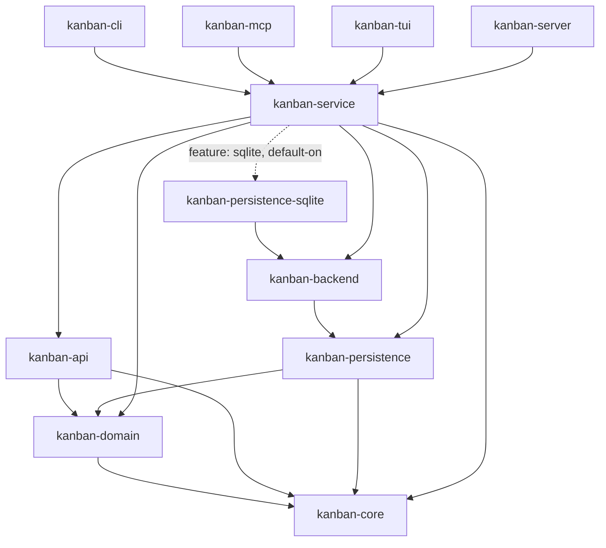

# kanban-service

Shared service layer implementing `KanbanOperations` over a pluggable
`PersistenceStore` / `KanbanBackend`. Sits between the persistence backends
(`kanban-backend` and its concrete implementations) and the interactive
frontends (`kanban-cli`, `kanban-mcp`, `kanban-tui`, `kanban-server`).

## Current architecture (post KAN-1024 / KAN-1027)

`KanbanContext` (`src/context/`, split across `core.rs`, `undo.rs`,
`persistence.rs`, `boards.rs`, `columns.rs`, `cards.rs`, `cards_batch.rs`,
`cards_batch_detailed.rs`, `sprints.rs`, `graph.rs`, `filters.rs`) wraps a
`backend: Arc<dyn kanban_backend::KanbanBackend>` — there is no domain data
cached on the struct itself; every accessor reads through to the backend on
each call. Undo/redo is driven by `undo_stack::UndoStack` (`src/undo_stack.rs`),
not a `HistoryManager`. Every command batch runs through
`KanbanBackend::with_transaction`, and `KanbanContext::open`/`open_deferred`
take a pre-built `Arc<dyn KanbanBackend>` — constructed by the caller via
`StoreManager` (`src/store_manager.rs`), which wraps both a
`kanban_persistence::StoreRegistry` (storage-format dispatch) and a
`kanban_backend::KanbanBackendRegistry` (backend dispatch). See
[Position in the workspace](#position-in-the-workspace) below for the
dependency graph — `kanban-service` has no production dependency on
`kanban-persistence-json` or `kanban-backend-memory`, and no `json` feature.

## `KanbanContext`

The central type. Holds a backend handle plus per-session undo/redo and
dirty/conflict state; all domain reads and writes go through `backend`.

```rust
pub struct KanbanContext {
    pub(super) backend: Arc<dyn KanbanBackend>,
    pub(super) app_config: AppConfig,
    pub(super) undo_stack: crate::undo_stack::UndoStack,
    pub(super) dirty: bool,
    pub(super) conflict_pending: bool,
    pub(super) session_id: Uuid,
    pub(super) app_type: AppType,
}
```

### Construction

```rust
KanbanContext::open_deferred(backend: Arc<dyn KanbanBackend>, config: AppConfig) -> Self
KanbanContext::open(backend: Arc<dyn KanbanBackend>, config: AppConfig) -> KanbanResult<Self>
ctx.with_app_type(app_type: AppType) -> Self
```

`open_deferred` is zero-I/O — it just wraps `backend`. `open` is async and
additionally calls `backend.batch_count()` so a lazy backend's load/parse
errors surface at construction time rather than on first use. `with_app_type`
is a builder call made right after `open_deferred`/`open` to record which
surface (CLI, MCP, TUI) owns the context, for command attribution.

### State Accessors

```rust
ctx.app_config() -> &AppConfig
ctx.data_store() -> &dyn DataStore
ctx.backend() -> Arc<dyn KanbanBackend>
ctx.persistence_metadata() -> Option<PersistenceMetadata>
ctx.session_id() -> Uuid
ctx.boards() -> KanbanResult<Vec<Board>>
ctx.columns() -> KanbanResult<Vec<Column>>       // live-scoped (excludes archived-board columns)
ctx.cards() -> KanbanResult<Vec<Card>>
ctx.sprints() -> KanbanResult<Vec<Sprint>>
ctx.archived_cards() -> KanbanResult<Vec<ArchivedCard>>
ctx.graph() -> KanbanResult<DependencyGraph>
ctx.require_board(id: Uuid) -> KanbanResult<Board>     // NotFound if missing
ctx.require_column(id: Uuid) -> KanbanResult<Column>   // NotFound if missing
ctx.is_dirty() -> bool
ctx.mark_dirty()
ctx.mark_clean()
ctx.has_conflict() -> bool
ctx.set_conflict()
ctx.clear_conflict()
ctx.set_conflict_pending(bool)
```

Unlike the pre-KAN-1024 shape, there are no cached `Vec` fields to read —
`boards()`/`columns()`/`cards()`/`sprints()`/`archived_cards()`/`graph()`
each query the backend fresh and return an owned, `KanbanResult`-wrapped
`Vec` (or `DependencyGraph`).

### Persistence

```rust
ctx.save() -> KanbanResult<()>                 // async; backend.flush().await
ctx.reload() -> KanbanResult<()>               // async; backend.reload().await, clears undo_stack
ctx.replace_backend(backend: Arc<dyn KanbanBackend>)  // clears undo_stack, marks clean
ctx.snapshot() -> KanbanResult<Snapshot>
ctx.apply_snapshot(snapshot: Snapshot) -> KanbanResult<()>
ctx.migrate_sprint_logs() -> KanbanResult<usize>  // one-time backfill utility, bypasses undo on purpose
```

`save` and `reload` are `async` — `save` delegates to `backend.flush()`
(a WAL checkpoint for SQLite, a cache flush for JSON); `reload` re-reads
from durable storage and drops the per-session undo/redo history, since
entity ids from before the reload may no longer exist.

### Undo / Redo

```rust
ctx.execute(commands: Vec<Command>) -> KanbanResult<()>
ctx.undo() -> KanbanResult<bool>   // Ok(false) if there was nothing to undo
ctx.redo() -> KanbanResult<bool>   // Ok(false) if there was nothing to redo
ctx.can_undo() -> bool
ctx.can_redo() -> bool
ctx.undo_depth() -> usize
ctx.redo_depth() -> usize
ctx.clear_history() -> KanbanResult<()>
```

Every undoable command captures an inverse at `execute` time; the
`(forward, inverse)` pair is pushed onto the per-session `UndoStack` — an
in-memory, unbounded `Vec` with a cursor, never persisted, never capped.
`undo`/`redo` re-run the captured inverse/forward batch through the same
command-execute path (no snapshot apply, no replay); the cursor only
advances once the batch commits, so a failed undo/redo leaves the stack
ready to retry the same entry. `execute` also appends the forward batch to
the `CommandStore` audit log via `backend.append_batch` — informational
only, it records what happened but does not drive undo.

### Board Operations

| Method | Description |
|--------|-------------|
| `create_board(name, card_prefix)` | Create a new board |
| `list_boards()` | List live boards (sugar for `list_boards_filtered` with the default `LiveOnly` selector) |
| `list_boards_filtered(filter)` | List board heads per `BoardListFilter`'s archival selector (live and/or archived) |
| `get_board(id)` | Get a board by ID |
| `update_board(id, updates)` | Partially update a board |
| `delete_board(id)` | Permanently delete a board and its subtree |
| `archive_board(id)` | Move a board out of the live set into the archived collection; its subtree stays in place |
| `restore_board(id)` | Restore an archived board back into the live set |
| `list_archived_boards()` | List archived boards (ascending by `archived_at`) |

### Column Operations

| Method | Description |
|--------|-------------|
| `create_column(board_id, name, position)` | Create a column |
| `list_columns(board_id)` | List columns for a board |
| `get_column(id)` | Get a column by ID |
| `update_column(id, updates)` | Partially update a column |
| `delete_column(id)` | Delete column and its cards |
| `reorder_column(id, position)` | Move column to new position |

### Card Operations

| Method | Description |
|--------|-------------|
| `create_card(board_id, column_id, title, options)` | Create a card |
| `list_cards(filter)` | List `CardSummary`s with `CardListFilter` (pagination is MCP-layer only — see below) |
| `list_all_cards()` | Live-scoped, unfiltered `Card`s across all live boards |
| `list_all_columns()` | Live-scoped, unfiltered columns across all live boards |
| `list_all_sprints()` | Live-scoped, unfiltered sprints across all live boards |
| `get_card(id)` | Get full card by ID |
| `find_cards_by_identifier(s)` | Find card(s) by UUID or `KAN-5` format |
| `update_card(id, updates)` | Partially update a card |
| `move_card(id, column_id, position)` | Move card to a column |
| `archive_card(id)` | Archive a card |
| `restore_card(id, column_id)` | Restore an archived card |
| `delete_card(id)` | Permanently delete a card |
| `list_archived_cards()` | List all archived cards |
| `list_archived_cards_by_board(board_id)` | Archived cards for one board (first-class `board_id` query) |

Pagination is not part of `KanbanContext`: `list_cards_paged(filter, page,
page_size)` lives on `kanban_mcp::McpContext` (`crates/kanban-mcp/src/context.rs`),
which wraps `list_cards` and paginates the result — `KanbanOperations::list_cards`
itself has no pagination parameters.

### Card–Sprint Operations

| Method | Description |
|--------|-------------|
| `assign_card_to_sprint(card_id, sprint_id)` | Assign a card to a sprint |
| `unassign_card_from_sprint(card_id)` | Remove card from its sprint |
| `get_card_branch_name(id)` | Generate git branch name for a card |
| `get_card_git_checkout(id)` | Generate `git checkout -b <branch>` command |

### Bulk Operations

| Method | Description |
|--------|-------------|
| `archive_cards(ids)` | Archive multiple cards; returns count |
| `move_cards(ids, column_id)` | Move multiple cards; returns count |
| `update_cards(updates)` | Per-card updates as one undo unit; auto-syncs the status ↔ completion-column invariant when only one side of a pair is set |
| `assign_cards_to_sprint(ids, sprint_id)` | Bulk sprint assignment; returns count |
| `archive_cards_detailed(ids)` | Archive with per-card success/failure report |
| `move_cards_detailed(ids, column_id)` | Move with per-card success/failure report |
| `assign_cards_to_sprint_detailed(ids, sprint_id)` | Bulk assign with report |

### Sprint Operations

| Method | Description |
|--------|-------------|
| `create_sprint(board_id, prefix, name)` | Create a sprint |
| `list_sprints(board_id)` | List sprints for a board |
| `get_sprint(id)` | Get a sprint by ID |
| `update_sprint(id, updates)` | Partially update a sprint |
| `activate_sprint(id, duration_days)` | Activate a sprint |
| `complete_sprint(id)` | Complete a sprint |
| `cancel_sprint(id)` | Cancel a sprint |
| `delete_sprint(id)` | Delete a sprint |
| `carry_over_sprint_cards(from, to)` | Move uncompleted cards to a new sprint |

### Card Relations (GraphOperations)

`KanbanContext` also implements the `GraphOperations` trait from
`kanban-domain`, which is the service-layer entry point for the card
dependency graph (parent/child, blocks, relates). The CLI relation
handler and the MCP relation tools both consume `&dyn GraphOperations`
through their respective context wrappers.

| Method | Description |
|--------|-------------|
| `attach_children(parent, children)` | Atomic batch: attach every child to `parent`; full rollback on any failure (cycle, self-reference, unknown card, duplicate) |
| `attach_child(parent, child)` | Singular convenience; default-method forward to `attach_children(parent, vec![child])` |
| `detach_children(parent, children)` | Atomic batch: detach every child from `parent`; rolls back on missing edge |
| `detach_child(parent, child)` | Singular convenience; default-method forward to `detach_children` |
| `list_children_of(parent)` | List direct children (active edges only) |
| `list_parents_of(child)` | List direct parents (active edges only) |
| `block(blocker, blocked, severity)` | Add a directed blocks edge with `Severity` metadata |
| `unblock(blocker, blocked)` | Remove the directed blocks edge |
| `list_blocked_by(blocker)` | Cards `blocker` blocks (outgoing) |
| `list_blockers_of(blocked)` | Cards that block `blocked` (incoming) |
| `relate(a, b, kind)` | Add an undirected relates edge with `RelatesKind` metadata |
| `dissociate(a, b)` | Remove the undirected relates edge |
| `list_related_to(card)` | Cards related to `card` via any active relates edge |

The plural methods are the atomic primitives; singular methods are
default-impl forwards that wrap a single id in `vec![]` so every
mutation routes through the same `KanbanContext::execute(Vec<Command>)`
transactional path. Cross-board parent/child is permitted at the
service layer; board-scoping is a separate caller decision. Every
mutation method validates participant card existence up front and
returns `NotFound` on stale ids before the command reaches the graph.

---

## `BatchOperationResult`

```rust
pub struct BatchOperationResult {
    pub succeeded: Vec<Uuid>,
    pub failed: Vec<BatchOperationFailure>,
}

pub struct BatchOperationFailure {
    pub id: Uuid,
    pub error: String,
}
```

Returned by the `*_detailed` bulk operation methods.

---

## `Snapshot`

There is no `kanban-service`-local snapshot type. `KanbanContext::snapshot()` /
`apply_snapshot()` and `StoreManager`'s export/migrate helpers all operate
directly on `kanban_domain::Snapshot` (`crates/kanban-domain/src/snapshot.rs`):

```rust
pub struct Snapshot {
    pub boards: Vec<Board>,
    pub columns: Vec<Column>,
    pub cards: Vec<Card>,
    pub archived_cards: Vec<ArchivedCard>,
    pub sprints: Vec<Sprint>,
    pub archived_boards: Vec<ArchivedBoard>,
    pub graph: DependencyGraph,
}
```

---

## Store / backend construction — `StoreManager`

Backend and store construction live on **`StoreManager`** (`src/store_manager.rs`),
which each application builds and hands a `kanban_persistence::StoreRegistry` +
`kanban_backend::KanbanBackendRegistry` pair at startup. These are **methods on
`StoreManager`**, not free functions:

```rust
// Dispatch to the right KanbanBackend by content-sniffing the locator
// (the KAN-1027 registry path): first factory whose matches_locator accepts it.
sm.make_backend(locator, config) -> KanbanResult<Arc<dyn KanbanBackend>>

// Build a raw PersistenceStore (used by the admin flows below and by callers
// that need the store directly, e.g. init's empty-file creation)
sm.make_store(backend, locator) -> KanbanResult<Arc<dyn PersistenceStore + Send + Sync>>
sm.make_store_with_config(file, config) -> KanbanResult<Arc<dyn PersistenceStore + Send + Sync>>

// Identify / align the backend for a locator
sm.detect_backend(locator) -> Option<String>
sm.is_sqlite(locator) -> bool
sm.sync_backend_with_file(locator, &mut config) -> bool  // returns true if it corrected config

// Admin flows that talk to SqliteStore directly (unrelated to backend dispatch)
sm.validate_and_load_store(backend, path) -> KanbanResult<Snapshot>
sm.export_to_sqlite(export, filename) -> KanbanResult<()>
sm.migrate_store(from_backend, from_path, to_backend, to_path) -> KanbanResult<()>
```

The former free functions `kanban_service::default_registry()` and
`kanban_service::open_context()` were **removed in KAN-1027** — each application now
assembles and owns its `StoreRegistry` + `KanbanBackendRegistry` (and, via the
extended `register_backend`, can add its own), rather than pulling a pre-built
registry out of `kanban-service`. This is what let the crate drop its production
dependency on the JSON concretion.

---

## Command Execution Flow

```
caller
  │
  ▼
KanbanContext::execute(commands: Vec<Command>)
  │
  ├─ 0. if backend.remote_writes().is_some(): return Err(Unsupported)
  │      (the HTTP backend bypasses this path entirely — see kanban-backend-http)
  │
  ├─ 1. backend.with_transaction(|| {
  │       for each command:
  │         per_cmd_inverses.push(command.capture_inverse(store))
  │         command.execute(&CommandContext { store })   ← mutates via DataStore
  │       backend.append_batch(&batch)                   ← audit log (informational)
  │     })
  │
  ├─ 2. undo_stack.push(UndoEntry { forward: commands, inverse: per_cmd_inverses.rev() })
  │
  ├─ 3. dirty = true
  │
  └─ (caller calls ctx.save().await → backend.flush().await)
```

`with_transaction` makes the whole batch atomic: if any command's
`capture_inverse` or `execute` fails partway through, the transaction rolls
back and nothing is pushed onto the undo stack. The inverse pushed for undo
is the per-command inverses composed in reverse order, so undoing runs each
inverse against the state its forward command actually saw.

---

## Position in the workspace



Solid arrows are normal (`[dependencies]`) edges; the one dotted arrow is the
`sqlite` feature (on by default). **This is the KAN-1027 payoff**:
`kanban-service` depends on the `kanban-backend` abstraction (and, only
optionally, on the SQLite concretion for its default-on feature) — not on
`kanban-persistence-json` or `kanban-backend-memory`, both of which are
`[dev-dependencies]`-only now (used to drive the shared contract test suite,
along with a dev-only, mutual `kanban-persistence-sqlite` edge). None of
those dev edges are reachable from a release build. See the
[root README](../../README.md) for the full workspace dependency graph.

## Dependencies

| Crate | Purpose |
|-------|---------|
| [`kanban-core`](../kanban-core/README.md) | `AppConfig`, `AppType`, `KanbanResult` |
| [`kanban-domain`](../kanban-domain/README.md) | All domain types, `KanbanOperations`, `DataStore` |
| [`kanban-persistence`](../kanban-persistence/README.md) | `PersistenceStore`, `StoreRegistry`, `PersistenceMetadata` |
| [`kanban-api`](../kanban-api/README.md) | Re-exported as `kanban_service::api` — wire DTOs for MCP/server consumers |
| [`kanban-backend`](../kanban-backend/README.md) | `KanbanBackend`, `RemoteWrites` — the backend abstraction this crate depends on instead of a concrete backend |
| [`kanban-persistence-sqlite`](../kanban-persistence-sqlite/README.md) (optional, feature `sqlite`, default-on) | The one concrete storage backend this crate still knows about by name |
| `tokio` | Async runtime |
| `serde` + `serde_json` | Serialization |
| `schemars` (optional, feature `schemars`) | JSON Schema derivation on wire DTOs for MCP tool parameters |
| `toml`, `dirs`, `dunce` | Config file location/parsing |
| `chrono`, `uuid` | Timestamps, entity/session IDs |
| `tracing` | Structured logging |

## Related crates

Used by: [kanban-cli](../kanban-cli/README.md), [kanban-mcp](../kanban-mcp/README.md), [kanban-tui](../kanban-tui/README.md), and [kanban-server](../kanban-server/README.md).
