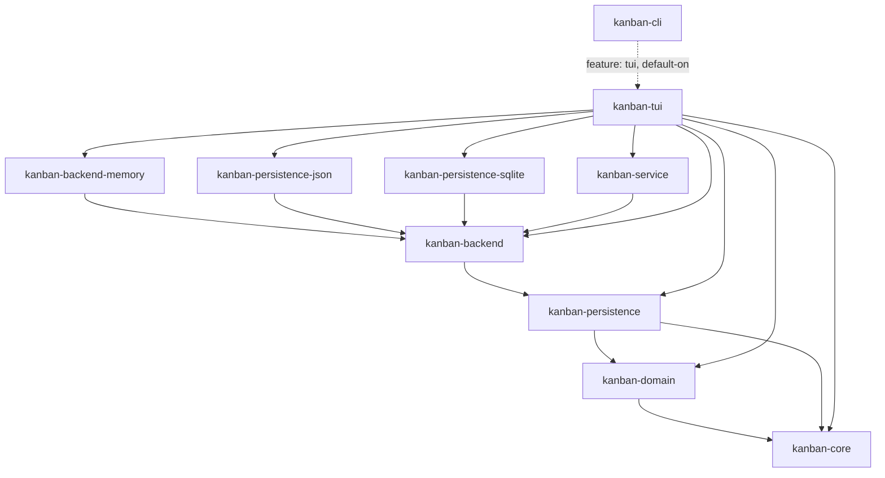

# kanban-tui

Terminal UI for the kanban workspace, built with [ratatui](https://ratatui.rs) and crossterm. Depends on `kanban-service` for all state management and persistence.

## Module Structure

```
src/
├── app/            # Application state, AppMode, event dispatch
├── components/     # Reusable UI widgets (panels, lists, popups)
├── handlers/       # Keyboard event handlers per mode
├── keybindings/    # Keybinding definitions and context registry
├── ui/             # Ratatui rendering for each view
└── lib.rs          # Public API: run()
```

## Application State

### `App`

The root application state struct:

```rust
pub struct App {
    pub mode: AppMode,
    pub mode_stack: Vec<AppMode>,
    pub focus: FocusState,
    // boards, columns, cards, sprints, ... all via KanbanContext
}
```

### `AppMode`

```rust
pub enum AppMode {
    Normal,
    CardDetail,
    BoardDetail,
    SprintDetail,
    Search,
    ArchivedCardsView,
    Settings,
    Help(Box<AppMode>),     // wraps the previous mode for help overlay
    ErrorLog,               // structured error log viewer
    Dialog(DialogMode),
}
```

### `DialogMode`

All 29 dialog variants:

| Variant | Description |
|---------|-------------|
| `CreateBoard` | Text input: new board name |
| `CreateCard` | Text input: new card title |
| `CreateSprint` | Text input: new sprint name |
| `CreateColumn` | Text input: new column name |
| `RenameBoard` | Text input: rename board |
| `RenameColumn` | Text input: rename column |
| `ExportBoard` | Text input: export file path |
| `ExportAll` | Text input: export all boards path |
| `ExportBoards` | Selection: choose boards to export |
| `ImportBoard` | Selection: choose file to import |
| `SetCardPoints` | Text input: story points |
| `SetCardPriority` | Selection: priority level |
| `SetMultipleCardsPriority` | Selection: priority (bulk) |
| `SetBranchPrefix` | Text input: branch prefix |
| `SetSprintPrefix` | Text input: sprint prefix |
| `SetSprintCardPrefix` | Text input: sprint card prefix |
| `OrderCards` | Selection: sort field |
| `AssignCardToSprint` | Selection: sprint |
| `AssignMultipleCardsToSprint` | Selection: sprint (bulk) |
| `SelectTaskListView` | Selection: view mode |
| `DeleteColumnConfirm` | Confirm: delete column |
| `ConfirmSprintPrefixCollision` | Confirm: prefix conflict |
| `FilterOptions` | Checkboxes: filter options |
| `ConflictResolution` | Confirm: keep local or reload |
| `ExternalChangeDetected` | Confirm: external file change |
| `ManageParents` | Selection: set parent cards (atomic batch via `attach_children`) |
| `ManageChildren` | Selection: set child cards (atomic batch via `attach_children`) |
| `CarryOverSprint` | Selection: target sprint for carry-over |
| `ChooseStorageFile` | Startup file picker: select kanban data file |

---

## Focus System

```rust
pub struct FocusState {
    pub active: Focus,         // Which top-level panel is active
    pub card_focus: CardFocus, // Which panel in CardDetail is active
    pub board_focus: BoardFocus, // Which panel in BoardDetail is active
    pub settings_focus: SettingsFocus,
}

pub enum Focus {
    Boards,
    Cards,
}

pub enum CardFocus {
    Title,
    Metadata,
    Description,
    Parents,
    Children,
}

pub enum BoardFocus {
    Name,
    Description,
    Settings,
    Sprints,
    Columns,
}
```

Focus is switched via number keys (`1`–`5`) or `h`/`l`.

---

## View Strategies

Three card list view modes, toggled with `V`:

| Mode | Description |
|------|-------------|
| **Flat** | All cards in a single flat list with metadata columns |
| **Grouped by Column** | Cards grouped under column headers |
| **Kanban Board** | Classic multi-column side-by-side layout |

The active mode is persisted per-session and defaults to Flat.

---

## Event Loop

```
crossterm event
       │
       ▼
  App::handle_key(KeyEvent)
       │
       ├─ dispatch to handler for current AppMode
       │    e.g. handle_normal_mode / handle_card_detail_key / handle_dialog / ...
       │
       ├─ state mutation (App fields + KanbanContext)
       │
       └─ mark dirty → auto-save via KanbanContext::save()

  ratatui render tick
       │
       └─ ui::draw(frame, &app)
            └─ render each panel based on app.mode and app.focus
```

---

## Key Bindings

### Normal Mode — Boards Panel

| Key | Action |
|-----|--------|
| `j`/`↓` | Navigate down |
| `k`/`↑` | Navigate up |
| `gg` / `G` | Jump to top / bottom |
| `Enter`/`Space` | Open board detail |
| `n` | New board |
| `r` | Rename board |
| `e` | Edit board |
| `x` / `X` | Export board / Export all |
| `i` | Import board |
| `u` / `U` | Undo / Redo |
| `S` | Settings |
| `1`/`2` | Focus panels |
| `q` | Quit |
| `?` | Help |

### Normal Mode — Cards Panel

| Key | Action |
|-----|--------|
| `j`/`↓`, `k`/`↑` | Navigate down/up |
| `gg` / `G` | Jump to top/bottom |
| `{` / `}` | Half-page up/down |
| `h`/`l` | Previous/next column |
| `H`/`L` | Move card left/right |
| `Enter`/`Space` | Open card detail |
| `n` | New card |
| `e` | Edit card |
| `c` | Toggle done |
| `p` | Set priority |
| `d` | Archive card(s) |
| `D` | Archived cards view |
| `v` | Toggle card selection |
| `Ctrl+a` | Select all visible |
| `Esc` | Clear selection |
| `P` | Set priority (bulk) |
| `a` | Assign to sprint |
| `o` / `O` | Sort / toggle sort order |
| `t` / `T` | Filter sprint / filter options |
| `/` | Search |
| `s` | Manage child cards |
| `V` | Toggle view mode |
| `u` / `U` | Undo / Redo |
| `q` | Quit |
| `?` | Help |

### Card Detail View

| Key | Action |
|-----|--------|
| `1`–`5` | Focus panel (Title/Metadata/Description/Parents/Children) |
| `e` | Edit current panel |
| `r` / `R` | Manage parents / children |
| `y` | Copy git branch name |
| `Y` | Copy git checkout command |
| `a` | Assign to sprint |
| `d` | Delete card |
| `u` / `U` | Undo / Redo |
| `q`/`Esc` | Back |
| `?` | Help |

### Board Detail View

| Key | Action |
|-----|--------|
| `1`–`5` | Focus panel (Name/Description/Settings/Sprints/Columns) |
| `e` | Edit current panel |
| `p` | Set branch prefix |
| `n` | New sprint (Sprints) / New column (Columns) |
| `r` | Rename column (Columns) |
| `d` | Delete column (Columns) |
| `J`/`K` | Reorder column up/down |
| `Enter`/`Space` | Open sprint detail (Sprints) |
| `u` / `U` | Undo / Redo |
| `q`/`Esc` | Back |

### Sprint Detail View

| Key | Action |
|-----|--------|
| `h`/`l` | Switch panels |
| `j`/`k` | Navigate |
| `a` | Activate sprint |
| `c` | Complete sprint |
| `p` / `C` | Set sprint/card prefix |
| `o` / `O` | Sort / toggle order |
| `v` | Select |
| `u` / `U` | Undo / Redo |
| `q`/`Esc` | Back |

### Archived Cards View

| Key | Action |
|-----|--------|
| `j`/`k` | Navigate |
| `gg`/`G` | Jump to top/bottom |
| `{`/`}` | Half-page up/down |
| `r` | Restore card(s) |
| `x` | Delete permanently |
| `v` | Select |
| `V` | Toggle view mode |
| `u` / `U` | Undo / Redo |
| `q`/`Esc` | Back |

---

## External Editor Integration

Descriptions are edited in an external editor:

1. Detect editor: `$EDITOR` → `nvim` → `vim` → `nano` → `vi`
2. Write current description to a temp file
3. Spawn editor as a subprocess; wait for it to exit
4. Read modified content from the temp file
5. Update card description in `KanbanContext`

---

## Clipboard

- `y` in card detail or card list: copies the git branch name (`KAN-42/fix-login-bug`)
- `Y` in card detail: copies the full `git checkout -b KAN-42/fix-login-bug` command

On Linux, clipboard content requires a clipboard manager to persist after the app exits (Wayland: `wl-clip-persist`; X11: usually built into the DE).

---

## Markdown Renderer

Card descriptions are rendered with basic markdown formatting in the description panel: `**bold**`, `*italic*`, `` `code` ``, `- lists`, `# headings`.

---

## Components

| Component | Description |
|-----------|-------------|
| `panel` | Generic bordered panel with title and focus indicator |
| `list` | Scrollable list with selection highlight |
| `card_list_item` | Single card row with priority/status/points indicators |
| `detail_view` | Multi-panel layout for Card/Board/Sprint detail views |
| `help_popup` | Context-sensitive keybinding overlay |
| `conflict_popup` | Conflict resolution dialog |
| `relationship_popup` | Parent/child card selection |
| `filter_popup` | Filter options checklist |
| `footer` | Bottom bar with context hints |
| `banner` | Top status bar with board name and mode |

---

## Position in the workspace

Unlike `kanban-cli`/`kanban-mcp`, `kanban-tui` depends on the storage
backends unconditionally rather than behind Cargo features — there's no
"minimal TUI without JSON support" build today.



All edges shown out of `kanban-tui` are normal (`[dependencies]`) edges — it
registers all four backends (in-memory, JSON, SQLite, and — via
`kanban-backend` — the abstraction an HTTP backend would plug into) at
startup itself, mirroring `kanban-cli`/`kanban-mcp`/`kanban-server` (KAN-1027:
the app crates, not `kanban-service`, compose the concrete backends). The one
dotted arrow (`kanban-cli -.-> kanban-tui`) is `kanban-cli`'s `tui` feature,
default-on. See the [root README](../../README.md) for the full workspace
dependency graph.

## Dependencies

| Crate | Purpose |
|-------|---------|
| [`kanban-service`](../kanban-service/README.md) | `KanbanContext` and all domain operations |
| [`kanban-core`](../kanban-core/README.md) | Shared types, config, pagination |
| [`kanban-domain`](../kanban-domain/README.md) | Domain models |
| [`kanban-persistence`](../kanban-persistence/README.md) | `PersistenceStore`, `StoreRegistry` |
| [`kanban-backend`](../kanban-backend/README.md) | `KanbanBackend`, `KanbanBackendRegistry` |
| [`kanban-backend-memory`](../kanban-backend-memory/README.md) | In-memory backend, registered for the no-file launch path |
| [`kanban-persistence-json`](../kanban-persistence-json/README.md) | JSON backend, registered at startup |
| [`kanban-persistence-sqlite`](../kanban-persistence-sqlite/README.md) | SQLite backend, registered at startup |
| `ratatui` | Terminal rendering |
| `crossterm` | Terminal input/output |
| `tokio` | Async runtime |
| `arboard` | Clipboard access |

## Related crates

Used by: [kanban-cli](../kanban-cli/README.md) (optional feature `tui`, default-on).
