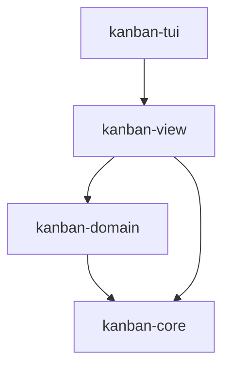

# kanban-view

Renderer-agnostic view-model layer shared by `kanban-tui` and (future)
`kanban-web`: which cards belong in which list, in what order, how selection
and scroll state carry across a refresh, and how panel titles/filter
summaries are formatted. No I/O, no rendering framework — each consumer
brings its own rendering stack on top. Extracted out of `kanban-tui` in
KAN-1044.

## Key public exports

From `src/lib.rs`:

```rust
pub mod card_list;             // CardList, CardListId, CardListRenderInfo
pub mod card_list_component;   // (ratatui-free) list-render-info plumbing
pub mod filter_state;          // FilterState
pub mod filters;                // FilterDialogState
pub mod layout_strategy;        // LayoutStrategy, SingleListLayout, ColumnListsLayout, VirtualUnifiedLayout
pub mod list_component;         // ListComponent (generic selectable-list state)
pub mod list_nav;               // pure navigation helpers
pub mod model;                   // Model — unified board/card/sprint view state
pub mod panel_titles;            // build_filter_title_suffix, build_tasks_panel_title
pub mod scroll_indicators;       // "N more above/below" formatting
pub mod search;                  // SearchState
pub mod selection_dialog;        // selection-dialog option<->domain mapping
pub mod sprint_assign_list;      // sprint-assignment list entries/navigation
pub mod view_strategy;           // ViewStrategy, ViewRefreshContext
```

`kanban-tui`'s `UnifiedViewStrategy` and `CardListComponent` (the ratatui
`Widget` impls) deliberately stay in `kanban-tui`, not here — this crate owns
only the render-free half of each.

## Position in the workspace



`kanban-view`'s `[dependencies]` are locked to `kanban-core`, `kanban-domain`,
`serde`, `uuid`, and `chrono` — enforced in CI by
[`scripts/check-kanban-view-deps-allowlist.sh`](../../scripts/check-kanban-view-deps-allowlist.sh),
since the compiler alone only stops this crate from *using* an undeclared
dependency, not from a future change *declaring* one. See the
[root README](../../README.md) for the full workspace dependency graph.

## Dependencies

| Crate | Purpose |
|-------|---------|
| [`kanban-core`](../kanban-core/README.md) | Shared types, error handling |
| [`kanban-domain`](../kanban-domain/README.md) | `Board`/`Card`/`Column`/`Sprint` domain models this crate builds view state over |
| `serde` | (De)serializing view state |
| `uuid` | Entity IDs |
| `chrono` | Timestamps |

## Related crates

Used by: [kanban-tui](../kanban-tui/README.md), and (future) `kanban-web`.
